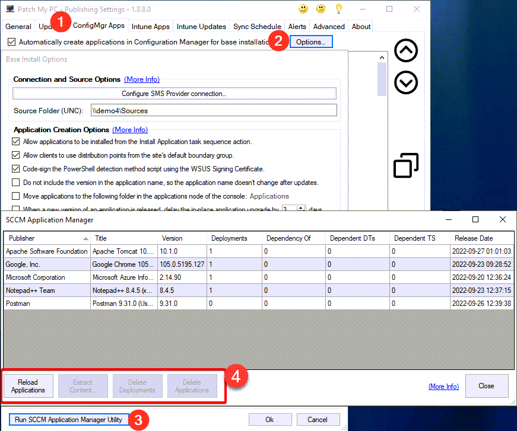
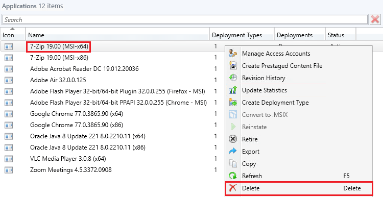

# How to Delete Applications Created by Patch My PC in SCCM

In this article, we will review how to delete applications created by Patch My PC from SCCM.

There are a few scenarios where you may want to do this.

* You **no longer need Patch My PC** for application management
* There was an update in the publishing service to **fix an application-specific issue** that requires recreation of an application to take effect

The following **two methods** are available for application deletion:

* [**Method 1 - SCCM Application Manager Utility**](https://patchmypc.com/how-to-delete-applications-created-by-patch-my-pc-in-sccm#Method-1-SCCM-AppManUtil)
* [**Method 2 - Manual Application Deletion**](https://patchmypc.com/how-to-delete-applications-created-by-patch-my-pc-in-sccm#Method2-Manual-App-Deletion)

## Method 1 - SCCM Application Manager Utility

* [**Step 1: Delete the Applications Using the Utility**](how-to-delete-applications-created-by-patch-my-pc-in-sccm-2.md#Delete-With-Util)
* [**Step 2: Recreation of All Applications (optional)**](how-to-delete-applications-created-by-patch-my-pc-in-sccm-2.md#Recreate-Apps)

**Note:** When **using the SCCM Application Manager to delete applications**, we will also **remove the source files automatically**. The steps for manually deleting the application include the process for manually deleting application source files. The manual deletion should _not_ be needed when using the SCCM Application Manager.

## Step 1: Delete the Applications Using the Utility

Within the Publisher, you can navigate through the UI as shown below.

1. **ConfigMgr Apps**
2. **Options**
3. **Run SCCM Application Manager Utility**
4. **Delete Applications**&#x20;
   1. **Note:** Only the applications you have highlighted will be deleted. You can hold CTRL and select multiple applications for deletion.

## Step 2: Recreation of All Applications (optional)

Please refer to the recreation step [here](how-to-delete-applications-created-by-patch-my-pc-in-sccm-2.md#Recreate-Apps).

## Method 2 - Manual Application Deletion

Manual deletion is a multi-step process covered below.

* [**Step 1: Deleting the Application Source Content**](how-to-delete-applications-created-by-patch-my-pc-in-sccm-2.md#Delete-Source-Content)
* [**Step 2: Delete the Application(s) from SCCM**](how-to-delete-applications-created-by-patch-my-pc-in-sccm-2.md#Delete-From-SCCM)
* [**Step 3: Recreation of All Applications (optional)**](how-to-delete-applications-created-by-patch-my-pc-in-sccm-2.md#Recreate-Apps)

## Step 1: Deleting the Application Source Content

If you only need to delete a single application, the easiest method is to delete the source content and application from SCCM manually. In this example, we will be deleting the source content for **7-Zip 19.00 (MSI-x64)**.

* Open the application's deployment type in the SCCM console
* Copy the content location path from the Content tab of the deployment type
  * 
* Open the folder in file explorer and delete the GUID folder for the application
  * 

If you need to delete all application content, you can remove all the vendor folders from the application source directory that was defined in the application options in the publishing service.

* Find the source folder specified in the base install options of the publishing service
  * 
* Go to this directory in file explorer to find the applications subfolder and delete all of the vendor folders within
  * 

## Step 2: Delete the Application(s) from SCCM

To delete individual applications in the SCCM console:

* Go to the **Applications node** in the Software Library
* **Right-click** the desired application and click **Delete**
  * 

To delete all applications in the SCCM console:

* Click the blue tab in the top left corner of the console and **Connect Via Windows Powershell**
  * 
* Run the following command in the Powershell window
  * **Get-CMApplication | Where-Object {($\_.SDMPackageXML -like '\*PatchMyPC-ScriptRunner.exe\*')} | Remove-CMApplication -Force -Verbose**
* The following verbose logging will show each application being deleted:
  * 
* Any active deployments or task sequence references must be removed before the application can be successfully deleted. If an application is deployed or referenced in a task sequence, you will get  the following error:
  * 

## Step 3: Recreation of All Applications (optional)

If applications were deleted due to a recommendation from the Patch My PC support team due to a bug in a previous version, here is the process to quickly recreate the applications.

* Manually run a publishing service sync in the Sync Schedule tab of the publishing service
  * 
* Monitor the sync process by opening the PatchMyPC.log in the General Settings tab
* Once all applications are recreated, verify in the console under the Comments column of the application that the "Created by Patch My PC..." version matches the version in the About tab in the publishing service
  * 
