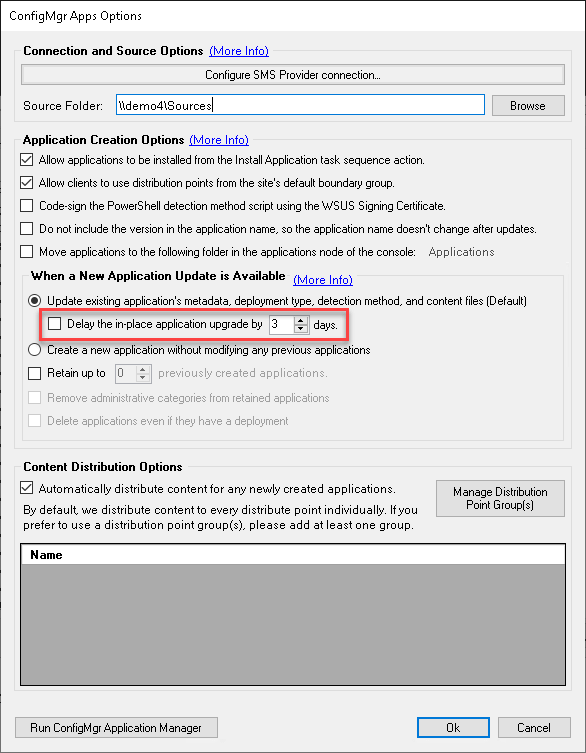

This article will explain the process of delaying the update of ConfigMgr base applications in the Patch My PC Publisher. 

## Set the number of days to delay the application update

In the Publisher, head to the **ConfigMgr Apps** tab and click **Options**.

For the option highlighted below, you can set the number of days to delay updating base install ConfigMgr Applications published through the Patch My PC Publishing Service. This setting delays **all** Applications published through the Publisher.

## How the delay works

Each product in the catalog has a creation date which represents the date the product was added. When the Publisher syncs, each product's creation date is compared to the current date. The **difference in days between the creation date and current date is compared to the configured delay**. If the configured delay is met or exceeded then the application will be updated during that sync. If the delay is not met or exceeded then a subfolder is created under the **PostponedBinaries** folder in the installation directory of the Publisher. Each delayed application will have its own folder containing the postponed binary as well as additional files with relevant metadata and update information. 

Below are three example scenarios of a delayed application update.

### Example 1: The Publisher syncs the same day the update is released

- The publisher is set to sync daily at 7:00 pm.

- The delay is configured to 3 days.

- On January 15th an update for Postman is released at 5:00 pm.

- On January 15th at 7:00 pm the Publisher syncs.

- A subfolder is created under the PostponedBinaries folder for Postman.

- Each day during the sync the **created date** of the Postman subfolder is compared to the current date and the difference in days is checked against the configured delay.

- On January 16th and 17th, the delay is not met.

- On January 18th the delay is met and the application is updated in ConfigMgr using the postponed binaries.

### Example 2: The Publisher syncs the day after the update is released

- The publisher is set to sync daily at 7:00 pm.

- The delay is configured to 3 days.

- On January 15th at 7:00 pm the Publisher syncs.

- On January 15th an update for Postman is released at 8:00 pm.

- On January 16th at 7:00 pm the Publisher syncs.

- A subfolder is created under the PostponedBinaries folder for Postman.

- Each day during the sync the **created date** of the Postman subfolder is compared to the current date and the difference in days is checked against the configured delay.

- On January 16th, 17th, and 18th the delay is not met.

- On January 19th the delay is met and the application is updated in ConfigMgr using the postponed binaries.

### Example 3: The Publisher syncs after the delay has been exceeded

- The publisher is set to sync Monthly on the 15th at 7:00 pm.

- The delay is configured to 3 days.

- On January 10th an update for Postman is released at 8:00 pm.

- On January 15th at 7:00 pm the Publisher syncs.

- The difference between January 10th and 15th is 5 days, exceeding the configured 3-day delay.

- The delay is exceeded and the application is updated in ConfigMgr, bypassing the postpone process.

## **Selective Sync Guidance**

**Updated 11th August 2025**

Postponed Binaries are evaluated during every Publisher sync including at the start of a manual sync when a [Selective Sync](https://patchmypc.com/kb/right-click-options-available-updates/#publish-this-product-during-the-next-manual-sync-selective-sync) is initiated. If their configured delay has elapsed, they will be published as part of that Selective Sync too.
