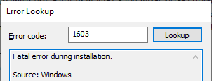
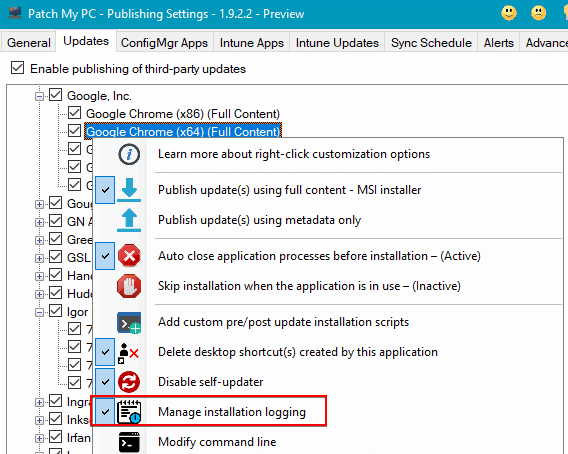
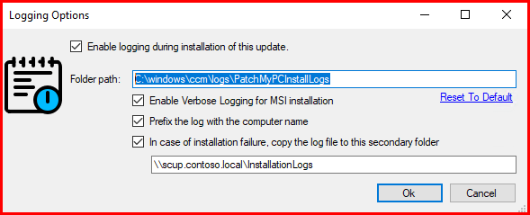

# Installation Fails Msi Error Code

Installation **error 1603** is one of the more common errors we see for application or update installations. This article will review installation error **1603** and explain how to get more details about why the installation failed. Error code 1603 is a generic Windows Installer error and translates to: "**Fatal error during installation.**"

### Determine if You are Affected

The log file where you see error code 1603 may vary depending on the method used to start the installation. Some examples of where the errors would log are listed below:

When using an **application** in Configuration Manager, you will see of logline similar to below in [**AppEnforce.log**](https://docs.microsoft.com/en-us/mem/configmgr/core/plan-design/hierarchy/log-files#BKMK_AppManageLog)

Unmatched exit code (1603) is considered an execution failure.

If the installation fails as a **software update**, you will see errors similar to below in [**WUAHandler.log**](https://docs.microsoft.com/en-us/mem/configmgr/core/plan-design/hierarchy/log-files#BKMK_SU_NAPLog)

Update 1 (0a91b273-404a-475f-b065-b2f54b99c7b1) finished installing (**0x80070643**)\
Installation job encountered some failures. Job Result = 0x80240022. WUAHandler

Error **0x80070643** translates to _**Fatal error during installation.**_ Error **0x80240022** translates to _**Operation failed for all the updates.**_

In the [**PatchMyPC-ScriptRunner.log**](https://patchmypc.com/collecting-log-files-for-patch-my-pc-support#update-troubleshooting-client-logs) you will likely see the following error lines:

End of installation. Exit code is: 1603\
End of Script Runner. Exit code is: 1603

### How to Troubleshoot Install Error Code 1603

Unfortunately, error 1603 is generic, and it's going to have a **different root cause** for each failure. There is a variety of common reasons that could cause it. The application could be **in use**, **permission issues to the folders or registry keys**, etc.

For Patch My PC support to help you with error 1603, we will need the actual **installers log file** specific to the application or update that is failing; otherwise, we will be unable to provide any assistance.

### How to Enable Installation Logging via Patch My PC

Patch My PC has an option that simplifies enabling logging for a product installer using our Publisher's [**custom right-click options**](../../custom-options-available-for-third-party-updates-and-applications/). This option enables logging **during the installation of the update or application** on the client device.

When enabled, the installer will create a directory (default path: **C:\Windows\CCM\LogsPatchMyPCInstallLogs**) that will store the vendor's installation log product, providing greater detail when troubleshooting is necessary.  Additional checkbox options enable **verbose logging**, **prefix the log** with the client device's computer name, and designate a **backup location** to store log files for failed installations.

* **Available At:** All Products, Vendors, and Products
* **Applicable To:** Software Updates, Applications

If logging was enabled **after a product has already been published**, you would need to **Run Publishing Server Sync** from the Sync Schedule tab.

> **Note:** If you are enabling the **Manage Installation Logging** feature for an **Intune application or update** then you will need to **delete the application out of Intune** and then Run Publishing Server Sync. Similarly if this is for a WSUS update then you may need to republish the update depending on what options are currently configured. Please refer to [this article](https://patchmypc.com/when-and-how-to-republish-third-party-updates) to understand when it is necessary to republish an update.

### Check for Installation Logs in C:\Windows\Temp

Even if Patch My PC logging wasn't enabled before the installation failed with **error 1603**, some installers may save a log folder to the %temp% folder by default.

You can check the **C:\Windows\Temp** folder to see if there are any logs specific to the failed update or application install.

