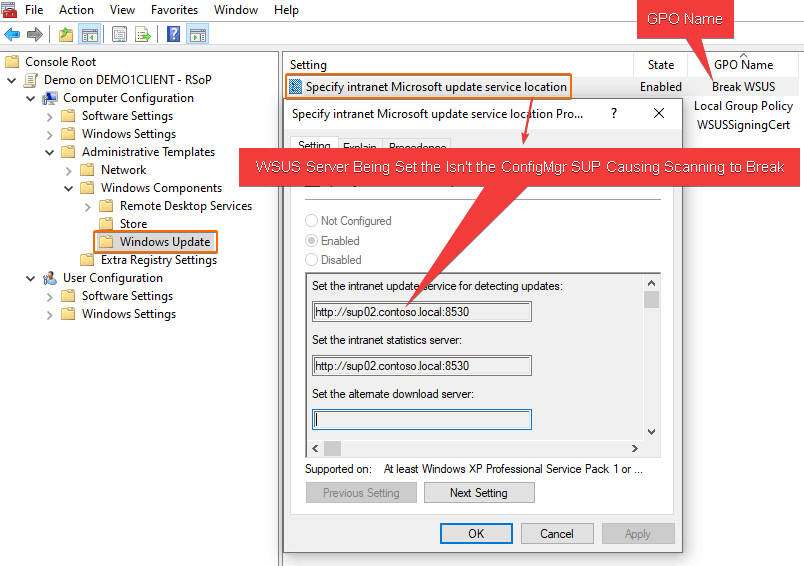

In this article, we are going to review a common error we see with our customers that can cause updates to evaluate and show an **[unknown scan state](/how-to-view-applicability-rules-and-troubleshoot-detection-states-for-third-party-updates#topic1)** resulting in third-party and Microsoft updates, not deploying to affected client devices.

### Symptoms of Error 0x87d00692

If you are experiencing this issue, you will see the following error in the **WUAHandler.log**:

Group policy settings were overwritten by a higher authority (Domain Controller) to: Server http://server.example.local:8530 and Policy ENABLED  
Failed to Add Update Source for WUAgent of type (2) and id ({891B2E1B-4873-4092-B1FD-7EAADE75A3D3}). Error = 0x87d00692.

In the **scanagent.log**, you will likely see the error:

CScanJob::Execute- Failed at AddUpdateSource, Error = 0x87d00692

In the **UpdatesDeployment.log**, you may see the error:

Job error (0x87d00692) received for assignment ({8b5e0d02-d742-4fdc-b06e-d1e55d8c05da}) action  
Updates will not be made available

### What is Error 0x87d00692 Anyway?

If you perform an error lookup using **Control** + **L** in CMTace.exe, you will see the error description for **0x87d00692** = "**Group policy conflict**".

Group policy conflict means a **GPO has been configured** to set the WSUS server to a different server than the ConfigMgr software update point.  A GPO will take precedence over the local GPO policy the ConfigMgr client is trying to set.

To determine the GPO setting the WSUS server Open **MMC.exe**, **File** > **Add/Remove snap-in... > Add Resultant Set of Policy**

Click **Generate RSoP Data...**

You can leave the **default options** when clicking through the Generate RSoP data wizard.

Once complete, navigate to **Computer Configuration** > **Administrative Templates** > **Windows Components** > **Windows Update > Specify intranet Microsoft update service location**

### How to Fix Error 0x87d00692

Remove or stop targetting the group policy that is setting the policy **Specify intranet Microsoft update service location**.

Once the GPO is not applied to a client, the ConfigMgr client will set the correct software update point dynamically based on boundary groups and other site configurations.

Please see the **[Microsoft Doc describing this policy when using Configuration Manager](https://docs.microsoft.com/en-us/mem/configmgr/sum/get-started/manage-settings-for-software-updates#specify-intranet-microsoft-update-service-location-local-policy)**

_When the software update point is created for a site, clients receive a machine policy that provides the software update point server name and **configures the Specify intranet Microsoft update service location local policy on the computer**. The WUA retrieves the server name that is specified in the Set the intranet update service for detecting updates setting, and then it connects to this server when it scans for software updates compliance. When a domain policy is created for the Specify intranet Microsoft update service location setting, **it overrides the local policy**, and the WUA might connect to a server other than the software update point. If this happens, the client might scan for software update compliance based on different products, classifications, and languages. Therefore, you **should not configure the Active Directory policy** for client computers._

> **Note:** Depending on other Windows Update GPO's and the timing of policies being removed and applied, clients may **scan against Windows Update directly** once the GPO is disabled and before the new WSUS server policy is configured locally by the Configuration Manager client.

Once the GPO is no longer applied to devices, you can optionally trigger a **Software Update Deployment Evaluation Cycle**. This cycle will trigger the client to attempt to set the local policy for the WSUS server to the Configuration Manager software update point.

> **Note:** You may want to limit the number of devices you perform this action on at once to avoid large WSUS scanning traffic.

In the WUAHandler.log, you should see the WUA Manager server can now be set by the ConfigMgr client, and the GPO conflict error will go away.

