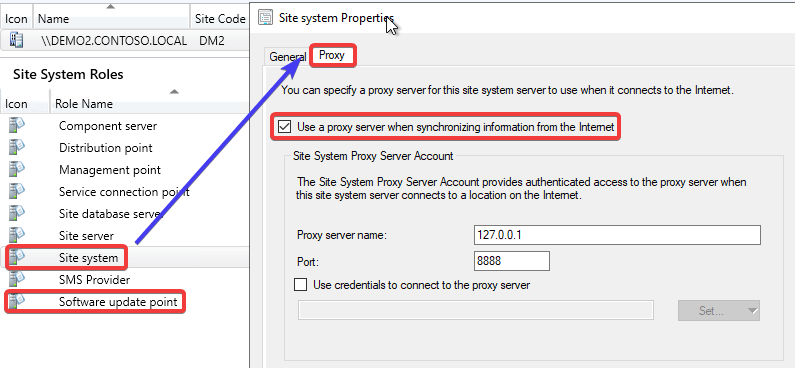
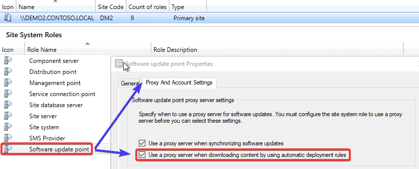
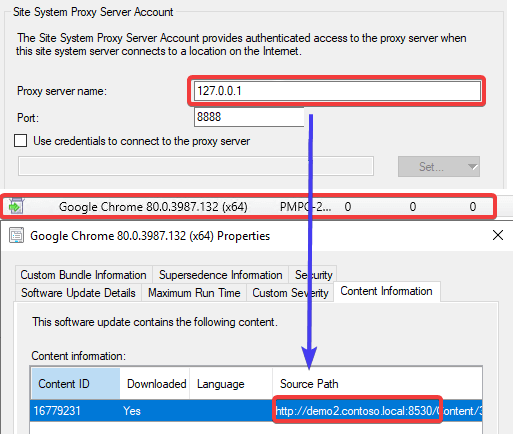
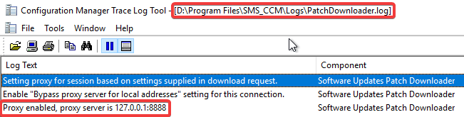
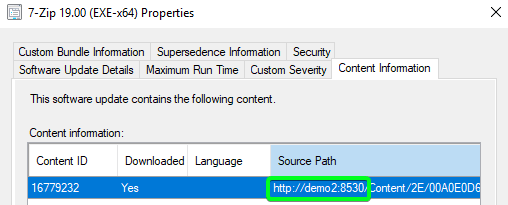
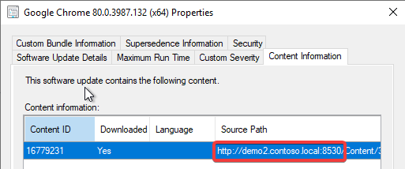
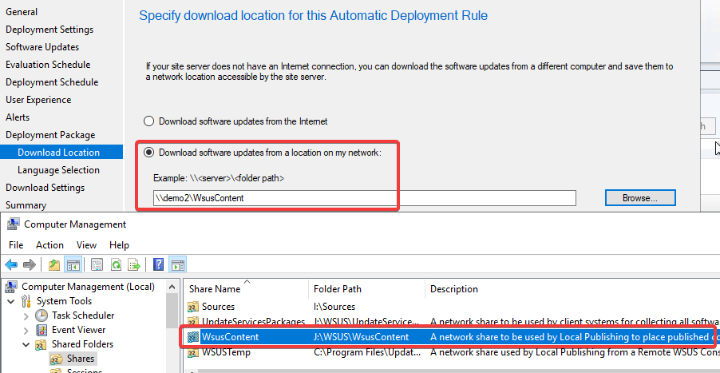
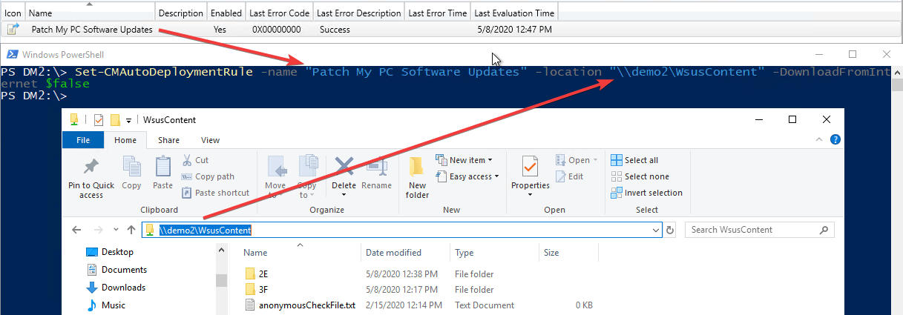

In this KB article, we will be reviewing a scenario where third-party software updates may fail to download to a Configuration Manager deployment package when using and automatic deployment rules (ADR).

## What Causes Error HttpSendRequest failed 502 / 0x800701f6 or 503 / 0x800701f7 [or 403 / 0x80070193](#topic1)?

First, we will dig into the conditions where this issue is most likely to occur. Here are the conditions that may cause this issue to occur:

1\. A **proxy is configured** on the **software update point site system**:

2\. The software update point site system is set to use the proxy for **automatic deployment rules content downloads**:

3\. The **proxy server being used** doesn't have access to download content from the **internal WSUS server**.

The third-party software updates are downloaded from the **internal WSUS** server. You can see download information in the following logs for ADRs (**RuleEngline.log** and **PatchDownload.log**). In the **PatchDownloader.log** you can see the proxy details as well,

This will cause an issue when the proxy doesn't have access to the **internal WSUS server**. This is common for proxies that are **internet-based** or even internal proxies that **don't allow access or route to internal servers**.

When the proxy can't resolve the internal WSUS server, you will often receive an HTTP response error such as:

HttpSendRequest failed 502  
ERROR: DownloadUpdateContent() failed with hr=0x800701f6

OR:

HttpSendRequest failed 503  
ERROR: DownloadUpdateContent() failed with hr=0x800701f7

OR:

HttpSendRequest failed 403  
ERROR: DownloadUpdateContent() failed with hr=0x80070193

**Note:** The actual error code can vary depending on the proxy configuration.

## Improvements in Configuration Manager 2002 for Proxies and ADRs

This proxy issue was becoming a very common issue with our customers and causing a lot of support cases. We submitted a Configuration Manager UserVoice request: [Add Option to Bypass Proxy for Local Address for ADR Content Downloads](https://configurationmanager.uservoice.com/forums/300492-ideas/suggestions/38885431-add-option-to-bypass-proxy-for-local-address-for-a), and the product group for Configuration Manager made some improvements in build 2002.

If the update is published using the WSUS servers **hostname only and not the FQDN**, the **PatchDownloader** component used for ADR downloads will bypass the proxy.

If the download URL for the third-party update is using the **FQDN of the internal WSUS server**, the proxy will still be used and the downloads will fail if the proxy server can't access that internal WSUS server URL. After working with the product group, the FQDN is generally used when [WSUS is configured to use SSL](https://docs.microsoft.com/en-us/windows-server/administration/windows-server-update-services/deploy/2-configure-wsus#25-secure-wsus-with-the-secure-sockets-layer-protocol).

## Workaround for Proxy Issue when Using HTTPS WSUS

If the improvements in Configuration Manager 2002 don't resolve your issue due to **WSUS using the FQDN**, you have another workaround to allow the content to be automatically downloaded. The resolution is to configure the ADR to download the content from the **WSUSContent UNC share** rather than **using the WSUS content URL**.

Unfortunately, you can **only configure the download location for an ADR is during the initial creation**. You are unable to change the download location in the properties of a previously created ADR within the Configuration Manager console.

By default, your **WSUSContent** folder should be shared automatically. The WSUSContent folder is the same folder the WSUS website uses for third-party update content downloads.

When this setting is enabled, it will allow the ADR to completely **bypass the proxy** and search the UNC share directly without any HTTP request or proxies. This should resolve the issue if it's related to a proxy, not allowing traffic to the internal WSUS server.

If you have an existing ADR that was configured with the options "**Download software update from the Internet**" it is possible the update that existing ADR using a PowerShell cmdlet.

Here's an example of the command you can copy and paste. You will need to update the **\-name** and **-location** parameter to match your environment.

`Set-CMAutoDeploymentRule -name "Patch My PC Software Updates" -location "demo1WsusContent" -DownloadFromInternet $false`
