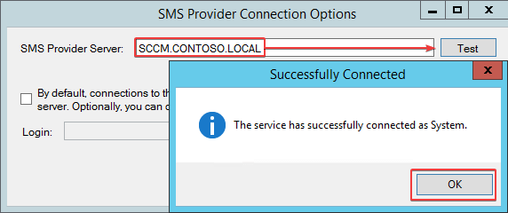
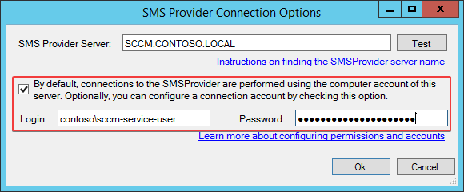

In this article, we are going to review the options related to the [SMSProvider](https://docs.microsoft.com/en-us/mem/configmgr/develop/core/understand/sms-provider-fundamentals) and the **application source folder**. It's important to ensure these settings are configured and have the **proper permissions** for our service to work correctly.

## Configure the SMS Provider Connection

The [SMSProvider](https://docs.microsoft.com/en-us/mem/configmgr/develop/core/understand/sms-provider-fundamentals) is how all actions take place within the Configuration Manager Console or any **API's** available for Configuration Manager.

First, you will need to define the SMSProvider server name in our **SMS Provider Connection Options** dialog.

Within your Configuration Manager console, navigate to **Monitoring** > **System Status** > **Component Status** > Search for **SMS\_PROVIDERS**

This search should return the SMSProver server(s) within your configuration manager environment. 

> **Important:** We recommend that you review our article [Permissions Required in SCCM for Base Installations](/permissions-required-in-sccm-for-base-installation-packages-from-patch-my-pc) to ensure you have the proper permissions configured to allow the service to create applications.

By default, the connection to the SMSProvider it performed using **SYSTEM-context** of the server running the publisher. **Optionally**, you can switch connection to the SMSProvider to use a domain service account:

## Application Source Folder

The Source Folder (UNC) is the **root folder** where you want all application content to be stored for applications created by the publisher.

The folder structure is \\\\**%Folder%\\Applications\\%Vendor%\\%Product%\\%UniqueID%**

> **Important:** All connections to the network share are **performed using the computer account** of the server. The **computer account** will need at a minimum modify permissions at both the **share** and **NTFS-level**. For more information on permissions required, please see our KB article [Access to the Path Is Denied – Configuring Content Source Permissions](/access-to-the-path-is-denied)

### **Source Folder Validation**

### **Alerts**

If there is an issue while performing validation an alert will be sent via Teams or SMTP email if they are set up. Below is a sample of each alert.

 Teams Alert

 Email Alert

Once you go into the ConfigMgr app options in the Publisher you can check which issue below applies and work to resolve the conflict.

#### **Deployment Package**

When configuring the ConfigMgr source you may receive a warning message regarding a misconfigured source such as the below.

In this case, the folder '\\\\demo1\\Sources\\Software Updates\\Patch My PC Updates' was selected as the source folder. This selection conflicts with an existing Deployment Package as shown below which contains our software update source files.

> **Note:** This warning is in place to prevent the use of a Deployment Package source as an application source. This is because **ConfigMgr regularly 'cleans' these source folders and will remove all content that is not a software update associated with the Deployment Package**. This would include removing the application source files placed here by the Publisher.

To resolve this issue please select a UNC path that is not in use by any Deployment Package.

### UNC

When configuring the ConfigMgr source you may receive a warning message regarding a misconfigured source such as the below.

In this case, a non-UNC path, such as '**D:\\Application\\Sources**' was selected as the source folder. This is an invalid ConfigMgr setting and will cause validation errors within ConfigMgr.

To resolve this issue please select a UNC path of a network share such as **'\\\\sccm\\Application\\Sources**' instead.
