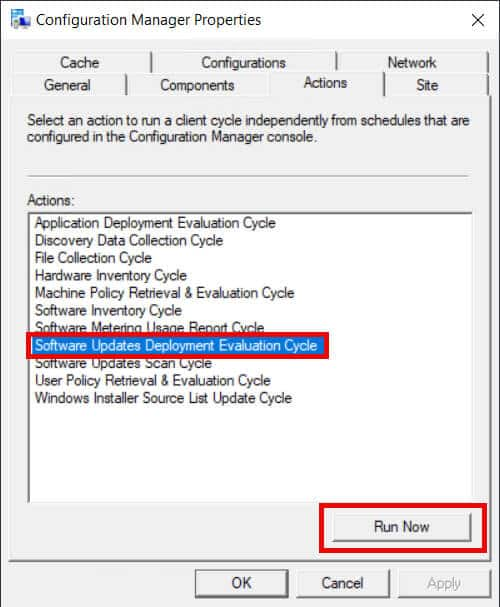
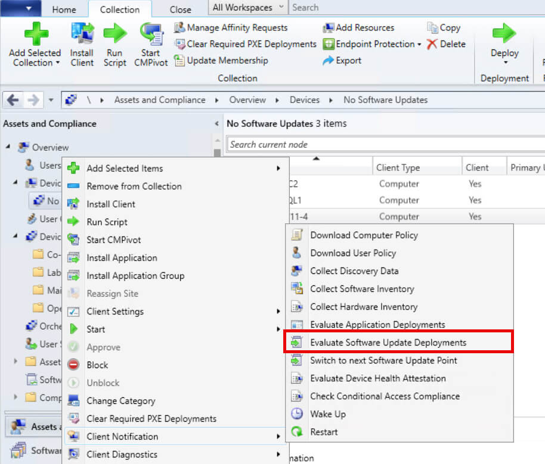

The **Software Updates Deployment Evaluation Cycle** is a critical process in SCCM that determines how frequently client devices evaluate whether they have the required software updates installed. This is critical in ensuring devices are up-to-date with security patches and other important updates as required by the organization.

## What is the Software Updates Deployment Evaluation Cycle?

The Software Updates Deployment Evaluation Cycle in SCCM is a setting that determines how frequently client devices evaluate whether they have the required software updates installed. This is critical in ensuring devices are up-to-date with security patches and other important updates as required by the organization. 

The component evaluation serves a vital purpose by ensuring that clients regularly check and verify the installation status of software updates deployed to them. If an update is missing or was not successfully installed, the evaluation process detects this and prompts the client to attempt the installation again, following the deployment configurations. This ensures compliance and helps maintain the integrity of the update deployment process.

## What does it do?

- **Ensures Compliance**  
    Regular evaluations ensure that all devices are compliant with the organization’s update policies.
    

- **Reduces Security Vulnerabilities**  
    By frequently evaluating updates, SCCM minimizes the risk of security breaches from unpatched software.
    

- **Automatic Remediation**  
    If an update fails or is missing, the evaluation schedule will detect this and reattempt installation without requiring manual intervention.
    

## How the cycle works

The SCCM client initiates the **Software Update Deployment Evaluation Cycle** on a predefined schedule (default is every 7 days).

During each cycle, the client:

1. **Contacts the SCCM Management Point**  
    The client connects to the SCCM management point to retrieve the list of available updates based on the policies and deployment configurations defined in SCCM.

3. **Downloads Update Policies**  
    The client downloads any update-related policies, which include details about required updates, installation deadlines, user interaction settings, and deployment configurations.

5. **Evaluates Update Compliance**  
    The client compares the list of required updates with the updates already installed on the device. During this evaluation:
    - **Missing Updates  
        **Identifies updates that are required but not yet installed.
    
    - **Failed Updates**  
        Flags updates that were previously attempted but failed to install.
    
    - **Outdated Updates  
        **Detects updates that need to be replaced by newer, superseding updates.

7. **Flags Updates for Action**  
    Based on the evaluation, the client flags any updates that need to be installed or reinstalled. This ensures all required updates are identified for remediation.

9. **Downloads Required Updates**  
    For flagged updates, the client begins downloading the necessary files from the designated distribution point. This process adheres to bandwidth settings and preferred caching locations.

11. **Installs Updates as Configured**  
     After downloading, the client initiates the installation process for the required updates. It respects SCCM deployment rules, such as:
     - Installation during a defined maintenance window.
     
     - Enforcement of restart policies.
     
     - Handling of user interaction prompts (if required).

13. **Reports Compliance Status**  
     Once the updates are installed, the client verifies the installation and reports the compliance status back to the SCCM server. This information includes details about successfully installed, pending, or failed updates, allowing administrators to monitor and address compliance gaps.

## Ways to manually invoke the Software Update Deployment Evaluation Cycle

Although the cycle runs automatically, administrators can also manually trigger it on individual clients to speed up policy application. There are numerous ways this can be invoked manually.

### 1\. From the Client Side

One method is by using the Control Panel **Configuration Manager** Applet:

1. Open the **Control Panel** on the client device.

3. Go to **System and Security** **\> Configuration Manager**.

5. In the Actions tab, select **Software Update Deployment Evaluation Cycle** and click **Run Now**.

### 2\. Using WMI

The other method of manually invoking the scan cycle from a client is by using PowerShell:

1. Open PowerShell as Administrator

3. Run this command:  
    
    > Invoke-WmiMethod -Namespace "rootCCM" -Class SMS\_Client -Name TriggerSchedule -ArgumentList "{00000000-0000-0000-0000-000000000108}"
    

###  3. From the SCCM Console

1. Open the ConfigMgr console and navigate to **Assets and Compliance** > **Devices**.

3. Locate the device and right-click on it.

5. In the **Client Notification** section, choose **Download Computer Policy**.

## Relevant logs to monitor on the client side

If you want to monitor the evaluation of this action, it can be done using these logs located on the client side in the %WinDir%\\CCM\\Logs folder:

- **UpdatesDeployment.log**
    - Tracks the evaluation and installation of updates on the client. This log records details about which updates are required, whether they are downloaded, and the results of the installation process.

- **UpdatesHandler.log**
    - Records the execution of software update installation, including initiation, progress, and completion. It also logs retry attempts if the installation fails.

- **CAS.log** (Content Access Service)
    - Logs the download of update files from distribution points to the client cache. It provides insights into the content retrieval process, including errors or delays.

- **WUAHandler.log**
    - Logs the interaction between SCCM and the Windows Update Agent (WUA). This log records scan results, including whether updates are applicable, and errors encountered during the scan.

- **LocationServices.log**
    - Records the process of finding management points and distribution points. This log helps identify issues if the client cannot locate a content source for updates.

- **DataTransferService.log**
    - Logs the actual download of update files to the client, including progress and transfer errors.
