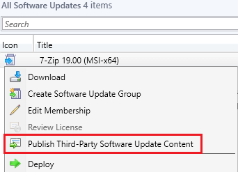

One of the new requirements when using the **System Center Configuration Manager 1806+ [Third-Party Software Updates feature](https://docs.microsoft.com/en-us/mem/configmgr/sum/deploy-use/third-party-software-updates)** is **every update's installer file must be digitally signed** when published as full-content within the SCCM console.

If you right-click an update where the **installer isn't signed** and choose to **Publish Third-Party Software Update Content**, you will receive an error in the binary validation in the **SMS\_ISVUPDATES\_SYNCAGENT.log** log file.

## Determine if You are Affected

The following errors will be shown in the **SMS\_ISVUPDATES\_SYNCAGENT.log** log file when an unsigned third-party update is published as full-content.

SyncUpdate: File 'D:Microsoft Configuration ManagerISVTemphdrdeabp.51d7z1604-x64.msi' does not appear to be signed or there was an error retrieving the signing certificate. Signatures are required.

Signature check on downloaded binary has failed, reason: 0.

STATMSG: (SRVMSG\_SMS\_ISVUPDATES\_SYNCAGENT\_UPDATECONTENT\_TRUST\_FAIL\_BADSIG).

STATMSG: (SRVMSG\_SMS\_ISVUPDATES\_SYNCAGENT\_UPDATECONTENT\_FAIL).

Since [System Center Updates Publisher (SCUP)](https://docs.microsoft.com/en-us/mem/configmgr/sum/tools/updates-publisher) does allow unsigned updates to be published, we expect Microsoft made the code-signing certificate requirement for SCCM due to the increased automated available in SCCM to add [another layer of validating binaries](https://docs.microsoft.com/en-us/mem/configmgr/sum/deploy-use/third-party-software-updates#known-issues) for any third-party software updates being published from their product.

## List of Products Where Vendors don't Code-Sign the Binary Installer File

We are maintaining a list of active products whose vendors who don't sign their installer binaries.

- 7-Zip

- Apache OpenOffice

- Apache Tomcat

- Archi

- FastStone Capture

- GanttProject

- ImgBurn

- Inkscape

- IZArc

- K-Lite "Basic & Mega"

- MapInfoPro

- MicroDicom

- MinuteTraq

- PaintDotNet

- PeaZip

- PKZip

- Programmer's Note

- ProjectLibre

- SeaMonkey

- ShareX

- Terminals RDP

- WinMerge

## Why don't vendor's code-sign their installers?

Great question, code-signing does add another [layer of integrity](https://en.wikipedia.org/wiki/Code_signing) to binaries and has been around for a long time. The vast majority of software vendors do code-sign their binaries, but we do see many open source projects such as [Notepad++](https://notepad-plus-plus.org/news/v864-released/) and [7-Zip](https://www.7-zip.org/download.html) choose not to code-sign due to cost and increased complexity and instead post file hashes.

## Unsigned Binary Workaround

To published products whose binaries are unsigned, you need to use our [publisher](/publishing-service-setup-documentation) or SCUP as a workaround. Our publisher has a [variety of benefits](/frequently-asked-questions#publishing-service-vs-sccm-publishing) compared to the SCCM in-console publishing.

We also recommend contacting the vendor of the software whose installer is unsigned to ask them if it would be possible to sign their binaries in future versions.
