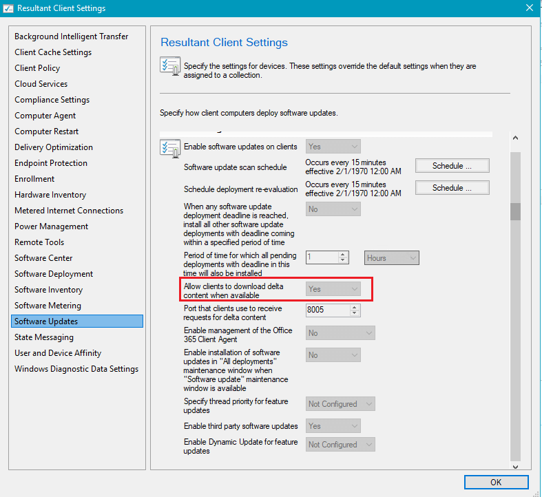

# Third Party Updates Fail Download

Microsoft has docs that discuss this scenario [here](https://docs.microsoft.com/en-us/mem/configmgr/sum/deploy-use/optimize-windows-10-update-delivery#bkmk_DO-1910) in the 'Important' note box, specifically the last bullet point.

We were able to reproduce this issue and wanted to explain what's happening and a workaround.

#### &#x20;Step 1: Check if Download Delta Content Client Setting is Enabled

For our scenario, we could only reproduce the third-party software update download issue when the client setting "[Allow clients to download delta content when available](https://docs.microsoft.com/en-us/configmgr/core/clients/deploy/about-client-settings#allow-clients-to-download-delta-content-when-available)" within "**Software Updates**" is enabled.

A quick way to check if this client policy may be enabled on a device facing the download issue is to right-click the device in the **Devices** node > **Client Settings** > **Result Client Settings**. In the Result Client Settings, check if the policy is Yes.

#### &#x20;Step 2: Reproduction of the Scenario

In our scenario, we had an available software update group deployment where **Google Chrome 81.0.4044.113 (x64)** UpdateID: **ff665b30-ccef-4806-9f81-7b5a762063d5** was targeted to a device.

Since this was an available deployment, we started the update installation using software center, but a required deployment would have the same download errors.

Once the download is triggered, we will see the following data in **DataTransferService.log**

CDTSJob::HandleErrors: DTS Job '{857B9A7B-0908-44AE-BB80-96F30EF11E96}' BITS Job '{0B57534F-36B3-4BA9-A07E-850F1B5C0CE4}' under user 'S-1-5-18' OldErrorCount 0 NewErrorCount 1 ErrorCode 0x80072EE7

Failed to set proxy to bits job for url 'http://sccm:80/Content/EB/2ABF1D5BCD7564FD2DF0E8DC6CFB628E6DEA4FEB.cab'. Error 0x87d00215

All proxy types and no proxy have been tried but failed. Loop the types again for the 1 time

The first interesting thing we notice is the client attempts to download the content from the internal WSUS server, but this actually isn't our issue and is a known scenario please see our [**UserVoice request**](https://configurationmanager.uservoice.com/forums/300492-ideas/suggestions/40174429-third-party-updates-should-not-attempt-3-downloads) to improve this behavior. The download against the internal WSUS will usually timeout after 3 attempts and fall back to your CMG-based distribution point.

The log that will help us see the issues in this scenario is **DeltaDownload.log**. In this log, we can see the following lines:

Failed to send HTTP Response. Error=800704cd

We will see this happen for each update **every 3 minutes** for about **30 minutes** before the download will fail.

Once the download times out, we will see the following error in **WUAHandler.log**.

Unexpected HRESULT for downloading complete: 0x80d02002

#### &#x20;Step 3: Root Cause and Workaround

In build 1910, the setting to [**download delta content files**](https://docs.microsoft.com/en-us/configmgr/core/clients/deploy/about-client-settings#allow-clients-to-download-delta-content-when-available) is enabled by default. Delta update content is not applicable for third-party updates, and it seems to cause the download to fail completely.

We were able to resolve this download issue by disabling the client settings [Allow clients to download delta content when available](https://docs.microsoft.com/en-us/configmgr/core/clients/deploy/about-client-settings#allow-clients-to-download-delta-content-when-available). Once the client received the policy and applied this change, it was able to download the third-party software update.

You may still see the device attempt to download the content from the internal WSUSContent folder three times (3 minutes) before it falls back to your CMG distribution point for each third-party update. You review and vote on our UserVoice here [**Third-Party Updates Should Not Attempt 3 Downloads from Internet (WUMU)**](https://configurationmanager.uservoice.com/forums/300492-ideas/suggestions/40174429-third-party-updates-should-not-attempt-3-downloads) to help improve this scenario.
