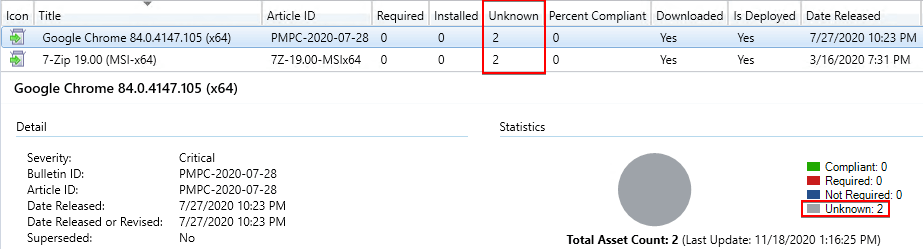
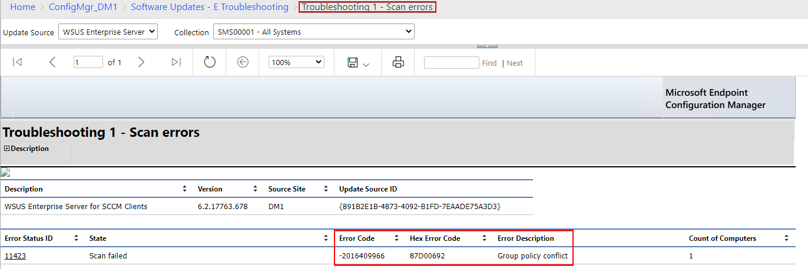
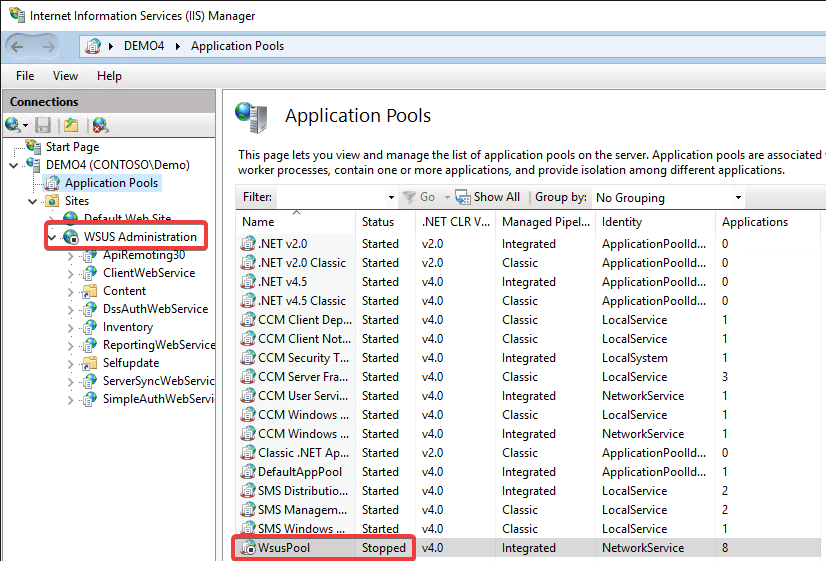
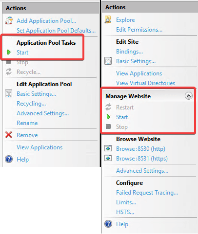

# Troubleshooting Clients Unknown Update State

We have seen an increase of cases where [**update states**](https://patchmypc.com/how-to-view-applicability-rules-and-troubleshoot-detection-states-for-third-party-updates#topic1) may show as Unknown for a large number of devices. Customers facing this issue will generally see third-party updates not applying when the updates are [**applicable to the devices**](../../how-to-view-applicability-rules-and-troubleshoot-detection-states-for-third-party-updates/).

An **Unknown** update state means the device(s) haven't successfully **scanned against the WSUS server** or haven't been able to **report the scan results to the Configuration Manager site**. There are a variety of possible causes that could cause scan issues. Please see the Microsoft doc [**Troubleshoot software update scan failures in Configuration Manager - Compliance results unknown**](https://docs.microsoft.com/en-us/troubleshoot/mem/configmgr/troubleshoot-software-update-scan-failures#compliance-results-unknown).

### Determine if You are Affected

If you are affected by scan issues, you will likely see a high percentage of devices showing an **Unknown state** in the ConfigMgr console's **All Software Updates** node. Although this issue **isn't specific to Patch My PC**, we will review some troubleshooting methods below as best-effort support.

> **Note:** Depending on your Windows Update for Business (**WUfB**) policies, it's possible Microsoft updates can still apply from WUfB even if results show unknown in the ConfigMgr console. Third-party updates will never be applied if the update is in an **Unknown state**. Please see [**Using ConfigMgr With Windows 10 WUfB Deferral Policies**](https://techcommunity.microsoft.com/t5/configuration-manager-archive/using-configmgr-with-windows-10-wufb-deferral-policies/ba-p/274278) for more details about WUfB policies.

### Troubleshooting Step 1: Troubleshoot software update scan failures in Configuration Manager

Microsoft has a detailed knowledge base article [**Troubleshoot software update scan failures in Configuration**](https://docs.microsoft.com/en-us/troubleshoot/mem/configmgr/troubleshoot-software-update-scan-failures#compliance-results-unknown) [**Manager**](https://docs.microsoft.com/en-us/troubleshoot/mem/configmgr/troubleshoot-software-update-scan-failures#compliance-results-unknown). We recommend starting your troubleshooting using this KB article. This article covers the following possible issues for software update scans:

* [**Scan failures due to missing or corrupted components**](https://docs.microsoft.com/en-us/troubleshoot/mem/configmgr/troubleshoot-software-update-scan-failures#scan-failures-due-to-missing-or-corrupted-components)
* [Scan failures due to proxy-related issues](https://docs.microsoft.com/en-us/troubleshoot/mem/configmgr/troubleshoot-software-update-scan-failures#scan-failures-due-to-proxy-related-issues)
* [Scan failures related to HTTP time-out or authentication](https://docs.microsoft.com/en-us/troubleshoot/mem/configmgr/troubleshoot-software-update-scan-failures#scan-failures-related-to-http-time-out-or-authentication)
* [Determine the port settings used by WSUS and the software update point](https://docs.microsoft.com/en-us/troubleshoot/mem/configmgr/troubleshoot-software-update-scan-failures#determine-the-port-settings-used-by-wsus-and-the-software-update-point)
* [Determine the WSUS port settings in IIS 7.0 and later versions](https://docs.microsoft.com/en-us/troubleshoot/mem/configmgr/troubleshoot-software-update-scan-failures#determine-the-wsus-port-settings-in-iis-70-and-later-versions)
* [**Verify and configure ports for the software update point**](https://docs.microsoft.com/en-us/troubleshoot/mem/configmgr/troubleshoot-software-update-scan-failures#verify-and-configure-ports-for-the-software-update-point)
* [Scan fails with error 0x80072f0c](https://docs.microsoft.com/en-us/troubleshoot/mem/configmgr/troubleshoot-software-update-scan-failures#scan-fails-with-error-0x80072f0c)
* [Group Policy overrides the correct WSUS configuration information](https://docs.microsoft.com/en-us/troubleshoot/mem/configmgr/troubleshoot-software-update-scan-failures#group-policy-overrides-the-correct-wsus-configuration-information)
* [Clients can't find the WSUS server location](https://docs.microsoft.com/en-us/troubleshoot/mem/configmgr/troubleshoot-software-update-scan-failures#clients-cant-find-the-wsus-server-location)
* [Compliance results unknown](https://docs.microsoft.com/en-us/troubleshoot/mem/configmgr/troubleshoot-software-update-scan-failures#compliance-results-unknown)

The following article describes log files the processes to [**troubleshoot client software update scanning**](https://docs.microsoft.com/en-us/troubleshoot/mem/configmgr/troubleshoot-software-update-management#troubleshoot-issues-in-step-1).

### Troubleshooting Step 2: Review the Troubleshooting 1 - Scan errors Report

In most cases, the Microsoft troubleshooting guide is [**step 1**](troubleshooting-clients-unknown-update-state.md#topic2) will help you resolve the issue. We will also share some common issues and **troubleshooting methods** we have found helpful.

The following report **Software Updates - E Troubleshooting** > **Troubleshooting 1 - Scan errors** can be run if you have the [**reporting services point installed**](https://docs.microsoft.com/en-us/mem/configmgr/core/servers/manage/configuring-reporting) in your ConfigMgr site.

In this report, you can review if there are a large number of devices reporting scan errors.

### Troubleshooting Step 3: Can the Client Find the WSUS/SUP Server?

Another common reason that can cause clients to show unknown is being **unable to locate a WSUS server** to scan against. Please see the Microsoft article [**WSUS server location**](https://docs.microsoft.com/en-us/troubleshoot/mem/configmgr/track-software-update-compliance-assessment#wsus-server-location) to understand how clients receive the WSUS server to scan against.

If the software update point isn't associated with a boundary group the clients are in, it will cause the clients to not scan against the WSUS server causing **Unknown states** for updates. For more details, please see the article [**Configure boundary groups for Configuration Manager**](https://docs.microsoft.com/en-us/mem/configmgr/core/servers/deploy/configure/boundary-groups).

> **From** [**Microsoft Docs**](https://docs.microsoft.com/en-us/mem/configmgr/core/servers/deploy/configure/boundary-groups#bkmk_sup)**:** Clients use **boundary groups to find a new software update point**. To control which servers a client can find, add individual software update points to different boundary groups.
>
> If you add all existing software update points to the default site boundary group, the client selects a software update point from the pool of available servers. This behavior is similar to earlier versions of Configuration Manager current branch. For controlled selection and fallback behavior, add individual software update points to different boundary groups.
>
> If you install a new site, **software update points aren't added to the default site boundary group**. Assign software update points to a boundary group **so that clients can find and use them**.

### Troubleshooting Step 4: Group Policy Conflict Causes Error 0x87d00692

One of the most common reasons we see for scan failures is a [**GPO conflict overwriting the WSUS server**](../../job-error-0x87d00692-received-for-assignment-id-action) ConfigMgr is trying to set locally.

If affect, In the **scanagent.log**, you will likely see the error:

CScanJob::Execute- Failed at AddUpdateSource, Error = 0x87d00692

If you receive the error above, please review our KB article [**Update Scan Error: Job error (0x87d00692) received for assignment ({ID}) action**](../../job-error-0x87d00692-received-for-assignment-id-action/)

### Troubleshooting Step 5: IIS Application Pool Running and Optimized

WSUS ultimately relies on **Microsoft IIS** on the backend, even when integrated with Configuration Manager. If the IIS website or application pool are not working properly then client devices may have scan errors, or report an unknown scan status.\
Within IIS on the server running WSUS we can see the below server has both the **WSUS Administration** and the **WsusPool** in a stopped state.\
When this does happen, clients may exhibit various errors in the **WUAHander.log**, two of which are below.

OnSearchComplete - Failed to end search job. Error = 0x80244022

OnSearchComplete - Failed to end search job. Error = 0x80240438

To begin with, the two should be started again. You can simply highlight the WSUS Administration website, or the WsusPool and select **Start** from the Actions pane on the right hand side of IIS.

Commonly the **WSUSPool Application Pool will crash due** to a lack of resources, or the app pool needing some advanced configuration changes. Microsoft has some docs [here](https://docs.microsoft.com/en-us/troubleshoot/mem/configmgr/windows-server-update-services-best-practices#disable-recycling-and-configure-memory-limits) which can help give a good baseline for your IIS configuration.
