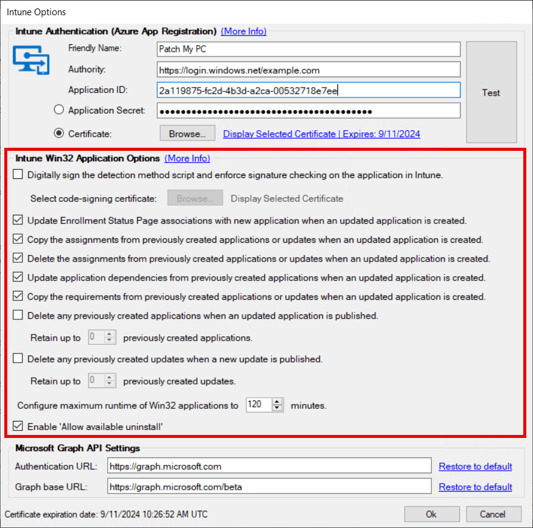
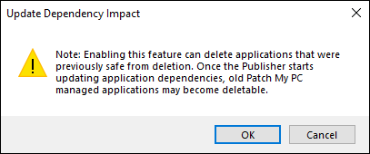

In this article, we will cover all of the Intune Application Creation Options that are available from the publisher. These are options that apply specifically to the creation of Win32 applications for your Intune tenant. Below is a screenshot of this section as of the writing of this article.

This article does not go over configuring Authority, Application ID, and Application Secret. For documentation on configuring these items please refer to our setup documentation for Intune [here](https://docs.patchmypc.com/installation-guides/intune/azure-app-registration).

### Digitally sign the detection method script and enforce signature checking on the application in Intune

When this option is checked, it will enforce signature checking for the detection method script.  This option will be reflected in the application's properties in your Intune tenant under Detection Rules.

If this option is enabled, you will need to browse for a code-signing certificate from your local computer's personal store to sign the Powershell detection method scripts for all created applications.  If you also use our product for MEMCM (SCCM), you can use your WSUS code signing certificate that you previously created also to sign the detection method script for Intune apps, as long you are running the service from the same server. Alternatively, you can generate a code signing certificate to sign the detection method script ([How to generate a code signing certificate and sign PowerShell .ps1 script - Patch My PC)](https://patchmypc.com/generate-signing-cert-and-sign-powershell-ps1-script). The certificate will still need to be deployed to your Intune-managed clients for the script to be trusted.

### Copy the assignments from previously created applications when an updated application is created

The Publisher can immediately add assignments for the apps to Azure AD groups upon creation.  This option can be executed through a right-click action at a global, vendor, or individual level.  Right-clicking a product, vendor, or All Products will give you the option to Manage Assignments. From this window, you can add an assignment for an app or apps as Available, Required, or as an Uninstall.

When a new version of an app is created, and the box to copy assignments in the Intune Options window is checked, the Publisher will automatically transfer these assignments to the newly created application. The assignments will not be transferred if you enable this option after the fact, while the newer version already exists in Intune.

### Update Enrollment Status Page associations with new application when an updated application is created

This option will ensure that the list of selected Win32 applications for an Intune [Enrollment Status Page](https://docs.microsoft.com/en-us/mem/intune/enrollment/windows-enrollment-status#block-access-to-a-device-until-a-specific-application-is-installed) is kept up to date as new versions of applications are published. These Enrollment Status Pages are commonly used during Autopilot. With this checkbox checked the Publisher will ensure the latest version of the published application are associated with your ESP.

The ESP associations will not be removed from older versions of Patch My PC-made Intune Win32 packages if you enable this option after the fact, while the newer version already exists in Intune.

### Delete the assignments from previously created applications when an updated application is created

This option corresponds with '[Copy Assignments...](#topic2)' feature from above. When the Publisher creates a new version of an application or update, the old version will still exist in the Intune tenant (unless specified to be deleted ie. [1](#topic4) or [2](#RemovePreviousUpdate)).  This Win32 application will still have the same assignments that were set before the new version was created.  If the [copy assignments option](#topic2) is set you will end up having two different versions of the same Win32 application assigned to your Intune clients.  To avoid this, you would want to enable this option to delete the assignments of the old application, so that only the latest version of the application is assigned to your clients.

The assignments will not be deleted if you enable this option after the fact, while the newer version already exists in Intune.

### Update application dependencies from previously created applications when an updated application is created

This option will support maintaining your application dependencies in Intune. When this option is enabled, if you have any Win32 apps from Patch My PC in the application dependencies you create, it will ensure that they are kept up to date as new versions are published.

> **Note:** When this option is enabled, the notification below will display. Previously, if you had a dependency change the applications would not go away. With this option enabled, there is a possibility that applications can be deleted. 
> 
> 

### Copy the requirements from previously created applications or updates when an updated application is created

When enabled, this option ensures that any customer-defined [Win32 requirements](https://learn.microsoft.com/en-us/mem/intune/apps/apps-win32-add#step-3-requirements) are retained as new versions of a product are updated. For example, the customer might add a custom requirement PowerShell script or registry value check. This will be copied forward as long as the checkbox is checked. 

> **Note:** If this feature is not enabled, then customer-defined requirements will not be retained. When a new version of a product is published, the additional requirements will not exist on the newly published Win32 application. The Publisher will never delete a requirement; they are simply not copied forward. 

### Delete any previously created applications when an updated application is created

As explained in Option 2 and 4, when the Publisher runs a sync and finds a new version is released for an application, it will create the new version of the application.  Without selecting this option, the old version of the application will still exist in the Intune tenant.  If this option is enabled, however, the Publisher will delete the old version of the application when the new version is created.  Select this option if you only want to have the latest version of an application that exists in your Intune tenant.

> **Note:** _Beginning in version 2.0.1 we support the ability to retain a limited number of previous versions for both updates and applications. Setting the value will allow you to preserve the specified number of previous versions. This provides you with the benefit of having access to older versions of applications in your environment, as well as the latest, ready to deploy if you need to roll back your devices to a last known good version. It also keeps your environment tidy by maintaining a set number of applications._

### Delete any previously created updates when a new update is published

As explained above, when the Publisher runs a sync and finds a new version is released for an application it will create the new version of the application as an Intune Update.  Without selecting this option, the old version of the Intune Update will still exist in the Intune tenant.  If this option is enabled, however, the Publisher will delete the old version of the Intune Update when the new version is created.  Select this option if you only want to have the latest version of an Intune Update that exists in your Intune tenant.

### [Enable 'Allow available uninstall'](#enableavailableuninstall)

When creating or configuring a Win32 app, there is a setting to provide the uninstall option for the app for users in the Company Portal. All Win32 apps published will inherit this flag if the option is set at this global level. For more information about this feature, and how to configure it at the vendor/product level, please see the following KB:-

[Intune Win32 app Allow Available Uninstall](https://patchmypc.com/intune-win32app-allow-available-uninstall "Intune Win32 app Allow Available Uninstall")
