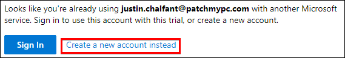
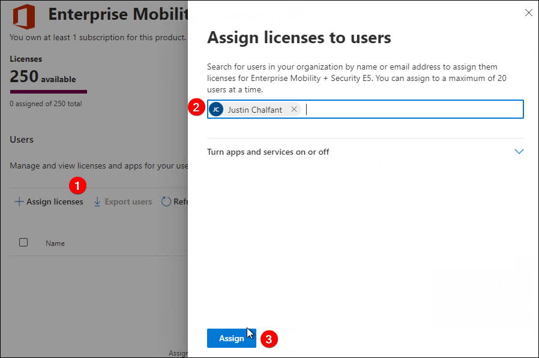

# Microsoft Intune Deployment and Getting Started Guide

Microsoft Intune helps you manage your corporate devices. The guide below will describe how to **set up and configure Microsoft Intune and activate a 90-day trial**. Many of the steps in the video and article below are also available on the Microsoft docs [Quickstart - Try Microsoft Intune for free](https://learn.microsoft.com/en-us/mem/intune/fundamentals/free-trial-sign-up).

**Topics** covered in this article:

* [Video Guide for Microsoft Intune Setup](how-to-setup-microsoft-intune.md#video-guide-for-microsoft-intune-setup)
* [Request a 30-Day Intune Trial](how-to-setup-microsoft-intune.md#request-30-day-intune-trial)
* [Set Up a Custom Domain Name (Optional)](how-to-setup-microsoft-intune.md#setup-custom-domain-name)
* [Enable Automatic Enrollment for Windows Devices and Enterprise Mobility + Security E5 90-Day Free Trial](how-to-setup-microsoft-intune.md#automatic-enrollment)
* [Create User for Intune Enrollment via Windows Autopilot](how-to-setup-microsoft-intune.md#create-user)
* [Enable Company Branding in Azure Active Directory (Optional)](how-to-setup-microsoft-intune.md#company-branding)
* [Disable Windows Hello for Business](how-to-setup-microsoft-intune.md#disable-hellow)
* [Enroll a Windows 11 Device Into Microsoft Intune Using Windows Autopilot](how-to-setup-microsoft-intune.md#enroll-device)

## Video Guide for Microsoft Intune Setup

If you **prefer to learn using video guides**, you can review the video below that covers all the steps in the article below.

## Request a 30-Day Intune Trial

Trying out Microsoft Intune is free. To start, request a 30-day trial at [Microsoft Intune 30-Day Trial Request](https://go.microsoft.com/fwlink/?linkid=2019088).

On the Microsoft Intune Trial page, **enter your work email** and click **next**.

**Note:** In the example above, the domain used for the email was "**patchmypc.com**". If there is any Intune instance setup for the domain, the option will be "**Sign In**" or "**Create a new account instead**". If Intune hasn't been set up for your domain, the button will say "**Set up account**".

If Intune hasn't been used before for your email domain, click **Set up account**.

If Intune has been configured for your domain before, you can create a new Intune tenant by clicking "**Create a new account instead**".

Complete the **Tell us about yourself** form and click **Next**

You will need to verify you are a person using the **Text me** or **Call me** option. **Enter your phone number** and click **Send verification code**.

On the **How you'll sign in** form, you will need to enter the **tenant's username**, **Domain name,** and **password** and click **Next**.

You will be redirected to the **Confirmation details** screen, which shows details about the Intune tenant.

## Set Up a Custom Domain Name (Optional)

If you don't have a domain name already purchased, you can **buy a custom domain name** that you can optionally use for Microsoft Intune user accounts. Purchasing a domain name is generally under $10.

Note: Using a custom domain is optional. If you don't use a custom domain, you can log in using the username@setupmem.onmicrosoft.com domain for example rather than username@setupmem.com.

For this guide, we are going to use a custom domain setupmem.com. I used [Cloudflare](https://www.cloudflare.com/products/registrar/) to purchase the domain name. To **buy a domain in Cloudflare**, you follow the steps below.

Log in to Cloudflare and navigate to the **Register Domain** page.

Search for your **desired domain name** and click **Purchase**. Complete the prompts to purchase the domain.

After purchasing the domain, navigate to the [Add a domain](https://portal.microsoft.com/Adminportal/Home#/Domains/Wizard) wizard in the Microsoft 365 admin center. Enter the **domain name** and click **Use this domain**.

_You can find more about adding a custom domain name at_ [_Add a domain to Microsoft 365 - Microsoft 365 admin_](https://learn.microsoft.com/en-us/microsoft-365/admin/setup/add-domain?view=o365-worldwide)_._

Click **Verify** on the **Verify you own your domain page**. If your domain registrar supports the [Microsoft Domain Connect feature](https://learn.microsoft.com/en-us/microsoft-365/admin/setup/add-domain?view=o365-worldwide#domain-connect-registrars-integrating-with-microsoft-365), the Verify wizard will automatically add a text record in DNS for you. Cloudflare does support this feature. Click **Authorize** in the popup to validate the domain name.

Click **Done** on the **Domain setup is complete** dialog.

Congrats, you have now added a custom domain to your tenant!

## Enable Automatic Enrollment for Windows Devices and Enterprise Mobility + Security E5 90-Day Free Trial

The Microsoft Intune subscription doesn't include automatic enrollment. If you want to enable [automatic enrollment](https://learn.microsoft.com/en-us/mem/intune/enrollment/quickstart-setup-auto-enrollment) for Windows devices, you can request a **90-day free trial of Enterprise Mobility + Security E5**.

Log in to the [Microsoft Endpoint Manager](https://endpoint.microsoft.com/) and navigate to **Devices** > **Windows** > **Windows enrollment** > **Automatic Enrollment**. Click the message about **Automatic MDM enrollment**, expand the Free trial for Enterprise Mobility + Security E5, and click **Activate**.

Note: The trial may take a few minutes to activate. Once activated, you can enable Automatic enrollment for Windows devices. The Enterprise Mobility + Security E5 includes the Microsoft Intune license.

Navigate to the [Licenses page](https://portal.microsoft.com/Adminportal/Home#/licenses) in the Microsoft 365 admin center.

**Assign** a license for the Enterprise Mobility + Security E5 to the user account you used to create the tenant.

Refresh the Microsoft Endpoint Manager page, and navigate to **Devices** > **Windows** > **Windows enrollment** > **Automatic Enrollment**. If the trial license is applied, you can enable **All** for the **MDM user scope** and **MAM user scope** and click **Save**.

## Create User for Intune Enrollment via Windows Autopilot

Next, we will create a standard Azure AD user account that we will use for [Windows Autopilot](https://learn.microsoft.com/en-us/mem/autopilot/windows-autopilot).

Navigate to the [Active users page](https://portal.microsoft.com/Adminportal/Home#/users) in the Microsoft 365 admin center. Click **add a user**.

In our example, we created a user named **John Smith** with the email of **john@setupmem.com**.

**Note:** If you added a custom domain and it doesn't show up in the Domain drop-down menu, try to **refresh the Active users page** and try again. It may take a few minutes to become available after verifying the domain name.

In the **Product licenses** dialog, assign the license for **Enterprise Mobility + Security E5** and click **Next**.

&#x20;Click **Next** on the **Optional settings,** then click **Finish adding** on the **Review and finish** dialog and **Close** on the confirmation page.

## Enable Company Branding in Azure Active Directory (Optional)

If you want to be fancy (and why wouldn't you), you can enable [Company branding](https://learn.microsoft.com/en-us/azure/active-directory/fundamentals/customize-branding) in [Azure Active Directory](https://learn.microsoft.com/en-us/azure/active-directory/fundamentals/active-directory-whatis).

To enable **Company branding**, **navigate** to the [Company branding page in Azure Active Directory](https://portal.azure.com/#view/Microsoft_AAD_IAM/ActiveDirectoryMenuBlade/~/LoginTenantBranding).

Click the Default locale, and upload the branding images, which include the **followings sizes**:

* 1920x1080px
* 280x60px
* 240x240px (light theme)
* 240x240px (dark theme)

If you want, you can download the **Patch My PC Company branding** we used [here](https://patchmypc.com/app/uploads/2025/06/Azure-Active-Directory-Company-Branding.zip).

Tip: Want more Patch My PC themed content? Download a variety of wallpapers at [**Patch My PC Logos, Wallpapers, and Brand Resources**](https://patchmypc.com/patch-my-pc-logos-wallpapers-and-brand-resources)

## Disable Windows Hello for Business

Since this is a lab environment, we will disable [Windows Hello for Business](https://learn.microsoft.com/en-us/windows/security/identity-protection/hello-for-business/hello-overview). Enrolling devices in a **test lab is easier without this feature enabled**.

To disable Windows Hellow for Business, log in to the [Microsoft Endpoint Manager](https://endpoint.microsoft.com/) and navigate to **Devices** > **Windows** > **Windows enrollment** > **Windows Hello for Business**.

For the settings "**Configure Windows Hello for Business:**" and "**Use security keys for sign-in:**" choose **disabled** on the drop-down menu and click **Save**.

**Note:** You probably wouldn't want to disable Windows Hello for Business in a **production environment**.

## Enroll a Windows 11 Device Into Microsoft Intune Using Windows Autopilot

Now you are ready to **enroll your first Windows device into Microsoft Intune**.

We installed Windows 11 on a virtual machine and booted to the [Autopilot](https://learn.microsoft.com/en-us/windows/deployment/windows-autopilot/demonstrate-deployment-on-vm?source=recommendations) / [OOBE](https://www.google.com/url?sa=t\&rct=j\&q=\&esrc=s\&source=web\&cd=\&cad=rja\&uact=8\&ved=2ahUKEwip1eTcgJ36AhUJIjQIHSOSBn8QFnoECAwQAQ\&url=https%3A%2F%2Fdocs.microsoft.com%2Fen-us%2Fwindows-hardware%2Fcustomize%2Fdesktop%2Fcustomize-oobe\&usg=AOvVaw0LozzvRLkQGszpujR05KCL) (Out of the Box Experience).

We clicked **next** on the screens related to **regions**, **keyboards**, and **languages**.

In the **Let's set things up for your work of school** dialog, we entered our user's email of [**john@setupmem.com**](mailto:john@setupmem.com) and clicked **Next**.

After clicking Next, we can see the **custom Company branding** is now available. Enter the **password** and click **Sign in**.

In the **Choose privacy settings for your device** dialog, choose the options you prefer and click **Accept**.

Once logged in, you can open **Settings** > **Accounts** > **Access work or school**.

Click the **Info** button for your user's account in the **Access work or school**.

You will see the **Device sync status** if the device automatically enrolled in Microsoft Intune successfully. Click **Sync** to initiate a sync for the device to Microsoft Intune.

The **device should appear in the Microsoft Endpoint Manager console in a few minutes**!

Congrats, we have now set up Microsoft Intune !
