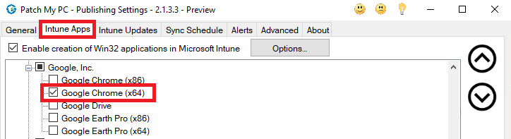
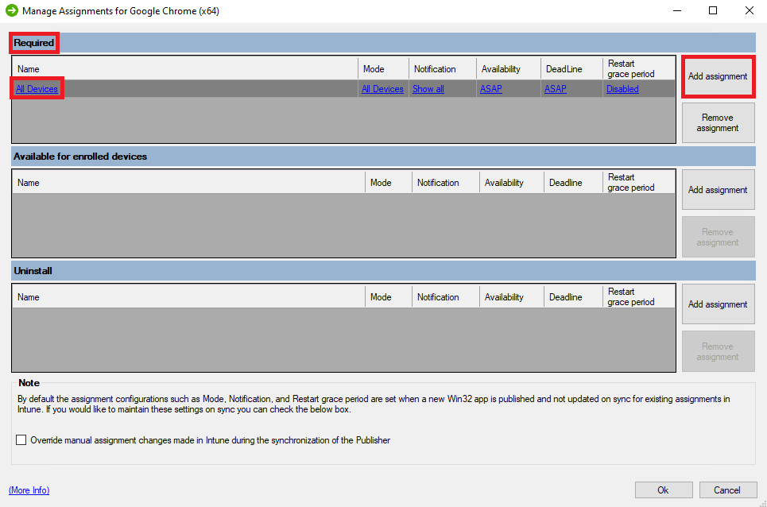
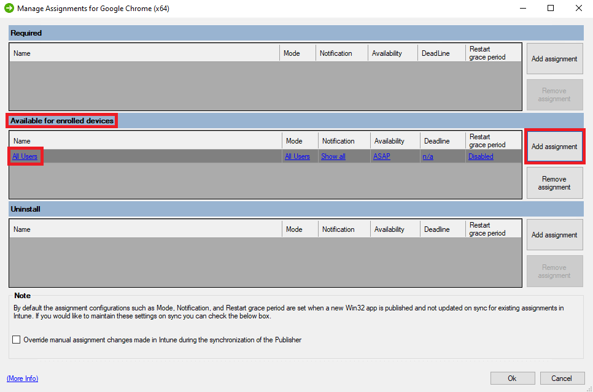
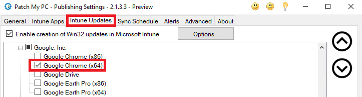
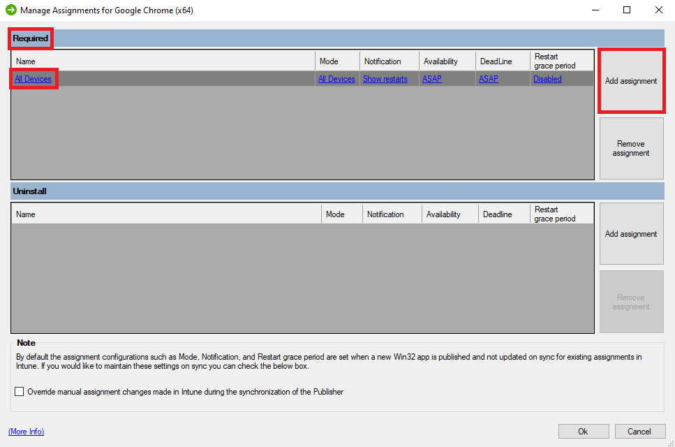

This article will detail when to use Intune Apps or Intune Updates and the relevant assignments for each.

## Intune Apps & Intune Updates - What's The Difference?

When talking about Intune Apps & Intune Updates in the Patch My PC Publisher there can be some confusion around when to use 1 or the other or both.

For this article, we will look specifically at Google Chrome x64 as an example.

When talking about Intune Apps I am referring to any Products selected under the Intune Apps tab in the Publisher and when talking about Intune Updates I am referring to any Products selected under the Intune Updates tab in the Publisher.

The main difference between Intune Apps and Intune Updates lies in what you are hoping to achieve and cover 2 different scenarios below.

## Scenario 1 - Required Apps

In Scenario 1, We want to ensure that all of our devices have Google Chrome x64 installed and always kept updated with the most recent version.

To achieve this, We want to select the **Intune App** for Google Chrome x64 and set our assignments to **Required** on **All Devices**

With this assignment set, Any time a device checks in it will evaluate the following

- If Google Chrome x64 isn't installed, The device will pull down and install Google Chrome x64

- If Google Chrome x64 is installed but requires an update, The device will pull down and install the most recent version of Google Chrome x64

## Scenario 2 - Available Apps & Required Updates

In Scenario 2, We want to make Chrome available to our users to install from the Company Portal but remain in control of keeping it up to date should they decide to install it.

To achieve this, We want to select the **Intune App** for Google Chrome and set our Assignments to **Available** to **All Users**

With this assignment set, Google Chrome will appear in the Company Portal for your users to install should they want to.

Once we have this assignment set, We want to select the **Intune Update** for Google Chrome and set our **Assignments** to **Required** on **All Devices**

With this assignment set, Any time a device checks in it will evaluate the following

- If Google Chrome x64 is not installed, Do nothing

- If Google Chrome x64 is installed and requires an update, The device will pull down and install the most recent version of Google Chrome x64

> **Note:** You can find more information on Managing Intune Assignments here - [Manage Assignments](https://patchmypc.com/custom-options-available-for-third-party-updates-and-applications#ManageAssignments)
