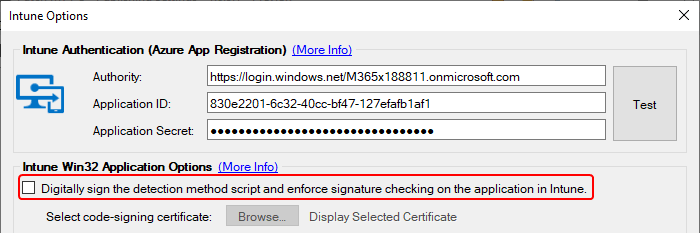

# Intune Policy Limit Considerations

In this article, we will discuss the existing limits on Intune Policy as it relates to Win32 application assignments. With these limits in mind, we can better plan the deployment of Intune Applications and Updates.

* [Identify If You Are Hitting Policy Size Limit](intune-policy-limit-considerations.md#topic1)
* [Reducing Policy Size](intune-policy-limit-considerations.md#topic2)

### Identify If You are Hitting Policy Size Limit

For most of our customers, the policy size limit will not be an issue. The policy for the Win32 applications in Intune includes the PowerShell Detection and Requirement scripts for the application. **The more applications you have assigned to any given device, the larger that policy will be**.&#x20;

The most immediate affect of exceeding the policy limit is **the client will stop processing application policies from Intune**.

To quickly identify if you are running into policy size limits you can check the two logs below.

* %ProgramData%\Microsoft\IntuneManagementExtension\Logs\IntuneManagementExtension.log
* %ProgramData%\Microsoft\IntuneManagementExtension\Logs\IntuneManagementExtension.lo\_

Within these logs, you can look for a line that starts with the below snippet.

Failed to get the app policy from service, exception is System.ArgumentException: Error during serialization or deserialization using the JSON JavaScriptSerializer. The length of the string exceeds the value set on the maxJsonLength property...

It is likely a large Base64 encoded JSON payload will be shown as well, such as below.

> **Note:** If you are hitting the policy limit the client will not be able to process application assignments.&#x20;

### Reducing Policy Size

There are a few options to consider when you need to reduce the total policy size your clients receive from Intune.&#x20;

#### Applications vs. Updates

The largest part of any given Win32 application's policy is the scripts associated with it. For the Win32 Applications, this will be the **Detection Script**. For the Updates that the Publisher creates there will be a **Detection Script** and a **Requirement Script**. Because the Updates have two scripts they will inherently consume more space in the policy payload.&#x20;

#### Code Signing

Within the Publisher the option to '**Digitally sign the detection method script**...' is provided as shown below.

When a script is digitally signed it will **add approximately 10kb to the total script size**. This does not seem like a lot, but for Intune Policy this is a very significant amount of overhead. Keeping in mind that **Intune Updates will have policy containing two scripts** when these are signed the policy per-app increases by approximately 20kb.&#x20;

> **Note:** In our testing, a device was able to have **80-90 Intune Updates assigned** without hitting the policy limit while having code signing enabled. With code signing disabled a device could have **over 300 applications assigned as Intune Updates** without hitting the policy size limit.

### Number of Assignments

With code signing, and the type of Win32 Application in mind the final consideration is the number of assignments. **The larger the number of assignments to any given device the larger the policy will be for that device when it requests it from Intune**.&#x20;

The business will need to determine their security requirements around code signing, and what applications they desire to update. The Publisher does have an [Intune Scan Tool](https://patchmypc.com/scan-intune-for-supported-products) that can assist in identifying products that exist on your Intune managed devices, but it does have limitations based on what is available via Microsoft Graph such as only MSI based applications being inventoried.&#x20;

Alongside identifying what software your devices have, you can leverage tools like [Microsoft Defender Advanced Threat Protection](https://docs.microsoft.com/en-us/windows/security/threat-protection/microsoft-defender-atp/microsoft-defender-advanced-threat-protection) to identify known vulnerabilities and CVEs on your devices. This can provide a good pointer to applications which should be updated.
