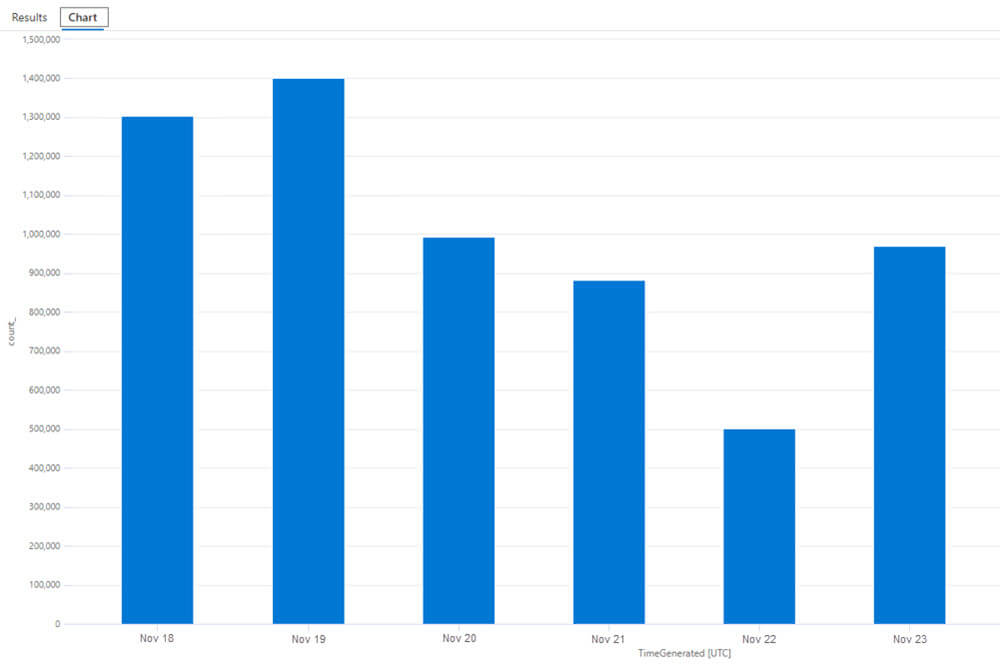

Azure Sentinel is a powerful security information and event management (SIEM) platform, but as organizations scale, large amounts of data can quickly lead to high operational costs.

For Intune customers using the Defender XDR Connector with Azure Sentinel, a common cause of excessive event ingestion is Win32 App Detection and Requirement scripts. These scripts are evaluated every 24 hours on each device for required apps. This frequent evaluation can lead to a significant increase in event volume, especially when targeting large numbers of devices with several hundred Intune Win32 app update policies.

## Determine if You are Affected

The **DeviceProcessEvents** and/or the **DeviceFileEvents** table can become noisy due to script executions by Intune Management Extension (IME). Specifically, events related to the execution of detection and requirement scripts.

Win32 app detection and requirement scripts are all handled by the IME process **AgentExecutor.exe** which, in turn, invokes powershell.exe.

You may see excessive events when you run the following query agains the **DeviceProcessEvents** table.

```
DeviceProcessEvents | where InitiatingProcessFolderPath != "C:\Program Files (x86)\Microsoft intune management extensionagentexecutor.exe"
```




A useful KQL query to understand the extent of these invocations and recorded entries against the DeviceProcessEvents table can be found below.

> **Note:** This example data does not reflect the issue outlined in this KB.

```
let TotalCount = toscalar(DeviceProcessEvents     | summarize Total = count());DeviceProcessEvents| summarize Count = count() by bin(TimeGenerated, 7d), InitiatingProcessFolderPath| extend Percentage = round(100.0 * Count / TotalCount, 2)| sort by Percentage desc
```


## Workaround

Azure Sentinel provides the ability to apply data transformations directly in the Log Analytics Workspace to customize data ingestion and processing. The following steps outline how to apply transformations to specific tables to exclude events related to the Intune Agent Executor.

> **IMPORTANT**
> 
> Applying transformations to tables to exclude certain events may have **serious security implications**. While transformations can help reduce noise and lower the cost of Azure Sentinel, they also **permanently exclude data before it is ingested**. Once excluded, the events are **irrecoverable**, which means they cannot be used for **future analysis**, **threat hunting**, or **incident investigation**.

Ensure you carefully evaluate the impact of any exclusions, and consult with your security team before applying transformations.

1\. Log in to the Azure Portal.

2\. In the search bar at the top of the portal, type **Log Analytics workspaces** and select it from the results.

3\. From the list of workspaces, locate the Log Analytics Workspace associated with your Azure Sentinel instance.


4\. From the left-hand menu, under Settings, click on **Tables**.

5\. Use the search bar to find the **DeviceProcessEvents** table.


6\. Click on the ellipsis (...) and select **Create transformation**.


7\. Select **Create a new data collection rule**.


8\. Select the desired **Subscription** and **Resource Group** to create the data collection rule in. Enter a **Name** for the rule and click **Done**.


9\. Click **Next**.

10\. Click **Transformation Editor** and enter the following KQL query in the window.

```
source
| where InitiatingProcessFolderPath != "C:\Program Files (x86)\Microsoft intune management extensionagentexecutor.exe"
```

Ensure the query **Runs** (copying and pasting from Wordpress can result in incorrect ASCII chars being pasted) and then click **Apply**.


11\. Click **Next** and on the summary review screen, click **Create**.

**Note:** You can find data collection rules used on table transformations by navigating to **Agents > Data Collection Rules** from the Log Analytics workspace.


> **NOTE  
> **  
> While transformations themselves don't incur direct costs, some scenarios can result in additional charges, as per:- [https://learn.microsoft.com/en-us/azure/azure-monitor/essentials/data-collection-transformations#cost-for-transformations](https://learn.microsoft.com/en-us/azure/azure-monitor/essentials/data-collection-transformations#cost-for-transformations)
> 
> Fortunately, if Azure Sentinel is enabled for the Log Analytics workspace, **there's no filtering ingestion charge regardless of how much data the transformation filters**.

### Additional Event Savings

If you are seeking additional savings, it might also be worth understanding if you can apply transformations to other tables. Specifically, montiroing whenthe IME creates detection scripts on disk might not be of value but it can result in large event data when targetting hundres or thousands of required apps to devices.

DeviceFileEvents |  
where FolderPath !startswith "C:\\Program Files (x86)\\Microsoft intune management extension\\content\\detectionscripts"

## Summary

Applying transformations to tables can effectively reduce costs by filtering out unnecessary events, such as those generated by the Intune Management Extension (IME), which can be excessively chatty when evaluating scripts for required Win32 apps.

These transformations permanently exclude the filtered events before ingestion, making them unavailable for future analysis or investigation. To avoid unintentionally filtering out critical security data, it is essential to thoroughly test and understand the transformation's impact before applying it.

Always consult with your security team to ensure that the exclusion does not adversely affect security monitoring or compromise your business compliance requirements.
