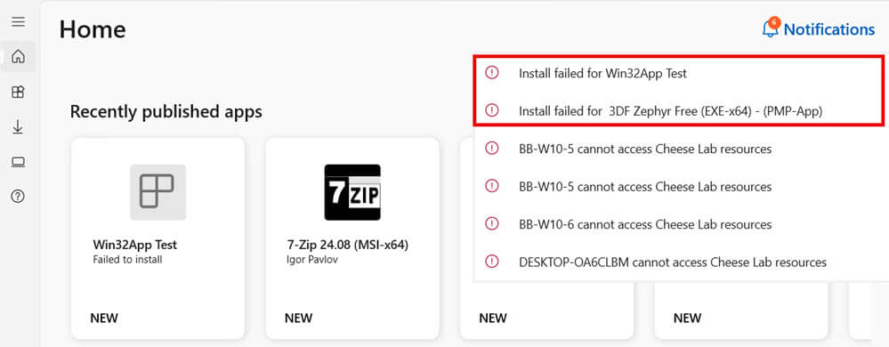
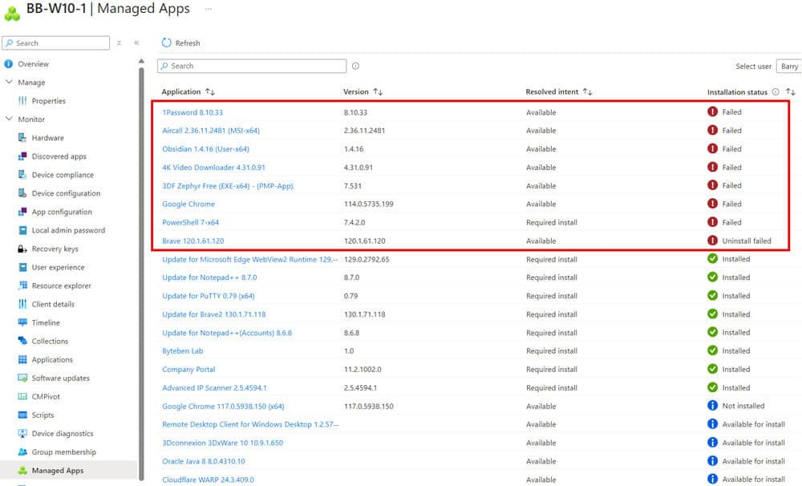
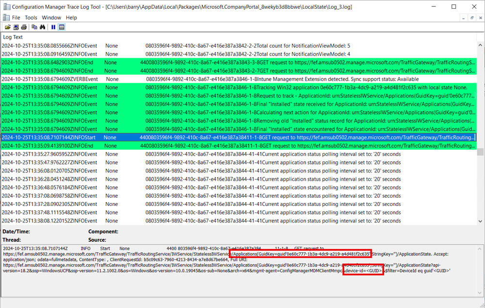
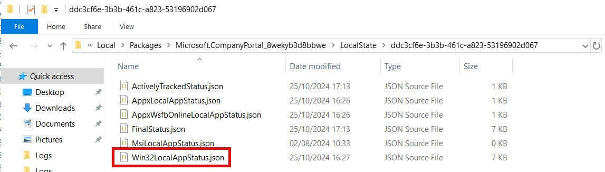
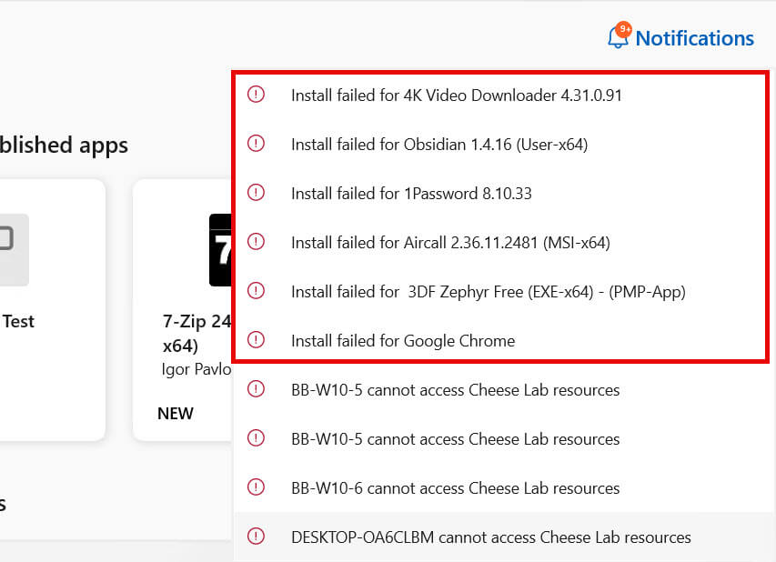

The Company Portal app communicates with Microsoft Intune using an IME (Intune Management Extension) bridge to manage app deployments and status reporting. When a user initiates actions like installing or uninstalling an app through the Company Portal, the app triggers calls to the Intune service to request app status updates based on both the User GUID and Device GUID. This setup enables the Company Portal to align the app’s displayed status with Intune's reported state.

Sometimes, the Company Portal doesn’t always reflect the real-time state of the apps on the device accurately for the logged in user.

## Determine if You are Affected

You will see that the Notifications displayed in the Company Portal app do not reflect the status of the apps in the Intune Admin Centre.

In this example, we only see **2** app related issues being notified (the other errors shown are related to device compliance for other devices belonging to the user).



But our expectation is there should be more. In your case, you might be expecting fewer, or no errors in the Company Portal at all.

We can see there are **8** related app install issues for this device.



## Workaround

The Company Portal periodically requests updated app status reports from the Intune service after each action (e.g. install, uninstall). It tracks the app status by requesting reports for the Intune enrolled device. 



However, the notifications shown in the Company Portal do not always match the actual state of applications on the device. This discrepancy is largley due to stale Win32 app reporting data cached in the user profile for the Company Portal.

Deleting a specific JSON files in the user's profile proves an effective workaround to the problem. This action forces the Company Portal to re-query Intune for updated app status data the next time it is launched, resulting in a more accurate display of the app states.

The JSON file is located here for each user profile on the device:

```
C:\Users\AppData\LocalPackages\Microsoft.CompanyPortal_8wekyb3d8bbweLocalState<>
```



**Delete** the file **Win32LocalAppStatus.json** and **re-open** the Company Portal.

The Company Portal should now show the correct notifications. In this example, it is displaying more errors - which is expected for this device.



> **Note:** Since the Company Portal tracking and reporting functions are proprietary to Microsoft Intune, the underlying processes remain outside direct control of Patch My PC.
> 
> If this issue persists, consider logging a support case with Microsoft.
