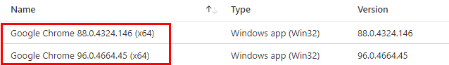
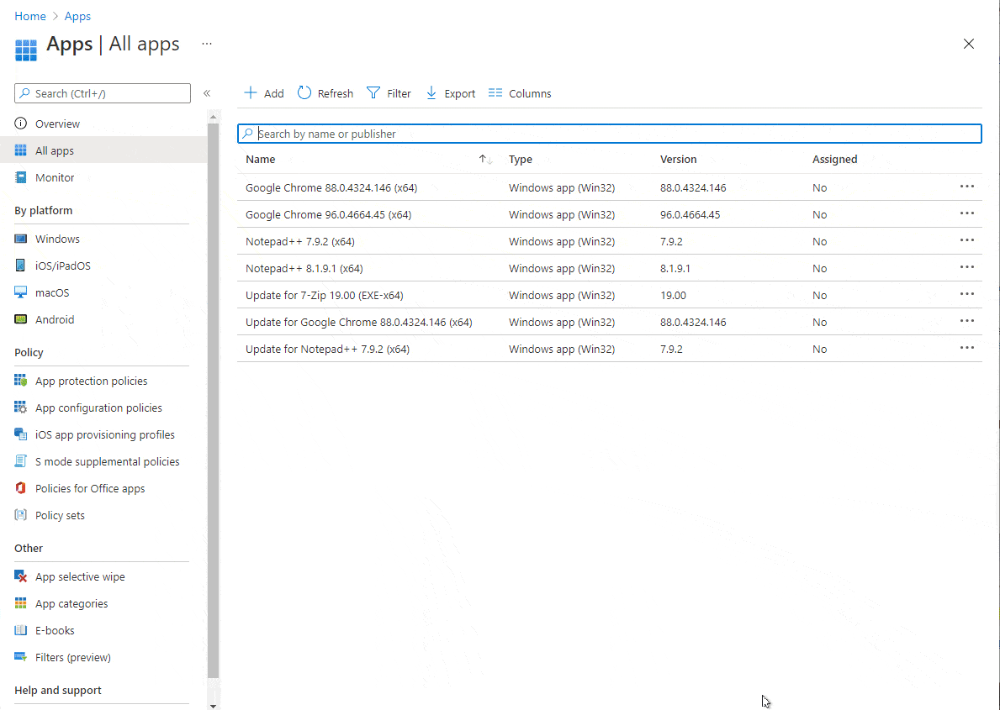
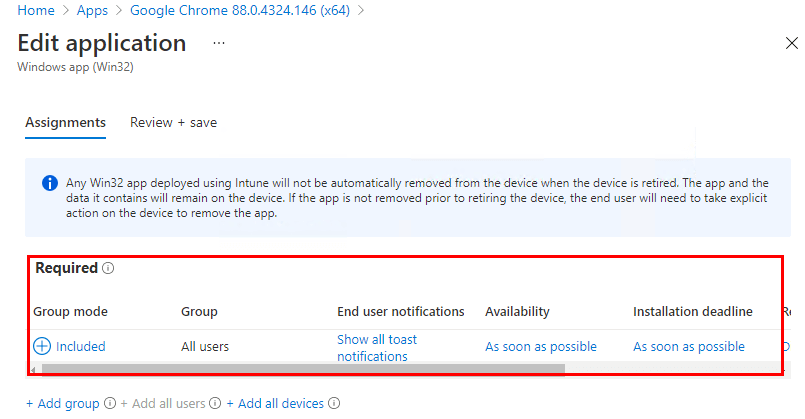
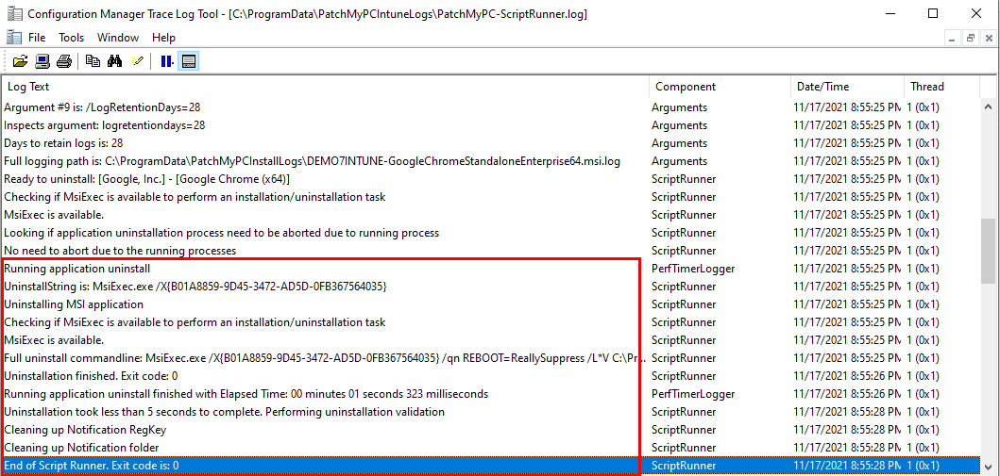
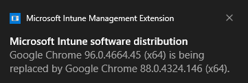
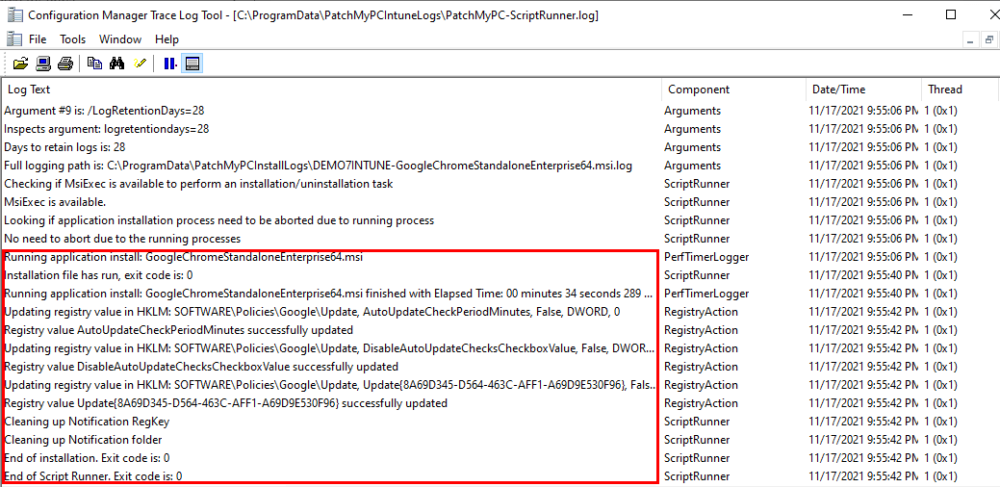
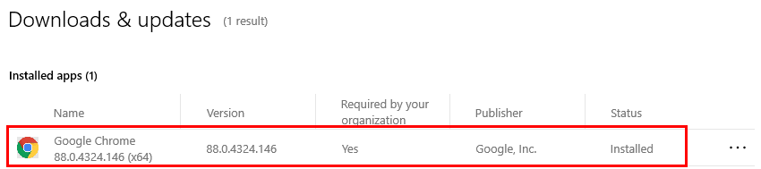
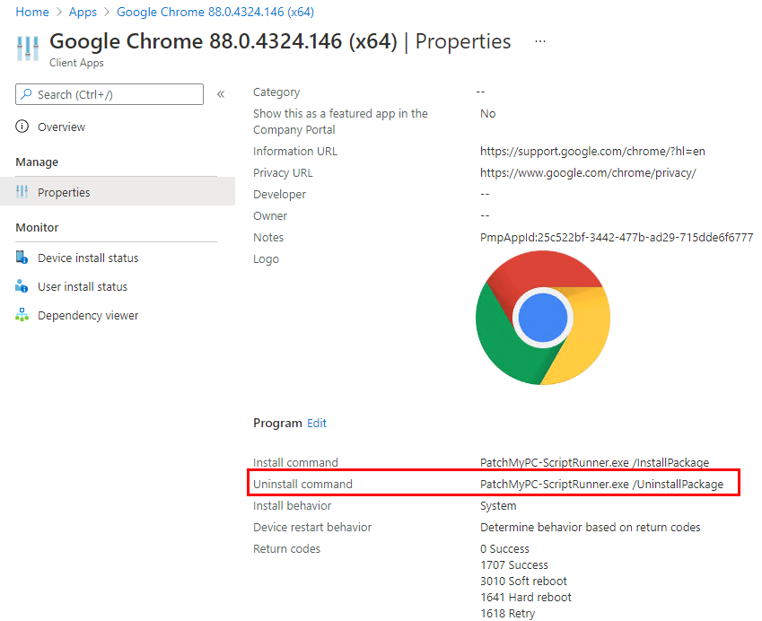
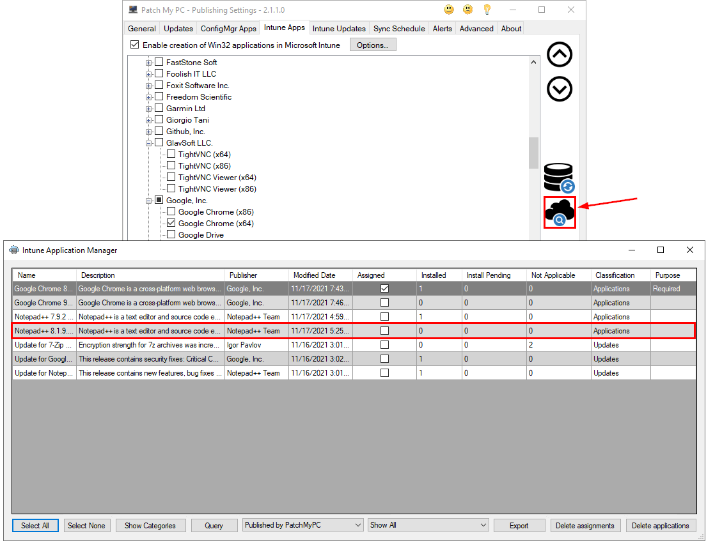
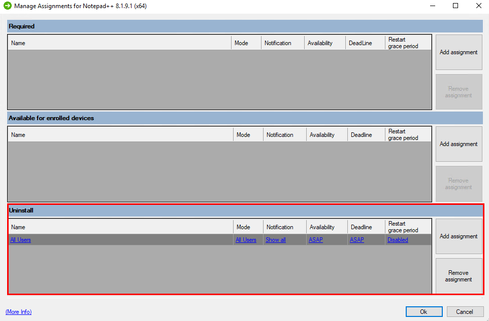

This article describes how to **rollback/uninstall a third-party update in Intune**. We get asked: _how do I rollback a third-party update if there are issues in my environment?_ This guide will describe your options and some limitations that exist.

## How to Rollback a Third-Party Update to a Previous Version in Intune

To rollback a third-party software update, you can use [**Win32 app supersedence**](https://docs.microsoft.com/en-us/mem/intune/apps/apps-win32-supersedence) in Intune to **revert an application to a previous version.** At the time of writing this article, this supersedence feature for Intune is in public preview.

In the example below, we will show how to **revert Google Chrome 96.0.4664.45 (x64)** to **Google Chrome 88.0.4324.146 (x64)**. To perform a rollback, you will need to have an application you want to rollback to as well as the version you want to revert from (the update that was installed).

> **Note:** Previous application versions may not be available from Patch My PC if you do not have the retain options enabled in the [Intune Options](https://patchmypc.com/intune-application-creation-options) window. 

> **Note:** If you have any required assignments for the application you want to uninstall, you will want to remove the assignments so that the rolled back version is not re-installed. 

To revert to an older version, go to the **properties** of the application you want to revert to and perform the following actions: Click the **Edit** next to the **Supersedence (preview)** option > click **Add** > Select the **latest application** you want to uninstall > Select **Yes** under **Uninstall previous version** > Click **Review + Save** > Click **Save**.

You can now deploy the application you want to revert to with a [required assignment](https://docs.microsoft.com/en-us/mem/intune/apps/apps-win32-add#step-7-assignments). The required assignment will automatically uninstall the latest update before the rollback to the previous version. It may take some time for the policy to hit your devices and for the full rollback to complete.

In our example we added a required assignment in Intune to our **All Users** group.

On our client machine, after the policy hits, we can take a look at our **PatchMyPC-ScriptRunner.log** and see when it uninstalled the application that will be superseded.

If you set the options to **Show all toast notifications** for your assignment, you should also see a notification similar to the one below.

In my case, it took about an hour for policy to hit on the client machine. We can view the **PatchMyPC-ScriptRunner.log**  to view when that installed.

The installation can also be confirmed in the **Download & Updates** section in **Company Portal**.

**Note:** After the superseded role is applied, you will need to either delete the supersedence relationship from the app you reverted to or delete the app completely from Intune. Since we cannot update the dependencies or supersedence relationships for the Win32 apps, we won't be able to delete the application when an updated version is available. 

## Perform an Uninstall of a Third-Party Application in Intune

If you want to remove a third-party **application entirely**, you can use an **Uninstall Assignment** to a user group you are targeting. Almost all Win32 apps created by Patch My PC will have the **uninstall command.** 

In the example below, we will demonstrate how to **uninstall Notepad++ 8.1.9.1 (x64)** with the [Intune Application Manager](https://patchmypc.com/intune-application-manager-utility) in our Publisher.

To uninstall the application, open the Intune Application Manager in the Publisher > double-click on the application you want to uninstall.

Remove any previous assignments for that app and then add an **Uninstall assignment** to the user group you want to target > Select **OK**. This will update the assignment for the Win32 app in Intune and depending on the deadline you set, it will perform the uninstall.

