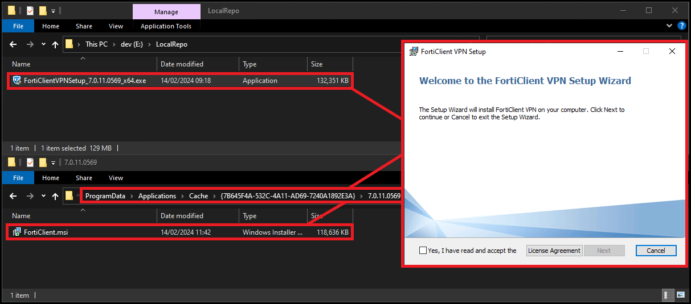

> **Update 27/11/2023: Fortinet have removed the free download link for v7.0.x. This version now requires a support contract with Fortinet to access. [More info](#v7.0.x)**

- [FortiClient VPN MSI Latest](#7.2MSI) 

- [FortiClient VPN EXE 7.0.x, 7.2.x, 7.4.x & Latest](#7.2EXE)

- [FortiClient VPN 7.0.x, 7.2.x & 7.4.x MSI](#7.0MSI)

## FortiClient VPN MSI Latest

In this article, we will detail how to get the MSI required for the **FortiClient VPN Latest (MSI-x64)** product in our catalog.

Currently, this product uses an "**online installer**". These type of installers are generally **"stub" installers**, where they **download the real software installer from the Internet prior to starting the installation**. Today, **we cannot directly support online installers** in our catalogue as they **aren't reliable** and **[invalidate our security measures](https://patchmypc.com/deep-dive-into-security-validation-of-third-party-software-updates-in-microsoft-sccm)**. Therefore the steps in this article are necessary to support this product.

These steps cover the process of downloading the online installer, extracting the MSI and placing the MSI in the [Patch My PC Publisher Local Content Repository](https://patchmypc.com/local-content-repository-for-licensed-applications-that-require-manual-download).

### Download the Installer

The Forticlient VPN **requires a manual download.** Browse to [Download Forticlient VPN](https://www.fortinet.com/support/product-downloads), find the product and download it. 

The product we are looking for specifically, is highlighted below:

### Extract the Installer and Grab the MSI

Once you have the online installer downloaded, you will have to extract it.

Running the **FortiClientVPNOnlineInstaller exe** will present you with a popup showing the download progress:

Once the download is finished, the installer will launch. Leave this open in the background for now.

With the installer open, navigate to **%ProgramData%\\ApplicationsCache**

Copy the MSI file you see here and place it in your [Local Content Repository](https://patchmypc.com/local-content-repository-for-licensed-applications-that-require-manual-download) set in  the Patch My PC Publisher Advanced tab:

## FortiClient VPN EXE v7.0.X, v7.2.X, 7.4.X & Latest

In this section, we will detail how to get the EXE required for the **Forticlient VPN 7.2.x & Latest (EXE-x64)** product in our catalog.

The download for FortiClient VPN EXE 7.2.x EXE requires a support contract with Fortinet. Provided you have one, you can login here to access the download.

https://support.fortinet.com/Download/FirmwareImages.aspx

Ensure you select the product titled **FortiClient**

Once download, Copy the file into your [Local Content Repository](https://patchmypc.com/local-content-repository-for-licensed-applications-that-require-manual-download) set in the Patch My PC Publisher Advanced tab

## FortiClient VPN MSI v7.0.x, 7.2.x, 7.4.x

In this section, we will detail how to get the EXE required for the **FortiClient VPN 7.0.x (EXE-64)** product in our catalog.

The download for FortiClient VPN EXE 7.0.x requires a support contract with Fortinet. Provided you have one, you can login here to access the download.

https://support.fortinet.com/Download/FirmwareImages.aspx

Ensure you select the product titled **FortiClient**

To acquire the MSI

1. Download the latest EXE installer (Pictured below)

3. Launch the EXE installer

5. Browse to %ProgramData%\\ApplicationsCache

7. Copy the FortiClientVPN.MSI to your **[local content repository](https://patchmypc.com/local-content-repository-for-licensed-applications-that-require-manual-download)**, set in the Patch My PC Publisher Advanced tab.  
    **Note**: The MSI file name has changed from Forticlient.msi to ForticlientVPN.msi

> **Note:** This process will need to be carried out **for each new version of the Forticlient VPN Online Installer**.
