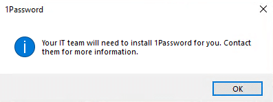
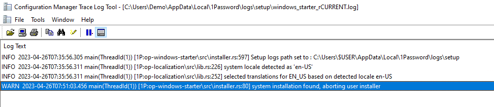

During the installation of 1Password, despite it being done silently, the user receives this message and the installation doesn't complete:

> Your IT team will need to install 1Password for you. Contact them for more information.

## The cause of this issue

This issue appears when the installation of 1Password is attempted using the user-based installer (EXE) while a previous version is already installed which was installed using the system-wide installer (MSI).

If you navigate to **%localAppData%\\Local\\1Password\\logs\\setup** and open the **windows\_starter\_rCURRENT.log** file, the following warning will be displayed:

## Resolution

Ensure you are deploying the system-wide version of 1Password. Another solution would be to deploy the software as an **update**, as it will only apply if an older version of the corresponding installer is present on the device.
