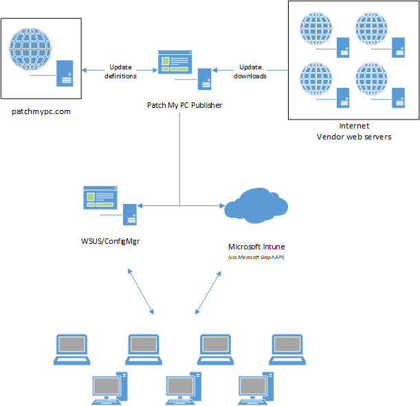
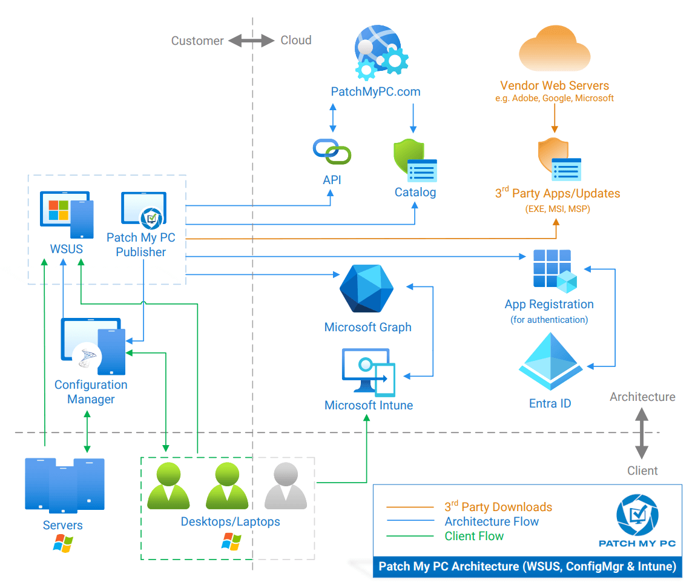

We understand IT security is an extremely critical aspect of organizations.  IT Security is probably more vital to your organization than the industry on average considering you are actively looking into a third-party patch management solution to help reduce vulnerabilities.

We often get asked how we validate the integrity of the [third-party updates](/supported-products) included in our catalog. This question is crucial for you to understand. In this post, we will describe in detail the procedures we take to ensure the quality and integrity of the patches we publish in our third-party software update catalog.

## Step 1: Creating Third-Party Updates and Storing the Hash

The first step in our process for creating an update is to **download** the update binary (**EXE, MSI, or MSP**) from the official vendor's download mirror. This update binary will be the file executed on client computers to update the product. The original **hash** of the binary and **download URL** is stored in our catalog metadata. The **download URL** is what will be used when downloading and publishing the update within your environment.

Whenever we add new updates to our catalog, the **catalog metadata** gets exported and **saved into a CAB file**. This catalog (.CAB) is imported into your environment and used to publish updates. To ensure the integrity of the catalog when downloaded and import to your environment, we **dual code-sign the catalog file** with our code-signing certificate. When the catalog gets downloaded in your environment, the import will only occur in our publishing service, SCCM 1806+, or SCUP if the catalog is code-signed from a **trusted publisher**.

## Step 2: Running the Update Installer Through VirusTotal

Once we obtained the vendor's **binary** and file **hash**, we then will then **upload** the binary to **[VirusTotal](https://www.virustotal.com/)**. VirusTotal will analyze the binary file through 55+ anti-virus engines. Here's an example of the **Slack 3.3.1.0 MSI** binary file from **Step 1**.

We post all VirusTotal results for any third-party updates released in our **[RSS feed](https://patchmypc.com/category/scupcatalogupdates/feed)** and [Catalog Release newsletter](https://patchmypc.com/scup-catalog-newsletter-signup).

> **Note:** VirusTotal has a 650MB limit for file uploads, therefore, Patch My PC is not able to scan updates larger than 650MB with VirusTotal.

## Step 3: How Update Binaries are Verified During Publishing

Before the catalog metadata is evaluated for publishing, there is a **digital signature check** on the downloaded catalog file. This check validates the catalog is signed from Patch My PC.

Once the catalog is **validated**, only then will the catalog metadata be evaluated for processing. Since we don't control the [servers used for content downloads](/list-of-domains-used-for-downloads-in-patch-my-pc-update-catalog), it's essential to ensure the file downloaded from the vendor's website is the **exact same file used when initially creating the update** that went through the VirusTotal scans. When an updated binary is downloaded, we will compare the **hash** of the **downloaded binary** with the **hash from the catalog** and only publish the update if they match.

## Step 4: Trust Within Your Environment

The final layer of trust for third-party software updates before client-side installation is **between your servers and clients**. Whenever third-party updates are published to your WSUS environment, they are added into a CAB file that gets **digitally signed** using the code-signing certificate that you configure within your environment. Client devices will only install third-party patches that are signed using a trusted certificate that you have configured and deployed to your devices.

## Dataflow Diagram for Update and Application Downloads

Below you can find a **dataflow diagram** of the download flow.

A full list of the vendor website can be found at [List of Domains for Whitelisting when Using Patch My PC’s Catalog](/list-of-domains-used-for-downloads-in-patch-my-pc-update-catalog)

**Detailed dataflow**

If you have any more detailed questions about our security testing, please visit our [Security Center](https://patchmypc.com/security/).
