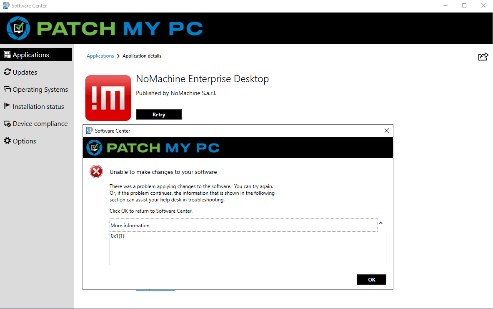
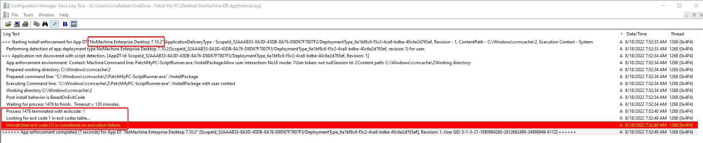
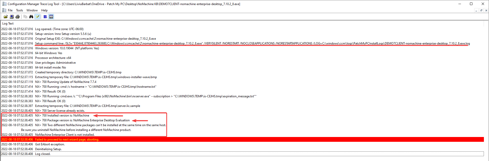

The installation of NoMachine Enterprise Desktop installation fails when an older version is installed.

## Determine if You are Affected

The installation might fail when an update is attempted on a device with an older version of NoMachine using a ConfigMgr base application or an IntuneApp.  
If the older version of NoMachine is the **free version** and not the **Enterprise** version, then the install will fail.  
The installation will fail with **Exit Code 1**.

Also, if we investigate the **AppEnforce.log** file, it will show us the same exit code:

Finally, if the [Right click customization](https://patchmypc.com/custom-options-available-for-third-party-updates-and-applications) option to enable additional, vendor verbose installation logs - [Manage installation logging](https://patchmypc.com/custom-options-available-for-third-party-updates-and-applications#install-logging) - is enabled, the vendor log will show the exact cause of the failure:

## Resolution

The resolution would be to make sure  that the **Free Version** of NoMachine is uninstalled before the **Enterprise Version** is installed. We recommend one of these options:

1. Supersede with uninstall:
    1. Deploy the update of the **Free Version** to that device to make sure the latest version of the Free edition is installed.
    
    3. Create the **ConfigMgr app** / **IntuneApp** for the Free Version.
    
    5. Edit the **Enterprise Edition** of NoMachine and set it to **supersede with uninstall** the **Free Version**.
    
    7. When NoMachine Enterprise Edition will install, the Free Version app will run first to uninstall it, and once complete, the Enterprise Edition app will run the install.

3. Use a custom script to uninstall the Free Version.
    1. Use the Right-Click customization option to [Manage custom pre/post scripts](https://patchmypc.com/custom-options-available-for-third-party-updates-and-applications#custom-scripts).
    
    3. Create your own script to uninstall the Free Version of NoMachine and use that as a custom **PreInstall** Script for **NoMachine Enterprise Desktop**.
    
    5. The [Uninstall-Software.ps1](https://github.com/PatchMyPCTeam/Community-Scripts/tree/main/Uninstall/Pre-Uninstall/Uninstall-Software) script we offer to the community can be used to uninstall a software based on it's DisplayName.
