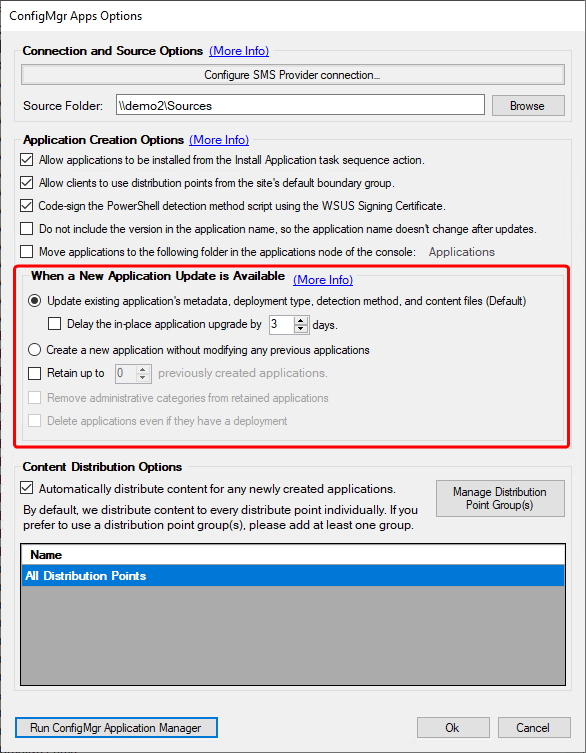

# When New Application Update Available

In this article, we will explain the options available when an **application update is available**. This information will help clarify the functionality of some of our base install options, which are highlight below.

### Option 1: Update existing application's metadata, deployment type, detection method, and content files (Default)

When this option is selected, the Patch My PC Publisher will automatically update the various pieces of metadata associate with the application, as well as the content files themselves. The metadata that will be updated is:

* **Title:**
  * Based on customer settings, such as not including the version, or custom application name
* **Version:**
  * Updated to reflect the new version synchronized from the catalog
* **Detection Method:**
  * PowerShell based detection method updated to ensure the new version is detected
  * The script will be re-signed based on customer settings

Alongside this metadata, the content itself will be updated. This means the binaries for the old version of the application will be removed, and the new binaries will be copied to the application source directory. Once complete, the Publisher will trigger a content update on the Deployment Type for the Application or a package refresh if it is a package.

Because we are updating the existing application in this scenario, we have some consideration to keep in mind.

* **Existing Deployments:**
  * If the application which was updated has required deployments then the targeted devices will receive the updated policy on their next Machine Policy refresh, including the new detection method, as we've created an application revision. The result is that machines may run this installation and update the software based off this application deployment. Be aware of this when creating any required deployments of the Patch My PC managed applications.
  * If the application which was updated has available deployments then the targeted devices will be installing the latest available version of these applications which Patch My PC provides when the user selects install.
* **Task Sequences:**
  * If you are referencing these Patch My PC managed applications within a task sequence then you will always be deploying the latest available version of these applications which Patch My PC provides.
* **General Consideration:**
  * We will be performing an 'update content' on these packages and applications. Any requests for this content while it is being refreshed will, of course, fail, stating that content is not available. Be aware of this, especially with task sequences that reference the content. It could be good to coordinate your publisher's sync schedule with your high-traffic imaging days and times.

### When a new version of an application is released, delay the in-place application upgrade by...

When this option is checked _**all**_ applications managed by the Publisher will have their creation delayed by the specified number of days. The delayed date is based on the date the new application version was synchronized by the Publisher.

For example, if Google Chrome was synchronized on February 3rd, and this setting was configured for a 3-day delay, you would expect to see the application be updated in Configuration Manager during a publisher synchronization on February 6th.

This feature will result in a logline similar to the below.

The updating of the SCCM Application... is delayed due to settings

### Option 2: Create a new application without modifying any previous applications

This scenario is much more straight forward. Whenever a new application update is available a new application will be created. The publisher will not take any action on the previously created application versions.

Even with simplicity comes a couple of considerations.

* **Application Sprawl:**
  * If left unchecked this approach could end up leaving tens of application versions per app, or more, in your Configuration Manager environment.
    * Periodically review old application versions and deployments.
* **Task Sequences:**
  * Task sequences that reference Patch My PC managed applications will likely be referencing old versions of the application.
    * Periodically review and update your task sequence references as needed

### Retain up to X previously created applications

Specify a number between 0 and 10 as the number of applications you would like to retain in your environment.

Setting this to the value of 0 would ensure, regardless of what radio option you have set from above, that you only have the latest version of applications in your environment.

Setting the value between 1 and 10, regardless of what radio option you have set from above, would keep that number of revised applications in your environment.

For example, setting it to the value of 1 would mean you would always have n-1 applications for Google Chrome: the latest, and the version prior.

This provides you with the benefit of having access to older versions of applications in your environment, as well as the latest, ready to deploy if you need to roll back your devices to a last known good verison. It also keeps your environment tidy by maintaining a set number of applications.

### Remove administrative categories from retained applications

By default, all administrative categories that are associated with a ConfigMgr application are left intact. **If this option is selected, then all administrative categories are removed from retained applications**. Only the latest published application will have the administrative categories associated with it.&#x20;

One use case for this is ConfigMgr operating system deployment frontends that use administrative categories to populate a list of applications.&#x20;

### Delete applications even if they have a deployment

This is an optional checkbox which only becomes available when you configure the **Retain up to X previously created applications** setting. It controls whether the Publisher can or can not delete applications in the retaining chain with active deployments.

Enabling this option allows the Publisher to delete applications in the chain, even if they have deployments. Leaving this option unchecked does not delete applications in the chain if they have deployments.

> **Note:** The Publisher will not delete an application if it is used in a task sequence, even if you have this option enabled.
