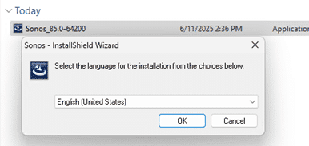
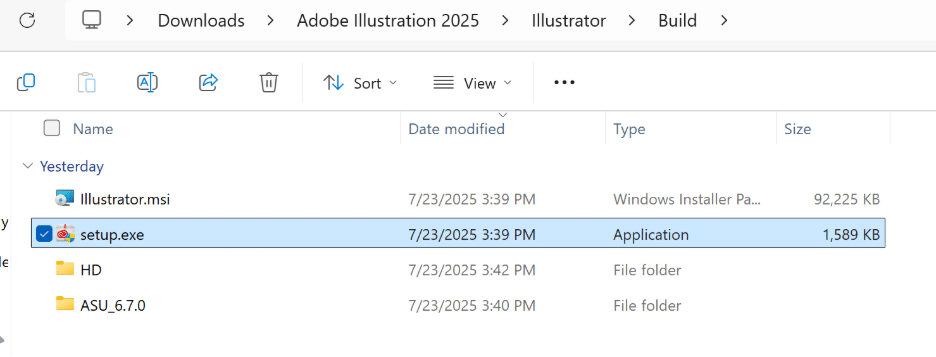
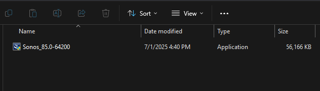
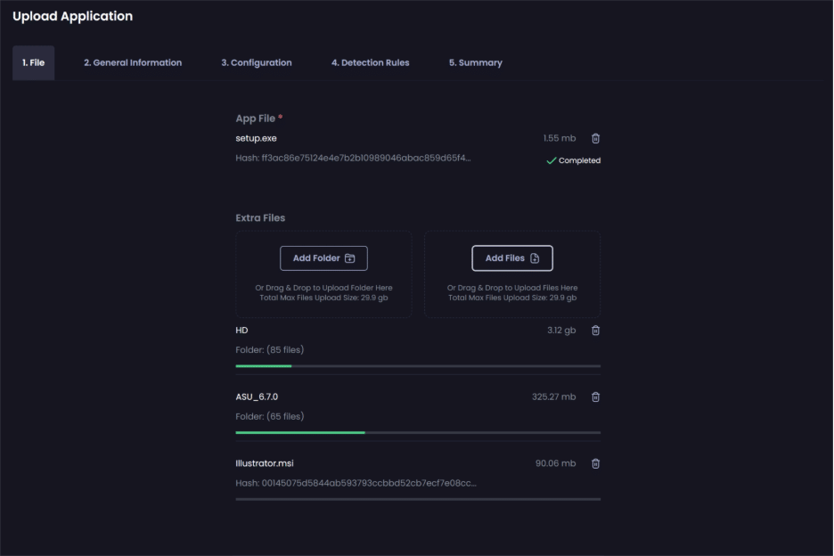
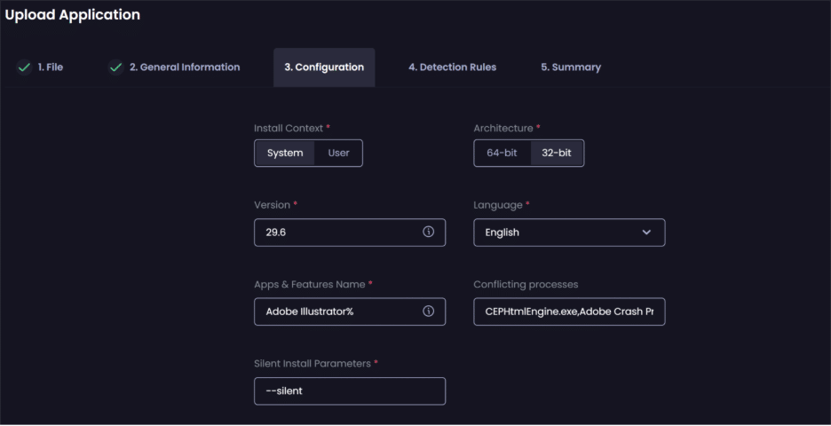

While Adobe Creative Cloud (CC) offers a wide range of products, each with its own configuration and licensing requirements, this flexibility also means that packaging Adobe CC applications for deployment requires careful preparation, especially when accounting for licensing restrictions and customer-specific customizations.

At the time of writing this article, Patch My PC does not provide out-of-the-box packages for Adobe CC products for these reasons. However, Patch My PC customers can use the Custom Apps feature in the Patch My PC Cloud portal to package and deploy Adobe CC applications to Intune or ConfigMgr as managed applications.

In this article, we will show you how you can prepare a package and create a Custom App using Patch My PC Cloud. We will be using Adobe Illustrator 2025 as an example.

## Prepare a package for Adobe Illustrator 2025

Customers must download the correct CC installer from the Adobe Admin console. These installer packages will support silent command line arguments which is a requirement for any custom application uploaded to the Patch My PC Cloud portal. The Adobe Admin Console can be accessed from:-

[https://adminconsole.adobe.com](https://adminconsole.adobe.com)

1. Navigate the Adobe Admin Console and locate and download the installer package for Adobe Illustrator.  
      
    

The **Build** folder contains the files needed to build the custom application. **Setup.exe** will be used as the primary installer file when creating the Custom App in the Patch My PC Cloud portal.  

## Create the Custom App

We now have the necessary files to create the custom app in Patch My PC Cloud.

1. Navigate to [https://portal.patchmypc.com/app-catalog](https://portal.patchmypc.com/app-catalog/upload)

3. Click **Add App**  
    

5. Add the following files and folders:- 
    **App File:** Setup.exe  
    **Folders:** HD, ASU\_6.7.0  
    **Files:** Illustrator.msi  
    

7. Click **Next**.

9. On the **General Information** tab, enter the following information:-
    
    | **FieldData**App IconProvide a suitable icon for the appApp NameAdobe Illustrator 2025VendorAdobeDescriptionAdobe Illustrator is the industry-leading graphic design tool that lets you design anything you can imagine |
    | --- |
    

11. Click **Next**.

13. On the **Configuration** tab, enter the following information:-
     
     | **FieldData**Install ContextSystemArchitecture32-bitVersion29.6LanguageEnglishApps & Features NameAdobe Illustrator%Conflicting processesillustrator.exeSilent Install Parameters--silent |
     | --- |
     

15. In the screenshot below, we have added all conflicting processors identified in the Illustrator MSI but these may not all be strictly necessary for the Conflicting Processes feature.  
       
     _CEPHtmlEngine.exe, Adobe Crash Processor.exe, AIMonitor.exe, AIRobin.exe, AISafeModeLauncher.exe, AISniffer.exe, CRLogTransport.exe, CRWindowsClientService.exe, Illustrator.exe, IllustratorDiagnosys.exe_   
       
     

17. Click **Create**.

> **Important:** You must use the correct **Apps & Features Name** and **Version** for the edition and version of Adobe CC app you are creating as a Custom App. If you do not, the application will fail to be detected after it has installed.
> 
> In the above example, a wildcard is used **%** in the Apps & Features name instead of including the major version number **2025** to ensure all older versions of Adobe Illustrator are applicable for the 2025 update. If the intent is to update the product within its major version, then include the full name in the Apps & Feature Name to ensure more accurate detection. e.g. **Adobe Illustrator 2025**
> 
> Patch My PC recommends to manually install any Adobe CC app to visually check the **Name** and **Version** that should be used when creating the Custom App. This can be done very easily be examining the **Name** and **Version** in the Control Panel after the app has been installed.

## References

[https://docs.patchmypc.com/patch-my-pc-cloud/cloud-deployments/deploying-an-app-using-cloud](https://docs.patchmypc.com/patch-my-pc-cloud/cloud-deployments/deploying-an-app-using-cloud)

[https://docs.patchmypc.com/patch-my-pc-cloud/custom-apps/update-a-custom-app](https://docs.patchmypc.com/patch-my-pc-cloud/custom-apps/update-a-custom-app)
