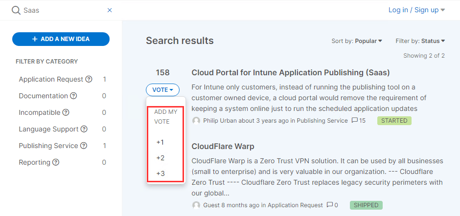

One of our most common questions is the **criteria used** when **adding new products to our catalog or building new features**. In this article, I want to **review the process** myself (Justin Chalfant, Founder) and our engineering team use when evaluating **pending feature and application requests** on our [UserVoice](https://ideas.patchmypc.com/).

## The Basics: We Don’t Know What We Don’t Know

The first step in the process is to ensure we know what **new application** you would like to see added to our **[supported products](https://patchmypc.com/supported-products)** or what **feature** would provide you value. Our goal is **not to have the largest update catalog in the industry** for promotional purposes. Instead, our goal is to have a **list of supported products that provides our customers with the most value**.

If you have a **new application** or **feature request**, the first step is to submit a new feature request on our **[UserVoice (https://ideas.patchmypc.com/)](https://ideas.patchmypc.com/)**. If you don’t submit it here, it’s unlikely your idea will ever be implemented into our product.

Before submitting a new request, you can **search** for the **application** or **feature** you would like to see added.

If you see an **existing feature matching your request**, you should **up-vote** it rather than submitting a new idea. After subscribing to an existing idea, you will receive an **email notification** when there are any status updates.

## How Does Patch My PC Prioritize New Application Requests?

There are multiple factors we take into account when working through the **[submitted application requests](https://ideas.patchmypc.com/?&category=6706577934663942204&sort=popular)**. One of the biggest factors we start with when working through our queue is how many **unique customers** have **subscribed** to a specific application request.

The number of **unique subscribers** does not necessarily mean the largest number of votes. For example, an idea with **10 votes** with subscribers from **8 different companies** would likely be prioritized over an idea with **25 votes** but only **subscribers from 3 different companies**. This is why the most important step is to submit your application request if it’s not already in our **[UserVoice](https://ideas.patchmypc.com/)**.

Once we determine there is a product that would **benefit multiple customers**, the next factors that **impact priority are**:

- How **complex** is the installer?

- Does the installer have a **public download**?

- Is the installer **digitally signed**?

- Is the installer downloaded in **EXE**, **MSI**, or **MSP** format?

- Does the installer support **silent installations**?

- Can the installer **reboot behaviour be controlled or suppressed**?

- Does the installer support **SYSTEM-level installations**?

- Are there any **custom-actions** or **scripts** that need to be run?

We have these requirements because each new product added requires a **large amount of up-front time** and even more time to **maintain all future updates**.

Our goal is to add around **50 new products per month**. In our **[Public Roadmap,](https://patchmypc.com/roadmap)** you can see the recent applications that shipped. Shipped application requests will use the “**New Products**” dark blue tag.

## How Does Patch My PC Prioritize New Feature Requests for the Publisher?

The prioritization of **new feature requests** for our **[Publisher](https://patchmypc.com/publishing-service-setup-documentation)** is very different from prioritizing **new application requests**. The reason for this is simple. For applications, we know the following:

- The upfront engineering time will be about **8+ hours**.

- Maintaining an application that updates often can be well over **40+ engineering hours per year**.

Many requests for features or improvements to our Publisher can be implemented **quickly** and is only a **one-time effort**, unlike new applications.

Since the engineering time can often vary, our criteria for adding features are **less based on the number of unique customers** and more based on the value we think the request could provide. For example, when filtering by **[shipped feature request for the publisher](https://ideas.patchmypc.com/?category=6706577541791499715&sort=recent&status=6706966578454455100),** you will see many features shipped with only 1 vote:

Oftentimes, these lower voted for ideas that are **easier to implement** from an engineering perspective may ship in a **few weeks**. However, there are often **complex** feature requests that may take many subscribers before it’s implemented. For example, the feature request to add support for [Microsoft Intune](https://ideas.patchmypc.com/ideas/PATCHMYPC-I-175) took about **1-year to implement** because it was difficult and took a **massive amount of engineering time**.

## What Does Each Status Mean in the UserVoice Portal?

Each idea submitted will have a **status** associated with it. The status will help you know at what point in the process the idea is in.

Below is an overview of how we define status:

#### SUBMITTED

Submitted is the **default status** assigned to every new idea. This means it’s been submitted, but there hasn’t been any action taken on the request from Patch My PC.

#### NOTED

We use this state to acknowledge this is a **popular request** or a request to **see the value**. We want to **consider any request marked noted for a future update** in our product, but there hasn’t been any engineering work yet.

#### FUTURE CONSIDERATION

We use this status when there is a more **complicated request** that we would like to consider adding in the future.

#### NEED CLARIFICATION

We need **more details** from the person who submitted the request in the comments section to understand the request better.

#### PLANNED

Planned means we **intend to implement this feature in the future**, but we haven’t actively started coding it yet. In the planned status, we also will not generally have an ETA yet.

#### STARTED

Started means our engineering team is **actively coding** the feature.

#### PRIVATE PREVIEW

The feature is available in private preview to specific customers and undergoing internal testing.

#### IN PREVIEW

The feature is available in the latest preview build, which can be enabled in the **About** tab of the Publisher.

#### SHIPPED

The feature is **available in the latest production build** of our Publisher or catalog.

#### NO GO

We will **not be implementing** the feature request.

#### INCOMPATIBLE

The request can’t be added due to **compatibility issues**.

## Takeaway: Please Submit Your Feedback on UserVoice

If you didn’t get this take away from the points above already :), please submit any new application or feature request at **[https://ideas.patchmypc.com/](https://ideas.patchmypc.com/)**.
