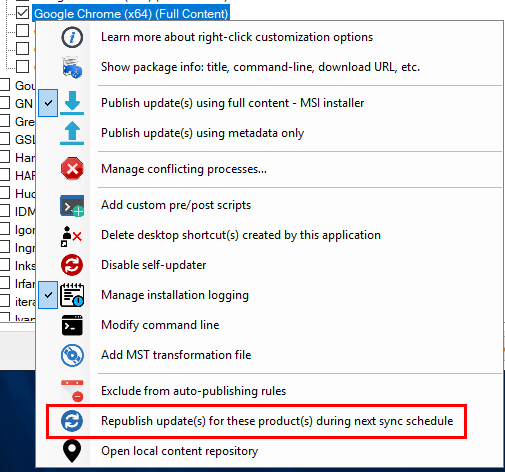
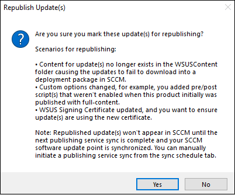
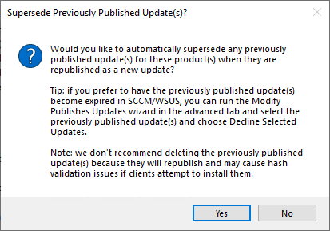
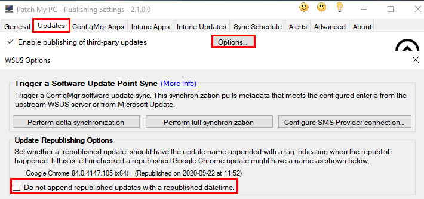
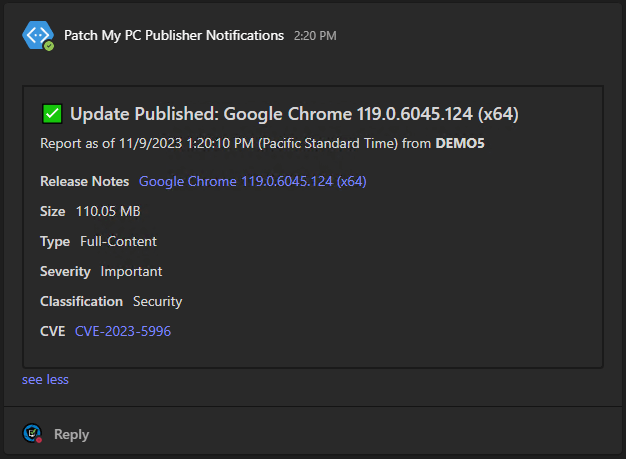

In this article, the topic of republishing non-WSUS updates in Patch My PC will be explained in detail.

## What is Republishing

Republishing an app or update means that the selected app or update(s) content will be **recreated in the assocated management system without changing the object ID**. This means that the app or update will have any new right-click options applied as well as the most up-to-date applicability and detection scripts.

## Why Would an Update Need Republishing

There are four scenarios that would require an update to be republished. Those scenarios, and the reason the republish is needed, are below.

1. A [right-click option](https://patchmypc.com/custom-options-available-for-third-party-updates-and-applications) is used that **adds content to an Intune app or Intune update**
    - [Add custom pre/post update installation scripts](https://patchmypc.com/custom-options-available-for-third-party-updates-and-applications#custom-scripts)
    
    - [Add MST transformation file](https://patchmypc.com/custom-options-available-for-third-party-updates-and-applications#mst-transform)
    
    - Branding/logo changed for [Manage conflicting processes…](https://patchmypc.com/custom-options-available-for-third-party-updates-and-applications#manage-conflicting-processes)
    
    - [Auto close application processes before installation](https://patchmypc.com/custom-options-available-for-third-party-updates-and-applications#close-apps)
    
    - [Skip installation when the application is in use](https://patchmypc.com/custom-options-available-for-third-party-updates-and-applications#skip-install)
    
    - [Delete desktop shortcut(s) created by this application](https://patchmypc.com/custom-options-available-for-third-party-updates-and-applications#delete-shortcut)
    
    - [Disable self-updater](https://patchmypc.com/custom-options-available-for-third-party-updates-and-applications#disable-updates)
    
    - [Manage installation logging](https://patchmypc.com/custom-options-available-for-third-party-updates-and-applications#install-logging)
    
    - [Modify command line](https://patchmypc.com/custom-options-available-for-third-party-updates-and-applications#modify-command-line)

3. Updated detection or applicability rules have been released by Patch My PC
    - This occasionally occurs when Patch My PC revises an update shortly after release, Patch My PC support may ask you to republish an app or update in this case

5. The code-signing certificate has been updated.

## How to Republish Apps or Updates

Once you determine what product(s) meet the criteria described above for requiring a republish operation you can **right-click the product, vendor, or all products level and choose the** '**Republish update(s) for these product(s) during next sync schedule**'

You may be prompted to verify if you want Patch My PC to Recreate Intune assignments for the products selected for republish.

If you select **Yes**, you will be prompted to verify if you want to **supersede the currently published updates** for this product when the new updates are republished. The popup also includes some details on how you can optionally expire those previously published updates.

> **Note:** If you select "**No**" in the above prompt you will **continue to receive warnings** from the Publisher stating that the update could not be revised. To stop these warnings in this scenario you will want to decline the update which is failing to revise using the [modify published updates wizard](https://patchmypc.com/modify-published-third-party-updates-wizard#topic3).

The republishing of the selected updates will occur during the next publishing service sync. You can trigger this sync to happen right away by clicking the **Run Publishing Service Sync** in the **Sync Schedule** tab.

If you review the **PatchMyPC.log,** you should see the updates being republished. Republished updates will have the date appended to the update title here's an example: **Google Chrome 84.0.4147.105 (x64) - (Republished on 2020-09-22 at 11:52)**

Optionally you can use the **WSUS Options** in the **Updates** tab of the Publisher to **disable the appending of the republish tag**. See below for an example of the option. With the checkbox checked republished updates **will not have the republished tag**, but would still supersede old updates if requested.

Once the republishing has completed, the updates will show up in SCCM after the next software update point sync has occurred. You can force a sync to happen by clicking '**Synchronize Software Updates**' in the Configuration Manager Console.

You can monitor the SCCM software update point sync by reviewing the **wsyncmgr.log**. Once the sync is complete, you should see the newly republished update(s) in the console with the date appended as described above. If you choose to **supersede** previously published updates for this product, you will see the previous update(s) as superseded as well as indicated by their [icon](https://docs.microsoft.com/en-us/mem/configmgr/sum/understand/software-updates-icons#superseded-icon), and a 'Yes' in the superseded column.

Note that the update has our appended republish date, and our previous update is now marked superseded.
