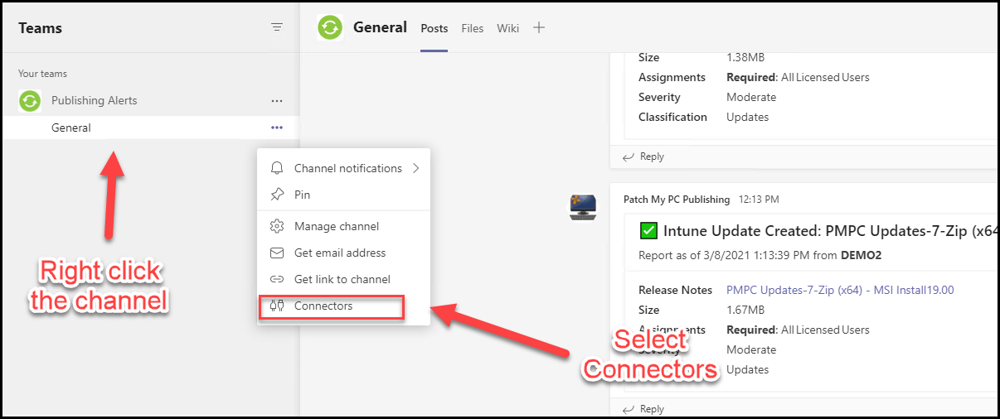

When running an outdated Microsoft Teams webhook, you will receive the alert _**Important: Your connector is running on old configuration. Navigate to connector configuration window to update to new configuration**_. This article will review how to identify an outdated webhook, and if necessary, upgrade your Microsoft Teams webbook connection.

In mid-January of 2021, Microsoft performed an upgrade to provide increased security on incoming webhook URLs. This change was communicated via the messaging center in your Tenant. See the below link.

**[Admin Center Message center: Microsoft Teams connector apps webhook URL security improvement](https://admin.microsoft.com/AdminPortal/Home#/MessageCenter/:/messages/MC234048)**

## Determine if You are Affected

You recently might have seen the following message in Microsoft Teams if you have the Patch My PC or other configured webhooks.

> **Warning Message:** _Important: Your connector is running on old configuration. Navigate to connector configuration window to update to new configuration._

## How to Resolve Warning "_Your connector is running on old configuration._"

If you see this message, you can validate the root cause as an out-of-date connector by browsing the **channel's connectors**.

Once you have opened the **connectors pane** for the channel, you will review your webhooks and other related connectors. Select "**Configured**" from the left-hand side. Then scroll through all your configured connectors until you find the "Incoming Webhook" section. In this section, select "**configured**" to open all of the resources that use the webhook.

If the connections denote "**attention required**", you will need to rebuild the webhook to cause the URL to update.

You will need to find the **webhook** in use for the **Patch My PC service from this list**. Once you find it select **manage** to view the configurable options for the webhook.

Once updated, you will notice the **webhook URL** will change the old prefix of **outlook.office.com** to **{yourdomain}.webhook.office.com**

> **Note:** In the event, the **Update URL** button does not properly regenerate a new URL, then we recommend using the remove option to delete the webhook and [creating a new webhook from scratch](https://patchmypc.com/how-publishing-alerts-work#topic3).

## Valid the Webhook was Updated and Can be Used

To validate the updated webhook works, you can use the **Test** button in the Publisher's **Alerts tab**.

You should see a **test notification** in the channel, and the message shouldn't give the warning that the connector is running an old configuration.

