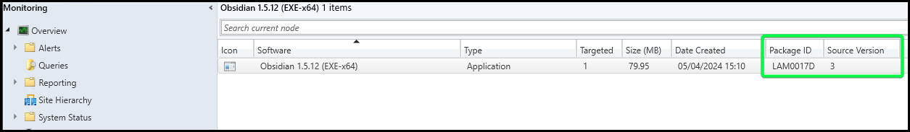
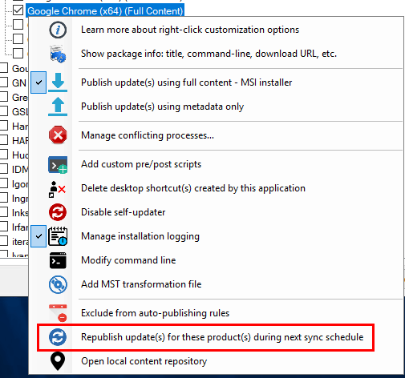
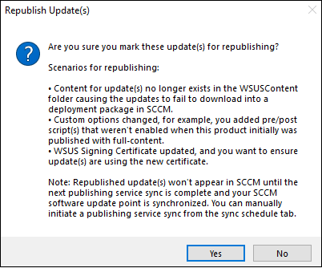

# When How Republish Patch My

In this article, the topic of republishing updates in Patch My PC will be explained in detail.

### What is Republishing

#### WSUS Updates

Republishing an update means the selected update(s) will be **published to WSUS with a new update ID**. This effectively creates an entirely new update. It will appear as a separate item in the WSUS, and in Configuration Manager. More importantly, **the update will have a new content path and content hash**.

As shown below, a republished update will have the name appended with '(Republished on )'.

Within the Publisher, we offer an option when republishing an update to supersede 'previously published update(s) for these product(s)', which will be discussed later in this article.

#### ConfigMgr Apps

Republishing a ConfigMgr App means that the selected application(s) will have its content recreated and its revision incremented while retaining its package ID.

### Why Would an Application or Update Need Republishing

There are four scenarios that would require an update to be republished. Those scenarios, and the reason the republish is needed, are below.

1. Published updates' content was **removed from WSUSContent**
   * If the update's content is no longer in WSUSContent, then Configuration Manager will fail to download the software update into a Deployment Package with a **404 (not found)** error.
2. A [right-click option](https://patchmypc.com/custom-options-available-for-third-party-updates-and-applications) is used that **adds content to an update**
   * [Add custom pre/post update installation scripts](https://patchmypc.com/custom-options-available-for-third-party-updates-and-applications#custom-scripts)
   * [Add MST transformation file](https://patchmypc.com/custom-options-available-for-third-party-updates-and-applications#mst-transform)
   * Branding/logo changed for [Manage conflicting processes…](https://patchmypc.com/custom-options-available-for-third-party-updates-and-applications#manage-conflicting-processes)
3. The **WSUS code signing certificate has been updated**
   * Republishing updates would code sign them with your updated certificate
4. A [right-click option](https://patchmypc.com/custom-options-available-for-third-party-updates-and-applications) is selected that would **add PatchMyPC-ScriptRunner.exe to the update**
   * [Auto close application processes before installation](https://patchmypc.com/custom-options-available-for-third-party-updates-and-applications#close-apps)
   * [Skip installation when the application is in use](https://patchmypc.com/custom-options-available-for-third-party-updates-and-applications#skip-install)
   * [Delete desktop shortcut(s) created by this application](https://patchmypc.com/custom-options-available-for-third-party-updates-and-applications#delete-shortcut)
   * [Disable self-updater](https://patchmypc.com/custom-options-available-for-third-party-updates-and-applications#disable-updates)
   * [Manage installation logging](https://patchmypc.com/custom-options-available-for-third-party-updates-and-applications#install-logging)
   * [Modify command line](https://patchmypc.com/custom-options-available-for-third-party-updates-and-applications#modify-command-line)

> **Note:** In scenario 4 above, a republish is only needed for the **first selected right click option** from the list. For example, you right click an update and none of the 6 options listed under scenario 4 are checked. **After you check one of them, a republish will be necessary so that the PatchMyPc-ScriptRunner.exe can be added to the update content.** Any additional options from the list can then be checked **without** a republish. This is because additional options are simply a command line update that is an update revision. **No additional binary changes are needed once PatchMyPC-ScriptRunner.exe is** **present** for the scenario 4 options right-click options. You can check to see if an update has **ScriptRunner.exe** present by looking in the update CAB file in the WSUS content folder. 

### Publisher Notifications Regarding Republishing

The Publisher will create log entries and alerts if it detects that updates require republishing.

A **logline** will appear in the PatchMyPc.log file such as the below.

Apple iTunes 12.10.8.5 (x64) previously published without custom actions, republish update to receive newly added custom actions. See https://patchmypc.com/faq-scup-catalog#republishing-updates for details on republishing updates.

Additionally, **if the Teams Alerts are configured** you will receive a message similar to below.

Similarly, if the [SMTP based alerts](https://patchmypc.com/email-alerts-for-newly-published-third-party-products) are configured, the **email report will include a notice** such as below.

Receiving a**ny of these alerts, or log entries would indicate that the specified update should be republished**. The process for republishing can be found below.

### How to Republish Updates

Once you determine what product(s) meet the criteria described above for requiring a republish operation you can **right-click the product, vendor, or all products level and choose the** '**Republish update(s) for these product(s) during next sync schedule**'

You will be prompted to verify that you do want to **mark these update(s) for republishing**. The popup also includes scenarios for republishing.

If you select **Yes**, you will be prompted to verify if you want to **supersede the currently published updates** for this product when the new updates are republished. The popup also includes some details on how you can optionally expire those previously published updates.

> **Note:** If you select "**No**" in the above prompt you will **continue to receive warnings** from the Publisher stating that the update could not be revised. To stop these warnings in this scenario you will want to decline the update which is failing to revise using the [modify published updates wizard](https://patchmypc.com/modify-published-third-party-updates-wizard#topic3).

The republishing of the selected updates will occur during the next publishing service sync. You can trigger this sync to happen right away by clicking the **Run Publishing Service Sync** in the **Sync Schedule** tab.

If you review the **PatchMyPC.log,** you should see the updates being republished. Republished updates will have the date appended to the update title here's an example: **Google Chrome 84.0.4147.105 (x64) - (Republished on 2020-09-22 at 11:52)**

Optionally you can use the **WSUS Options** in the **Updates** tab of the Publisher to **disable the appending of the republish tag**. See below for an example of the option. With the checkbox checked republished updates **will not have the republished tag**, but would still supersede old updates if requested.

Once the republishing has completed, the updates will show up in SCCM after the next software update point sync has occurred. You can force a sync to happen by clicking '**Synchronize Software Updates**' in the Configuration Manager Console.

You can monitor the SCCM software update point sync by reviewing the **wsyncmgr.log**. Once the sync is complete, you should see the newly republished update(s) in the console with the date appended as described above. If you choose to **supersede** previously published updates for this product, you will see the previous update(s) as superseded as well as indicated by their [icon](https://docs.microsoft.com/en-us/mem/configmgr/sum/understand/software-updates-icons#superseded-icon), and a 'Yes' in the superseded column.

Note that the update has our appended republish date, and our previous update is now marked superseded.
