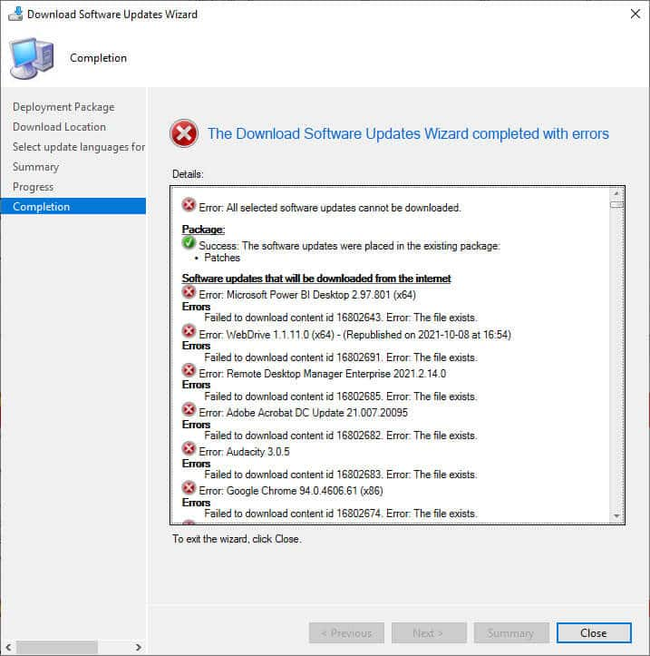

# Failed Create Temp File Gettempfilename

Error **80**, or **0x80070050**, generally occurs when attempting to download software updates (whether third party updates or Microsoft updates) into a deployment package. When attempting to download an update into a deployment package in the SCCM console, you receive the error message: **Failed to download content id Error: The file exists.**

### Determine if You Are Affected

Whenever a software update is being downloaded, regardless of whether it’s a Microsoft or third-party update, you receive the following error using the Download Software Updates wizard in the console:



Looking in [PatchDownloader.log](https://patchmypc.com/collecting-log-files-for-patch-my-pc-support#deployment-package-download-logs) file we can see an error code which resolves to The file exists (**0x80070050** or **80**):

Failed to create temp file with GetTempFileName() at temp location C:\Usersusername\AppData\Local\Temp, error 80\
ERROR: DownloadUpdateContent() failed with hr=0x80070050

If using Automatic Deployment Rules (ADR), the error code will be different and unfortunately a little more generic (**0X87D20417**):


Looking at the [ruleengine.log](https://patchmypc.com/collecting-log-files-for-patch-my-pc-support#automatic-deployment-rules-logs) log file for ADRs, we can find a more useful error code which resolves to the file exists (80):

Failed to download the update content with ID from internet. Error = 80\
Failed to download ContentID for UpdateID . Error code = 80

### Root Cause

**Temporary files are created** by ConfigMgr in the **%temp% directory** while it downloads software updates. Depending on whether you're downloading software updates manually via the Download Software Updates Wizard or automatically with ADRs, %temp% could be located in one of two places.

If downloading software updates manually via right click > Download, %temp% will resolve to your **user profile's temp directory** - typically this is in **AppData**.

If downloading software updates automatically via ADR, this will be in the system's context and will generally be **C:\Windows\Temp**.

> **Note:** The system environment variable **temp** can be changed. To verify your system's temp directory, execute the below PowerShell snippet:
>
> ```
> ::GetEnvironmentVariable("temp","Machine")
> ```

The issue stems from there being **too many temporary files** in the **temp directory**. The naming convention of the **.tmp** files it tries to create is **CAB.tmp** where is a random hexadeciaml number. 

Since there can only be so many valid permutations in this naming convention, when a new temporary file is attempted, it will **fail** with **exit code 80** "The file exists" if it tries to create the temporary file with the **same name with one that already exists**.

Generally, applications like SCCM dispose of temporary files after they're done with them. However **security software (antivirus)** or **NTFS permissions** can **interfere with the file creation and deletion** of these temporary files when the application processes them.

Your content goes here. Edit or remove this text inline or in the module Content settings. You can also style every aspect of this content in the module Design settings and even apply custom CSS to this text in the module Advanced settings.

### Workaround: Manually delete all .tmp files

As a temporary workaround to enable you to download the software updates now, you can manually delete all .tmp files in the %temp% directory.

Note that this is not a practical solution as the issue will invaraibly return because something is stopping Windows / applications from cleaning up temporary files.

If downloading software updates mmanually via right click > Download, %temp% will resolve to your **user profile's temp directory** - typically this is in **AppData**.

If downloading software updates automatically via ADR, this will be in the system's context and will generally be **C:\Windows\Temp**.

> **Note:** The system environment variable **temp** can be changed. To verify your system's temp directory, execute the below PowerShell snippet:
>
> ```
> ::GetEnvironmentVariable("temp","Machine")
> ```

### Solution: Create antivirus exceptions

Create an exclusion policy in your security software to exclude .tmp files in your or your system's temp directory.

The temp directory which you exclude depends on whether you experience the issue while downloading manually or via ADR.

If downloading software updates mmanually via right click > Download, %temp% will resolve to your **user profile's temp directory** - typically this is in **AppData**.

If downloading software updates automatically via ADR, this will be in the system's context and will generally be **C:\Windows\Temp**.

> **Note:** The system environment variable **temp** can be changed. To verify your system's temp directory, execute the below PowerShell snippet:
>
> ```
> ::GetEnvironmentVariable("temp","Machine")
> ```

### Solution: Verify NTFS permissions

Another possible solution could be that the security context trying to conduct the downloads does not have the NTFS permission to delete files.

Therefore ensure your user or system object has the **Delete** NTFS permission in the temp directory.


If downloading software updates mmanually via right click > Download, %temp% will resolve to your **user profile's temp directory** - typically this is in **AppData**.

If downloading software updates automatically via ADR, this will be in the system's context and will generally be **C:\Windows\Temp**.

> **Note:** The system environment variable **temp** can be changed. To verify your system's temp directory, execute the below PowerShell snippet:
>
> ```
> ::GetEnvironmentVariable("temp","Machine")
> ```
