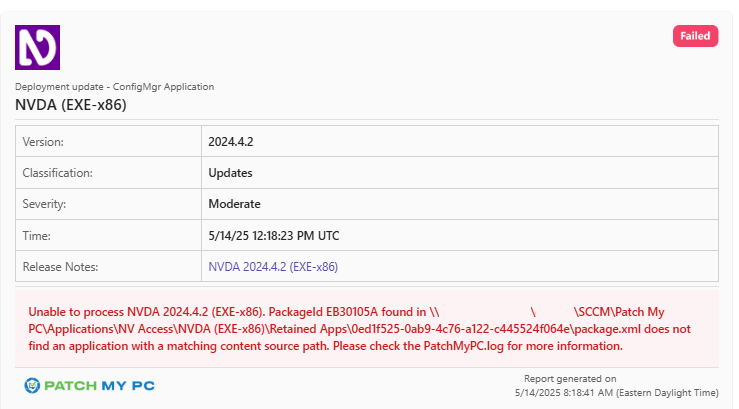
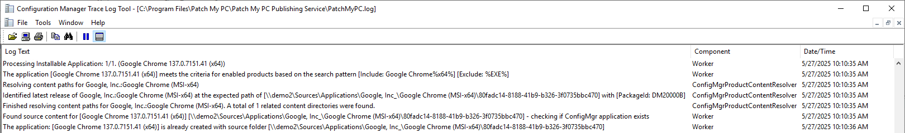
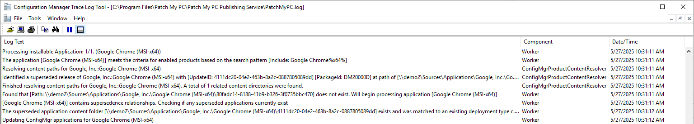

The error "_A package.xml file is found in <new source path> that belongs to a package with_ _content source path <old source path>_" can happen when the Patch My PC Publisher attempts to update a Configuration Manager application, but **fails due to an unexpected folder structure**.

To fix it, delete the app and all its retained versions from both disk and ConfigMgr, and let the Publisher recreate it cleanly - continue reading more guidance and context on the issue.

This article will discuss how you can identify if you're impacted, provide remediation guidance, and also an optional technical deep dive reference on how the Publisher updates Configuration Manager applications.

## Determine if You Are Affected

Customers experiencing this failure will likely have the following application update mode configured: "**[_Update existing application's metadata, deployment type, detection method, and content files (Default)_](/base-install-update-options-explained)**" (also known as an "in-place update", where the existing application is updated without creating a new one) - and have a retention value configured.

If affected, you will see the below notification:



In [PatchMyPC.log](/collecting-log-files-for-patch-my-pc-support#publishing-service-logs), the error will read along the lines of:

```
A package.xml file is found in <new source path> that belongs to a package with content source path <old source path>
```

The error message is presented when **the Publisher has found the source path for the application about to be updated does not match the Deployment Type's source folder** within Configuration Manager.

If you've encountered this error message, it's likely due to your source folders for the application(s) failing to update are in an **unexpected state**.

Applications managed by the Publisher can enter this state through a variety of reasons. While the Publisher is updating an application and managing retention, a copy of its application content on disk is attempted, and we have seen customer **antivirus solutions cause file locks and access denied exceptions during this process**.

In older versions of the Patch My PC Publisher, this scenario was not handled gracefully and subsequently caused nested Retained Apps folders with duplicate content, and duplicate applications within Configuration Manager.

We have since implemented more robust error handling in these circumstances to ensure we gracefully handle these errors that are typically caused by antivirus solutions. Since **[version 2.1.36.0](https://docs.patchmypc.com/installation-guides/on-premises-publisher/release-notes-publisher)** of the Patch My PC Publisher, **an improvement was added to ensure we do not process an application update when we detect it's in a state that might exacerbate the issue** and create duplicate folders/applications

## Remediation

To remediate the issue, the recommended approach is to delete the application producing the error and the entire folder structure for the product.

If you continue to experience this error after performing this remediation once, [open a technical s](/technical-support)[upport case](/technical-support) as we are committed to ensuring this scenario doesn't happen again and we can'treproduce all scenarios that cause the failures.

1. [Ensure a Publisher Sync Is Not In Progress](#ensure-a-publisher-sync-is-not-in-progress)
2. [Identify the Product on Disk and Delete It](#identify-the-product-on-disk-and-delete-it)
3. [Delete the Applications in Console for the Product](#delete-the-applications-in-console-for-the-product)

### 1\. Ensure a Publisher Sync Is Not In Progress

It is recommended to **ensure a sync is currently not in progress before continuing**. You can do this by viewing PatchMyPC.log and monitoring its activity.

Avoid performing clean-up while the Publisher is actively syncing.

### 2\. Identify the Product on Disk and Delete It

Here you will need to delete all content disk for the application(s) failing to update; the current version and all retained versions, too.

The parent source folder is configurable in the Publisher under the **ConfigMgr Apps** tab -> **Options**. Generally, application source folders resemble the following pattern:

```
\\server\share\Applications\<Vendor>\<Product>
```

Beneath the **<Product>** folder, you should see **one GUID folder** (representing that version's update ID) and a "Retained Apps" folder (if there are any retained versions).

In your environment, you may see multiple GUID folders beneath the **<Product>** folder and multiple "_Retained Apps_" folders that are nested within each other. This malformed folder structure is one of the core reasons contributing to the problem.

For products like **Google Chrome (MSI-x64)** you can expect its parent source folder to be:

```
\\server\share\Applications\Google, Inc.\Google Chrome (MSI-x64)
```

The name of the **<Product>** folder is the same name as the product you see in the Patch My PC Publisher. However, in scenarios where we rename products in our catalogue, the name of the folder will be the product's former name as you once saw it in the Publisher.

For that reason, you may not find the application(s) source folder via browsing File Explorer if you were searching based on the product's name as you see it today in the Publisher. To locate the correct folder, use the Deployment Type's source path in Configuration Manager.

For example, if an application's source path resembles the structure like any of the below, you shuold delete the folder **\\\\server\\share\\Applications\\Google, Inc.\\Google Chrome (x64)** and all its contents:

```
\\server\share\Applications\Google, Inc.\Google Chrome (x64)\994df44d-76fe-467e-bc9f-818eba5c668f
\\server\share\Applications\Google, Inc.\Google Chrome (x64)\Retained Apps\994df44d-76fe-467e-bc9f-818eba5c668f
\\server\share\Applications\Google, Inc.\Google Chrome (x64)\Retained Apps\Retained Apps\994df44d-76fe-467e-bc9f-818eba5c668f
```

The above example with Google Chrome is a real world example, where the product name was once **Google Chrome (x64)** and renamed to **Google Chrome (MSI-x64)** in October 2024.

### 3\. Delete the Applications in Console for the Product

After you have taken care of all the application sources on the file system, the next task is simpler: **delete the failed application objects within the Configuration Manager console** - this includes the current version **and all old retained versions, too**.

Before you can delete these you may need to remove their deployments and any associations from task sequences or dependency relationships.

Thereafter, you can initiate a sync of the Patch My PC Publisher and it will **recreate the application(s) with a clean, predictable folder structure**.

At this point, you should not have:

- More than one application for the same product within the Configuration Manager console
- More than one GUID folder within the product's parent source folder

This remediation action should be a one-time measure. However, if you encounter this issue again, it is likely you have an environmental factor that is causing the issue and is not yet handled gracefully by the Publisher. If you encounter this issue again, kindly [open a technical support case](/technical-support).

## How the Publisher Updates Applications

**This section is optional** and provides technical insight into how Patch My PC Publisher handles in-place updates for applications in Configuration Manager. **It's not required reading** to resolve the issue - but **it may help understand the product's logic**.

### Detecting Existing Application Versions

When the Publisher begins synchronising ConfigMgr Apps, it checks to see if the version already exists by checking:

1. [File System Check](#file-system-check)
2. [WMI Check (SMS\_Content)](#wmi-check)

Both conditions for the above must find the application. If the application's source exists on disk but not in WMI, then the Publisher deletes the content on disk - this is to make way for publishing of the app again on the next sync.

#### 1\. File System Check

The Publisher first begins searches for the source folder on disk by performing an exact match. For example, if the update was for **Google Chrome 137.0.7151.41 (x64)** and its update ID was **80fadc14-8188-41b9-b326-3f0735bbc470**, it will first check to see if the below path exists:

```
\\server*\share\Applications\Google, Inc.\Google Chrome (MSI-x64)\80fadc14-8188-41b9-b326-3f0735bbc470
```

[](https://patchmypc.com/app/uploads/2025/05/more-info-icon.svg)**Note:** If the **Source Folder** you provided contains an FQDN address for the shared folder in **ConfigMgr Apps** -> **Options**, the FQDN will be stripped to just the hostname and replaced with a wildcard.

For example, **\\\\server.contoso.com\\share** will be replaced with **\\\\server\*\\share**.



If it cannot find the folder with the exact the path above, it will then begin a wider search using wildcards:

```
\\server*\share\Applications\Google, Inc.\*\80fadc14-8188-41b9-b326-3f0735bbc470
```

This use of wildcard is intended to provide flexibility when products are renamed.

In **PatchMyPC.log**, if the new version does not exist and the current version needs updating:



```
Processing Installable Application: 1/1. (Google Chrome (MSI-x64))
The application [Google Chrome (MSI-x64)] meets the criteria for enabled products based on the search pattern [Include: Google Chrome%x64%]
Resolving content paths for Google, Inc.:Google Chrome (MSI-x64)
Identified a superseded release of Google, Inc.:Google Chrome (MSI-x64) with [UpdateID: 4111dc20-04e2-463b-8a2c-0887805089dd] [PackageId: DM20000D] at path of [\\server\share\Applications\Google, Inc.\Google Chrome (MSI-x64)\4111dc20-04e2-463b-8a2c-0887805089dd]
Finished resolving content paths for Google, Inc.:Google Chrome (MSI-x64). A total of 1 related content directories were found.
Found that [Path: \\server\share\Applications\Google, Inc.\Google Chrome (MSI-x64)\80fadc14-8188-41b9-b326-3f0735bbc470] does not exist. Will begin processing application [Google Chrome (MSI-x64)]
[Google Chrome 137.0.7151.41 (x64)] contains supersedence relationships. Checking if any superseded applications currently exist
The superseded application content folder [\\server\share\Applications\Google, Inc.\Google Chrome (MSI-x64)\4111dc20-04e2-463b-8a2c-0887805089dd] exists and was matched to an existing deployment type content location, update application and retain supersedence
Updating ConfigMgr applications for Google Chrome (MSI-x64)
```

If the latest version already exists:


```
Processing Installable Application: 1/1. (Google Chrome 137.0.7151.41 (x64))
The application [Google Chrome 137.0.7151.41 (x64)] meets the criteria for enabled products based on the search pattern [Include: Google Chrome%x64%]
Resolving content paths for Google, Inc.:Google Chrome (MSI-x64)
Identified latest release of Google, Inc.:Google Chrome (MSI-x64) at the expected path of [\\server\share\Applications\Google, Inc_\Google Chrome (MSI-x64)\80fadc14-8188-41b9-b326-3f0735bbc470] with [PackageId: DM20000B]
Finished resolving content paths for Google, Inc.:Google Chrome (MSI-x64). A total of 1 related content directories were found.
Found source content for [Google Chrome 137.0.7151.41 (x64)] [\\server\share\Applications\Google, Inc_\Google Chrome (MSI-x64)\80fadc14-8188-41b9-b326-3f0735bbc470] - checking if ConfigMgr application exists
```

#### 2\. WMI Check (SMS\_Content)

The **[SMS\_Content WMI class](https://learn.microsoft.com/en-us/intune/configmgr/develop/reference/core/servers/configure/sms_content-server-wmi-class)** provides content information about Configuration Items (CIs) within Configuration Manager. Applications share the same base model as CIs within Configuration Manager.

The Publisher performs a similar search routine in WMI as it does on disk, however with the exception for the usage of the wildcard - it uses a wildcard for both the vendor and product part of the folder.

Each instance of **SMS\_Content** contains a **ContentSource** path; the query to finding matching instances in this class would be similar to the below in the same Google Chrome example:

```
\\server*\share\Applications\*\80fadc14-8188-41b9-b326-3f0735bbc470
```

An example PowerShell command that is equivalent would be as follows:

This should return no more than two instances - one or two instances is acceptable.

### Application Update Flow (In-Place)

Once it has been established whether or not the latest version of an application currently exists, the Publisher will begin publishing the new version if available.

At a high-level overview, this process involves:

1. Download the update to the cache content folder. If the download fails, abort publishing and move onto the next application.

[](https://patchmypc.com/app/uploads/2025/05/more-info-icon.svg)Note: By default this is C:\\Windows\\temp but it is customisable. Read more here: **[Customize Content Download and Log Save Location - Patch My PC](/customize-content-download-and-log-save-location)**

**PatchMyPC.log**:

```
Adding download job 0f78781b-f9af-4c19-b0a0-9198c2d7c7df : (https://dl.google.com/chrome/install/GoogleChromeStandaloneEnterprise64.msi) : [GoogleChromeStandaloneEnterprise64.msi] to the download queue.
Processing download job 0f78781b-f9af-4c19-b0a0-9198c2d7c7df
The file is not present in the cache: GoogleChromeStandaloneEnterprise64.msi
Downloading the file to the cache [Destination: C:\Windows\TEMP\PMP-r3l3u3jt\80fadc14-8188-41b9-b326-3f0735bbc470\GoogleChromeStandaloneEnterprise64.msi]
Configured Download Timeout: 15 minutes and 0 seconds
Finished downloading file: [https://dl.google.com/chrome/install/GoogleChromeStandaloneEnterprise64.msi] Average speed: 17.82 MB/s (6.00 MB)
Removing download job 0f78781b-f9af-4c19-b0a0-9198c2d7c7df [GoogleChromeStandaloneEnterprise64.msi] : (https://dl.google.com/chrome/install/GoogleChromeStandaloneEnterprise64.msi) from the processing queue.
```

2. Copy the source folder for the current version to a subfolder named _Retained Apps_

[](https://patchmypc.com/app/uploads/2025/05/more-info-icon.svg)**Note:** It has historically been this step of publishing which has failed and largely caused the issues for customers, resulting in creating this knowledge base article.

**PatchMyPC.log**:

```
Creating a copy of \\server\share\Applications\Google, Inc.\Google Chrome (MSI-x64)\4111dc20-04e2-463b-8a2c-0887805089dd
```

3. Clone the application within Configuration Manager for the current version. If this step fails, the Publisher deletes the folder from the previous step.

**PatchMyPC.log**:

```
Making a copy of application with PackageID: <PackageID_OriginalApplication>
PackageID of newly copied package: <PackageID_ClonedApplication>
Copy done. New package created with resulting PackageId <PackageID_ClonedApplication>
```

4. Modify Package.xml within the source directory for the newly cloned app to contain the Package ID from the previous step
5. If you have the option enabled to [Move applications to the following folder in the applications node of the console](/application-creation-options), the newly cloned application will be moved to the designated folder

**PatchMyPC.log**:

```
Moving application to ConfigMgr console folder: Applications<FolderName>
Moving application from folderID: 0 to <FolderID>
Application moved to [<FolderID>] Applications<FolderName>
```

6. If you have the option enabled to [Automatically distribute content for any newly created applications](/application-creation-options), the content for the newly cloned application will be distributed to the designated Distribution Point Groups

**PatchMyPC.log**:

```
Distributing package to Distribution Point Group(s) [<PackageID_ClonedApplication>]
```

7. Copy the binary downloaded in step 1 to the original application's source directory

**PatchMyPC.log**:

```
Moving staging binaries from C:\Windows\TEMP\PMP-0ooc30ec to application content source path \\server\share\Applications\Google, Inc.\Google Chrome (MSI-x64)\80fadc14-8188-41b9-b326-3f0735bbc470
```

8. Rename the original application's source directory GUID to represent the latest update's update ID. This step is attempted five times with a 20 seconds pause in between each attempt - this is an attempt to combat antivirus solutions causing file locks or \*access denied\* exceptions
9. Delete the old installer in the original application's source directory if it wasn't overwritten in step 7
10. Update the PowerShell detection script in the original application's Deployment Type to represent the latest version's detection logic

**PatchMyPC.log**:

```
Creating PowerShell detection script.
Signing C:\Program Files\Patch My PC\Patch My PC Publishing Service\Detection Method Scripts\Google Chrome 137.0.7151.41 (x64).ps1 with the code signing certificate [Thumbprint=<CertificateThumbprint>][Store=LocalMachineWSUS]
Code signing certificate signature algorithm: sha512RSA
Signing with Windows native method...
Successfully signed with Windows native method
```

11. Various attributes and metadata are updated on the application, e.g. the Software Centre tab
12. If the option [Do not include the version in the application name, so the application name doesn't change after updates is not enabled](/application-creation-options), then rename the original application to represent latest version's title
13. If you have the option enabled to [Automatically distribute content for any newly created applications](/application-creation-options), the content for the original application will be distributed to the designated Distribution Point Groups

**PatchMyPC.log**:

```
Triggering a RefreshPackageSource for packageID: <PackageID_OriginalApplication>
Successfully triggered ConfigMgr package source refresh
Successfully updated ConfigMgr application: Google Chrome 136.0.7103.114 (MSI-x64) -> Google Chrome 137.0.7151.41 (x64)
```

14. If there any old versions available for deletion as per your retention setting ([Retain up to X previously created applications](/application-creation-options)), delete those applications from Configuration Manager and their associated content within the _Retained Apps_ folder

**PatchMyPC.log**:

```
Cleaning up previous releases - keeping last X versions.
```

15. [Notifications are sent via webhook](/how-publishing-alerts-work) with the result, whether it be success or failure

**PatchMyPC.log**:

```
Adding a notification to the message queue for <WebhookURL>
Processing notification to <WebhookURL>
```
