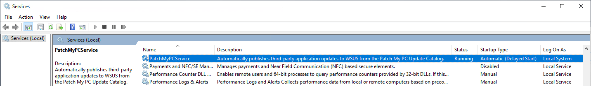
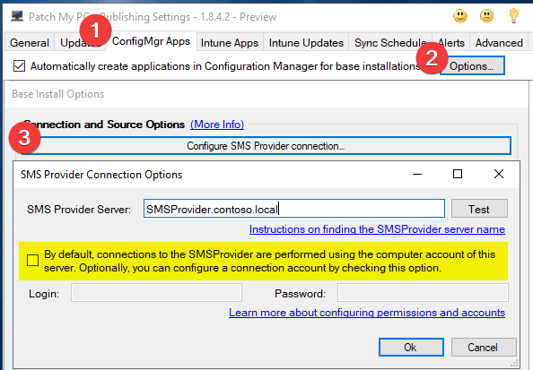
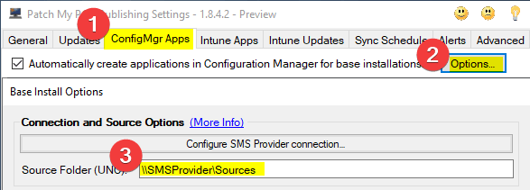
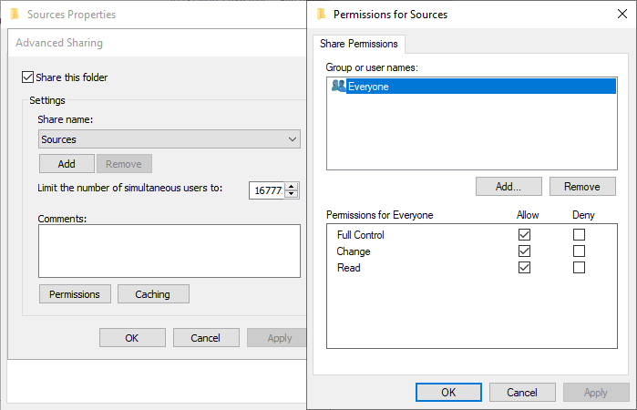
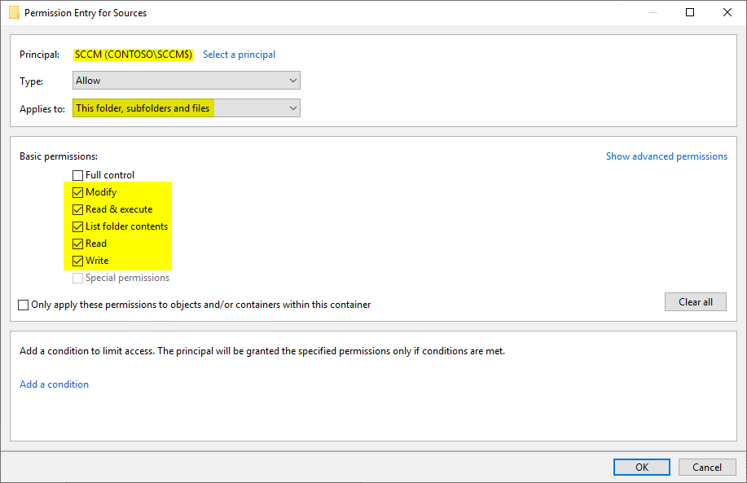
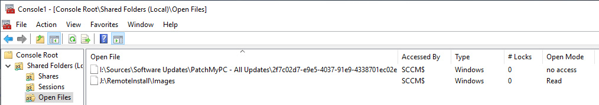

# Path Denied SCCM

In this article, we will cover the necessary **permissions required for the Patch My PC Publisher to manage content** for the Applications which are published to Configuration Manager. This article is useful when you are **receiving errors such as the below** from the Patch My PC Publisher.

| Applications Updated                                                                                | Time                 | Size    |
| --------------------------------------------------------------------------------------------------- | -------------------- | ------- |
| Google Chrome 81.0.4044.122 (x64)                                                                   | 4/24/2020 6:08:42 AM | 59.34MB |
| Access to the path ‘\\\sccm\sources\Applications\Google, Inc.\Google Chrome (x64)...’ is denied.    |                      |         |
| Google Earth Pro 7.3.3.7673 (x64)                                                                   | 4/24/2020 6:09:06 AM | 65.54MB |
| Access to the path ‘\\\sccm\sources\Applications\Google, Inc.\Google Earth Pro (x64)...’ is denied. |                      |         |

### Step 1: Identify _Who_ To Grant Permissions To

The **PatchMyPCService** is the identity that will perform all content-based actions. This, by default, will run as the **Local System** on the machine which runs the Publisher. This is generally your top-level Software Update Point, which may, or may not also be your primary site server.

In our example, **the&#x20;**_**who**_ will be our **Configuration Manager Site Server**, named **SCCM**. In other environments, this may be the site server or the software update point. Whichever is hosting the [**publisher**](../../docs/).

If you have navigated the Base Install options, you might be familiar with an option to configure the **SMS Provider connection**. It is important to note the credentials in the below location are **specifically for interactions between the Publisher, and the SMS Provider**, i.e. application publishing, content distribution, etc. For more details, see [this article.](https://patchmypc.com/permissions-required-in-sccm-for-base-installation-packages-from-patch-my-pc) Otherwise, **all of the file-based operations for managing the sources will happen as the Local System**, as shown in the Services screenshot above.

### Step 2: Identify _What_ To Grant Permissions To

The sources location which the service will need permissions to can be found within the settings of the Publisher. See below for the location of this setting.

**Note:** You do not need to share out the direct folder which the settings reference. It just needs to be a folder that sits within a shared folder. For example, the share can be "\\\sccm\sources" while your source folder below can be "sccm\sourcesPatchMyPC" if you prefer. For our example, the share happens to be the same folder as the sources.

### Step 3: Configure the Permissions - Both Share, and NTFS

The effective permissions of your sources folder will be the result of combining both your NTFS, and your Share permissions with the more restrictive being the effective permission. To simplify the management of permissions, the Share permissions are typically set to 'Everyone Full Control' as shown below. Don't worry, the effective permissions will be restricted by your NTFS permissions.

As noted above, the share which you grant permissions on may not be the exact path specified in the settings. But the sources folder should be a subfolder of the share.&#x20;

With share permissions set, we can configure the NTFS permissions. This is where the _who,_ and the _where_ comes into play, which we determined earlier to be the computer account which runs the Publisher, and the UNC path configured in the Publishing Tool. At a minimum, the computer account needs read, write, and modify permissions on the folder structure which will host the source content. This should also propagate to all subfolders and files. Because this is more restrictive than the ‘Everyone Full Control’ permission set on the share, this will be our effective permission for the SCCM principal.&#x20;

### Other Considerations: Processes Locking Source Content

Sometimes an ‘Access Denied’ does not mean the permissions are setup incorrectly. Instead, there can be a separate process that is locking the files. The typical culprits in this scenario are outlined below.

* **Content distribution actively updating your content library**
  * **Problem:** Configuration Manager will take a ‘snapshot’ of the source directory in order to determine what needs copied into the content library. This can cause a file lock.
  * **Solution:** Wait for content distribution to complete, and attempt another synchronization
* **Admin actively editing file**
  * **Problem:** Administrative user has the file open
  * **Solution:** Open the MMC on the server hosting your shares, and add the ‘Shared Folders’ snap-in. Within this snap-in, there is an ‘Open Files’ section where you can ‘Close Open File’

