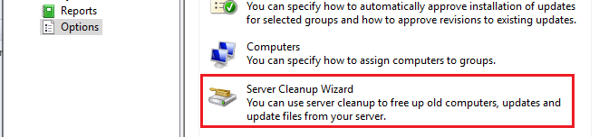

# Define SQL Server connection details

We periodically get reports about the error **Publishing operation failed, too many locally published categories** when publishing third-party updates. In this article, we will review the root cause and how to resolve the issue. This error generally happens for customers trying our service who were previously using another vendor.

The error message for this scenario will look similar to the error below.

An error occurred while publishing an update to WSUS: Publishing operation failed, too many locally published categories.

### A Little Background on this Error

WSUS has a limitation on the number of unique third-party vendors/products that can be published. When troubleshooting with customers coming from another product, we have seen where some vendor catalogs can **cause you to exceed the 100 category limit**.

Here's an example of all the custom third-party products that may be listed.


Due to this **100 category limitation** and after talking to the Microsoft product group, this is why we decided to use a [**single vendor and product**](https://www.youtube.com/watch?v=kqttlu-kkMs) in our catalog.


### Am I Affected?

If you receive this error, it means you currently have **100 or more categories** published to WSUS.

The WSUS API checks the total number of categories before it allows an update to be published. Part of the check requires the API to call the _**GetLatestRevisionNumberForUpdate**_ stored procedure in SQL. This stored procedure is looking in the tbRevision table to see if the category already exists. If it doesn't, it needs to calculate how many new categories the API call will make and if that total plus the existing category total is larger than 100, the API throws the error "Too many locally published categories".


Note that the stored procedure is checking the **tbRevision** table here.


#### **Check using  SQL Server Management Studio**

You can run the following SQL query against SUSDB to understand the total number of categories in the same way the API performs the test.

[>> Download Category\_Count.sql.txt <<](https://patchmypc.com/app/uploads/2025/06/Category_Count.sql_.txt)

**Note:** Rename the extension from .txt to .sql to import the query in SQL Server Management Studio.

Category\_Count.sql

```
-- This is how the WSUS API evaluates the maximum category value of 100.
-- The main purpose is to evaluate both product and company categories and sum the total updates.
USE SUSDB;
-- Insert the CTE result into a temporary table
SELECT
    cs.DefaultTitle AS Category,
    parent_cs.DefaultTitle AS ParentCategory,
    cs.CategoryType,
    COUNT(ct.UpdateID) AS UpdateCount
INTO #CategoryData
FROM
    [SUSDB].[dbo].[tbUpdate] AS cr
JOIN
    [SUSDB].[dbo].[vwUpdateInCategory] AS ct ON cr.UpdateID = ct.UpdateID
JOIN
    [SUSDB].[PUBLIC_VIEWS].[vCategory] AS cs ON ct.CategoryUpdateID = cs.CategoryID
LEFT JOIN
    [SUSDB].[PUBLIC_VIEWS].[vCategory] AS parent_cs ON cs.ParentCategoryID = parent_cs.CategoryID
WHERE
    cr.IsLocallyPublished = 1
    AND ct.CategoryUpdateID IS NOT NULL
GROUP BY
    cs.DefaultTitle,
    parent_cs.DefaultTitle,
    cs.CategoryType;
-- First result set: Product categories and company-level aggregates
SELECT
    Category,
    ParentCategory,
    CategoryType,
    UpdateCount,
    1 AS TotalCategories
FROM
    #CategoryData
WHERE
    CategoryType = 'Product'
UNION ALL
-- Calculate TotalCategories for each ParentCategory in the company-level rows
SELECT
    ParentCategory AS Category,
    NULL AS ParentCategory,
    'Company' AS CategoryType,
    SUM(UpdateCount) AS UpdateCount,
    (SELECT COUNT(*) FROM #CategoryData AS sub WHERE sub.ParentCategory = main.ParentCategory AND sub.CategoryType = 'Product') + 1 AS TotalCategories
FROM
    #CategoryData AS main
WHERE
    CategoryType = 'Product'
GROUP BY
    ParentCategory
ORDER BY
    CategoryType ASC, Category ASC;
-- Second result set: Display totals for UpdateCount and TotalCategories specifically for 'Company' categories
SELECT
    'UpdateCount' AS Name,
    SUM(UpdateCount) AS Total
FROM
    #CategoryData
WHERE
    CategoryType = 'Company'
UNION ALL
SELECT
    'TotalCategories' AS Name,
    SUM(TotalCategories) AS Total
FROM
    (
        SELECT
            ParentCategory AS Category,
            NULL AS ParentCategory,
            'Company' AS CategoryType,
            SUM(UpdateCount) AS UpdateCount,
            (SELECT COUNT(*) FROM #CategoryData AS sub WHERE sub.ParentCategory = main.ParentCategory AND sub.CategoryType = 'Product') + 1 AS TotalCategories
        FROM
            #CategoryData AS main
        WHERE
            CategoryType = 'Product'
        GROUP BY
            ParentCategory
    ) AS CompanyCategories;
-- Clean up the temporary table
DROP TABLE #CategoryData;
```


As the API call is only limited by total number of categories, including revisions, for updates marked as **isLocallyPublisher = 1**, a simple workaround is to change this flag. Changing this flag for all updates in a category will mean the those third party updates will show in the WSUS console.

**Note:** When updates are set to show in WSUS, and the isLocallyPublished flag changes to 0, the CategoryType also changes from **Other** to **MicrosoftSource.**

#### **Check Using PowerShell**

The following PowerShell snippet uses the built-in .NET Framework's _**System.Data.SqlClient**_ namespace to interact with SQL Server

Script Example

```
# Define SQL Server connection details
$server = "YourSQLServerName"      # Replace with your SQL Server name
$database = "SUSDB"               # Replace with your database name
$connectionString = "Server=$server;Database=$database;Integrated Security=True;"
# Define the SQL Queries for the two result sets
# Full SQL Query to generate both result sets
$sqlQuery = @"
WITH CategoryData AS (
    SELECT
        cs.DefaultTitle AS Category,
        parent_cs.DefaultTitle AS ParentCategory,
        cs.CategoryType,
        COUNT(ct.UpdateID) AS UpdateCount
    FROM
        [SUSDB].[dbo].[tbUpdate] AS cr
    JOIN
        [SUSDB].[dbo].[vwUpdateInCategory] AS ct ON cr.UpdateID = ct.UpdateID
    JOIN
        [SUSDB].[PUBLIC_VIEWS].[vCategory] AS cs ON ct.CategoryUpdateID = cs.CategoryID
    LEFT JOIN
        [SUSDB].[PUBLIC_VIEWS].[vCategory] AS parent_cs ON cs.ParentCategoryID = parent_cs.CategoryID
    WHERE
        cr.IsLocallyPublished = 1
        AND ct.CategoryUpdateID IS NOT NULL
    GROUP BY
        cs.DefaultTitle,
        parent_cs.DefaultTitle,
        cs.CategoryType
)
-- First result set: Product categories and company-level aggregates
SELECT
    Category,
    ParentCategory,
    CategoryType,
    UpdateCount,
    1 AS TotalCategories
FROM
    CategoryData
WHERE
    CategoryType = 'Product'
UNION ALL
-- Calculate TotalCategories for each ParentCategory in the company-level rows
SELECT
    ParentCategory AS Category,
    NULL AS ParentCategory,
    'Company' AS CategoryType,
    SUM(UpdateCount) AS UpdateCount,
    (SELECT COUNT(*) FROM CategoryData AS sub WHERE sub.ParentCategory = main.ParentCategory AND sub.CategoryType = 'Product') + 1 AS TotalCategories
FROM
    CategoryData AS main
WHERE
    CategoryType = 'Product'
GROUP BY
    ParentCategory
ORDER BY
    CategoryType ASC, Category ASC;
-- Second result set: Display totals for UpdateCount and TotalCategories specifically for 'Company' categories
WITH CategoryData AS (
    SELECT
        cs.DefaultTitle AS Category,
        parent_cs.DefaultTitle AS ParentCategory,
        cs.CategoryType,
        COUNT(ct.UpdateID) AS UpdateCount
    FROM
        [SUSDB].[dbo].[tbUpdate] AS cr
    JOIN
        [SUSDB].[dbo].[vwUpdateInCategory] AS ct ON cr.UpdateID = ct.UpdateID
    JOIN
        [SUSDB].[PUBLIC_VIEWS].[vCategory] AS cs ON ct.CategoryUpdateID = cs.CategoryID
    LEFT JOIN
        [SUSDB].[PUBLIC_VIEWS].[vCategory] AS parent_cs ON cs.ParentCategoryID = parent_cs.CategoryID
    WHERE
        cr.IsLocallyPublished = 1
        AND ct.CategoryUpdateID IS NOT NULL
    GROUP BY
        cs.DefaultTitle,
        parent_cs.DefaultTitle,
        cs.CategoryType
)
SELECT
    'UpdateCount' AS Name,
    SUM(UpdateCount) AS Total
FROM
    CategoryData
WHERE
    CategoryType = 'Company'
UNION ALL
SELECT
    'TotalCategories' AS Name,
    SUM(TotalCategories) AS Total
FROM
    (
        SELECT
            ParentCategory AS Category,
            NULL AS ParentCategory,
            'Company' AS CategoryType,
            SUM(UpdateCount) AS UpdateCount,
            (SELECT COUNT(*) FROM CategoryData AS sub WHERE sub.ParentCategory = main.ParentCategory AND sub.CategoryType = 'Product') + 1 AS TotalCategories
        FROM
            CategoryData AS main
        WHERE
            CategoryType = 'Product'
        GROUP BY
            ParentCategory
    ) AS CompanyCategories;
"@
# Create a SQL Connection
$connection = New-Object System.Data.SqlClient.SqlConnection
$connection.ConnectionString = $connectionString
$connection.Open()
# Execute the full query
$command = $connection.CreateCommand()
$command.CommandText = $sqlQuery
$adapter = New-Object System.Data.SqlClient.SqlDataAdapter $command
$dataSet = New-Object System.Data.DataSet
$adapter.Fill($dataSet)
# Close Connection
$connection.Close()
# Separate and display the result sets
Write-Host "Result Set 1:" -ForegroundColor Yellow
$dataSet.Tables[0] | Format-Table -AutoSize
Write-Host "Result Set 2:" -ForegroundColor Yellow
$dataSet.Tables[1] | Format-Table -AutoSize
```


#### Resolution for Error: Too many locally published categories

When you consider which approach you want to take below, Option 1, below, should be considered first, especially for customers who have used an Ivanti catalog in the past and are not comfortable removing updates/categories during a POC.

You have 3 options:&#x20;

[**Option 1:** Use the Modify Published Updates Wizard in the Publisher to show updates in the WSUS Console \*](publish-error-too-many-locally-published-categories.md#option1)

[**Option 2:** Use the Modify Published Updates Wizard in the Publisher to delete updates in a category (Vendor / Product)](publish-error-too-many-locally-published-categories.md#option2)

[**Option 3:** Using a **Powershell Script** to delete updates by Category](publish-error-too-many-locally-published-categories.md#option3)&#x20;

\* Recommended option for customers coming from Ivanti

#### Option 1: Use the Modify Published Updates Wizard in the Publisher to show updates in the WSUS Console

In Publisher, the **Modify Published Updates Wizard** allows you to set third-party updates to **Show in WSUS**. Doing so will flip the **isLocallyPublished** flag for an update. Flipping this flag for all updates in the same category will ensure the category, and the category revisions, do not count towards the limit of the API.

It can be found under the **Updates** tab > **Options** > select **Run Wizard** under **Modify Published Updates**.


After running the SQL query shared above in [Resolution for Error: too many locally published categories](publish-error-too-many-locally-published-categories.md#topic2) you should be able to understand which products to select to reduce the overal category count.

In this example, we need to reduce the **TotalCategories** count down from 205 to under 100


In the **Modify Published Updates Wizard**, filter by one of the vendors identified in your SQL query results, click **Select All** and click **Show in WSUS**.


Re-run the SQL query again. Repeat this process until the query indicates you are below **100** categories.

**IMPORTANT:** The **Third Party Category Count** displayed in the bottom left of the window (shown above) does not account for revised categories or categories that have isLocallyPublished = 0 (This can happen if the third-party updates are set to be visible in the WSUS console). Always use the total category count from the SQL query to understand if you are under the 100 category limit imposed by the WSUS API.

#### Option 2: Using Modify Published Updates Wizard to Remove Categories

Our publishing service **Modify Published Updates Wizard** allows you to delete published third-party updates. It can be found under the **Updates** tab > **Options** > select **Run Wizard** under **Modify Published Updates**. In the example below, we selected two updates from the vendor **7-Zip** and choose **Delete**.


**Note:** To enable the **Delete** button, create a new DWORD registry value: Computer\HKEY\_LOCAL\_MACHINE\Software\Patch My PC Publishing Service: EnableDeleteUpdates = 1


Once you have deleted the updates from WSUS, run the **WSUS Cleanup Wizard** from the Options node in WSUS.



You should be able to leave the default checkboxes in the **Select items to Clean** wizard


Once you complete the WSUS Server Cleanup Wizard, **republish the updates**.

**That's it!** As long of you removed enough of the old vendors and products, you can publish new third-party updates to WSUS

#### Option 3: Running a Powershell Script to Remove Categories&#x20;

1. Open an elevated PowerShell window.
2. Copy and paste this PowerShell script from our GitHub repository&#x20;

You will want to navigate to our GitHub page and run this script: [CustomerTroubleshooting/PowerShell/Remove-WSUSCategories.ps1 at Release · PatchMyPCTeam/CustomerTroubleshooting · GitHub](https://github.com/PatchMyPCTeam/CustomerTroubleshooting/blob/Release/PowerShell/Remove-WSUSCategories.ps1)&#x20;

This will open a UI showing all the categories you have published in WSUS. You can select multiple categories and delete. &#x20;


If you receive an error stating “The update content cannot be deleted as it is still referenced by other updates(s).”


Run the script again with **-force**. This will ensure it also removes revised categories, which is common with customers migrating from Ivanti. &#x20;

After running with -force, it should say “The update could not be found.”&#x20;


This indicates we successfully removed the revised categories from WSUS, despite the update referenced under that category not being found..&#x20;

As long of you removed enough of the old vendors and products, run another publisher sync and you should be able to successfully updates in WSUS. &#x20;

**Note:** Many customers encountering this error were using **Ivanti**, if this is your case, you may also be able to use their tool to delete all their **vendor** and **product** categories if applicable using [https://help.ivanti.com/iv/help/en\_US/PAT/24/Topics/Managing\_Products.htm](https://help.ivanti.com/iv/help/en_US/PAT/24/Topics/Managing_Products.htm)
