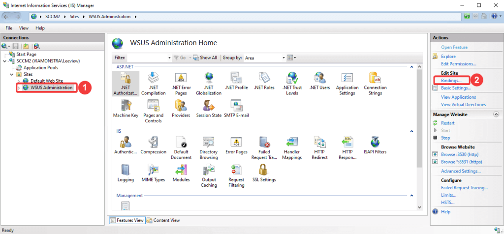

When starting the Patch My PC Publisher, you get an error message stating that it is “Unable to Connect to WSUS”.  
This issue usually appears due to a WSUS misconfiguration, and the cause might vary. The most common causes are documented in this article.

## Ensure that the PMPC Publisher is installed on the top-most SUP

The PatchMyPC Publisher need to be installed on the top-most Software Update Point, as documented in the [requirements](https://docs.patchmypc.com/installation-guides/configmgr/requirements) page.

Ensure it is installed on the top-most SUP.  
In case you don't know how to find out what the name of your top-most SUP is, you can use [this](https://github.com/PatchMyPCTeam/Community-Scripts/tree/main/Other/ConfigurationManager/Get-TopSUPname) script.

## Basic troubleshooting

Before doing anything else, we need to ensure that the **WsusPool** and **WSUS Service** are running.

For the **WsusPool**, go to the **IIS Manager** --> **Application Pool** --> check the status.  
If it is **Stopped**, right-click it and choose **Start**.

Once ensured that the WsusPool is running, go to **services.msc** and ensure that the **WSUS Service** is also running.  
If it’s not running, right-click the service and start it.

## The WsusPool stops immediately after being started

Make sure that the WSUS AppPool in IIS is optimized for better performance, as described in [this article](https://patchmypc.com/the-simple-guide-to-wsus-maintenance-and-optimization-in-configmgr#topic4).

## The issue exists with https configured while the WsusPool is running

Ensure the SSL Certificate is bound to the WSUS Administration site and was not dropped for some reason:

1. On the WSUS server, open Internet Information Services (IIS) Manager.

3. Go to **Sites** > **WSUS Administration**.

5. Select **Bindings** from either the action menu or by right-clicking on the site.

7. In the **Site Bindings** window, select the line for https, then select **Edit**....

> **Note: Don't remove the HTTP site binding even if HTTPS is configured. WSUS uses HTTP to update content files.**

6\. Under the **SSL certificate** option, choose the certificate to bind to the WSUS Administration site if the option is set to **Not Selected**. The certificate's friendly name is shown in the drop-down menu. If a friendly name wasn't specified, then the certificate's IssuedTo field is shown. If you're not sure which certificate to use, select View and verify the thumbprint matches the one you obtained.

