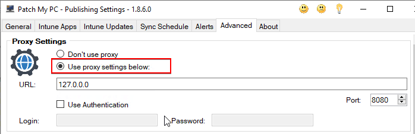
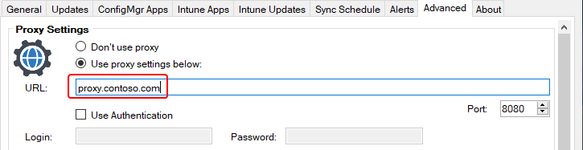
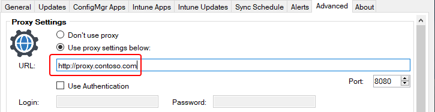

In this article, we will discuss a bug introduced in **version 1.8.6.0** of the Patch My PC Publisher.

In version 1.8.6.0, changes were made to **parse the provided proxy URL** in the Publisher. Below you will find how to identify if the bug affects you, and resolve it.

## Determine if you are affected

If you have **a proxy configured in the publisher** and upgraded to version 1.8.6.0 then the below error will be in your **PatchMyPC.log** file.

An error occurred while converting the provided Proxy URL to a URI for use by the Web Client. Invalid URI: The format of the URI could not be determined

Check if you are on **build 1.8.6.0** and a **proxy is enabled**:

If you open the Publisher UI, you will **likely see error(s)** similar to the error shown below:

> **Note:** This proxy is used by the publisher for all download operations, including downloading Publisher updates.

## Resolving the Issue (Option 1 - Recommended)

Manually update the publisher to a build that is [version 1.8.7.0 or above](https://patchmypc.com/msi). This bug has been fixed in all newer versions of the publisher. You can run the MSI installer on the machine which runs the publisher. All settings will be retained during the in-place upgrade.

Once the upgrade is complete, attempt to validate the **License URL** in the Publisher to confirm the fix.

## Resolving the Issue (Option 2)

Within the Publisher on the affected 1.8.6 build, navigate to the '**Advanced Tab**' and update the Proxy URL field by adding **http://** to the beginning of your URL as shown below.  Once you have changed this you can click **Apply, then close and reopen the publisher**. Once this is complete the error messages will be resolved. 

