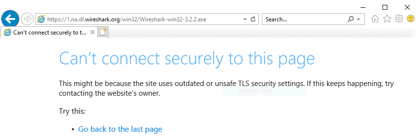
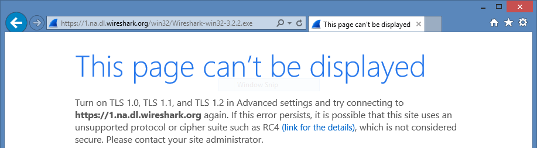
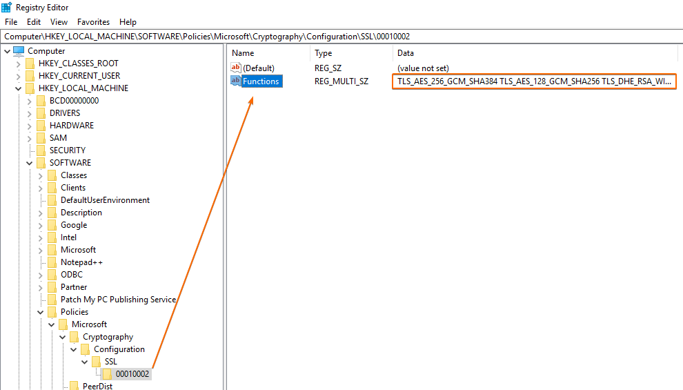
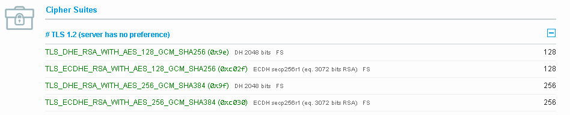
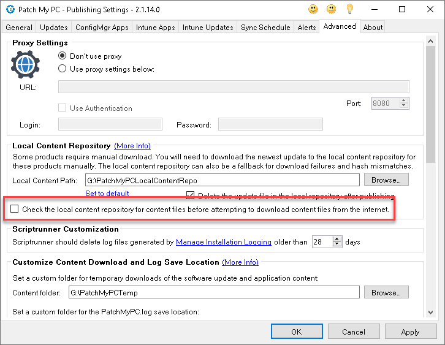

The error "_The request was aborted: Could not create SSL/TLS secure channel._" can happen during any download HTTP request. This error generally will correspond to **firewalls, proxies** or **DNS filtering** blocking the connection or an **SSL/TLS cipher** misconfiguration.

## Determine if You are Affected

If affected, you will see an error similar to below in one of the following log files **[PatchMyPC.log](https://patchmypc.com/collecting-log-files-for-patch-my-pc-support#publishing-service-app-logs-intune)** or **[SMS\_ISVUPDATES\_SYNCAGENT.log](https://docs.microsoft.com/en-us/mem/configmgr/core/plan-design/hierarchy/log-files#BKMK_SU_NAPLog),** dependent on the publishing method you are using.

The request was aborted: Could not create SSL/TLS secure channel.

> **Note**: We are generally pretty limited in the amount of support we can provide for issues related to **web filters**, **firewalls**, **proxies**, **certificate trust**, or other **network-related errors**. However, our resolutions below will generally help **diagnose and resolve** this specific error. 

## Possible Cause 1: Firewall, DNS, or Proxy Blocking Network Connections

The most common cause for this errors us network firewalls or security appliances blocking network connections.

If using our **[Publisher](/docs)**, the **[PatchMyPC.log](/collecting-log-files-for-patch-my-pc-support#publishing-service-app-logs-intune)** will show the specific download URL returning the SSL/TLS error. On the machine running with the error, copy the download URL from the log:

On the same machine where the Publisher is installed returning the error, browse to the URL in **Internet Explorer running as NT AUTHORITY\\SYSTEM**. Check if Internet Explorer returns any errors or warnings from a firewall or security appliance.

> **Important**: The Patch My PC Publisher uses the same .NET Framework classes as Internet Explorer to download content from the Internet. The default identity of the service is also NT AUTHORITY\\SYSTEM.
> 
> It may be possible you have different Internet access control policies applied between users and computers in your environment. Performing this test in a different browser or as another identity may produce different results.

If blocked, you will need to work with your networking team to remove any restrictions. You can find the full list of domains, ports, and protocols used for Patch My PC Publisher and catalogue at **[List of Domains for Firewall Allowlist when Using Patch My PC](https://patchmypc.com/list-of-domains-used-for-downloads-in-patch-my-pc-update-catalog)**.

## Possible Cause 2: Are You Using A Proxy and is It Configured Correctly?

If a proxy is required for internet access within your environment, you will need to configure it in the **Advanced** tab:

After configuring the proxy, restart the service **PatchMyPCService** (can also be done in the **About** tab), and close and re-open the Publisher UI.

If proxy authnetication is required, enable the **Use Authentication** checkbox and enter credentials.

## Possible Cause 3: Is SSL Being Limited to Specific Cryptography Protocols and Cipher Suites?

We have also seen issues related to customers that are only **[allowing specific SSL protocols and ciphers](https://docs.microsoft.com/en-us/windows-server/identity/ad-fs/operations/manage-ssl-protocols-in-ad-fs#managing-the-tlsssl-protocols-and-cipher-suites)**. Some customers configure this to apply security harden policies to the Operating System.

In this scenario, we have observed the following errors when browsing out to the file download URL in internet explorer.

On **Server 2019** or **newer**:

On **Server 2016** or **older**:

> **Important**: The Patch My PC Publisher uses the same .NET Framework classes as Internet Explorer to download content from the Internet. The default identity of the service is also NT AUTHORITY\\SYSTEM.
> 
> It may be possible you have different Internet access control policies applied between users and computers in your environment. Performing this test in a different browser or as another identity may produce different results.

If you receive one of the **errors below** in the **PatchMyPC.log** and your error is similar to the Internet Explorer images above it may be related to only **allowing specific SSL ciphers \***

WebClient report an error during download: The request was aborted: Could not create SSL/TLS secure channel.

**OR**

An error occurred WebClient reported an error during download. The handshake failed due to an unexpected packet format.

On the server, check if the following registry value exists:  
**HKEY\_LOCAL\_MACHINE\\Software\\Policies\\Microsoft\\Cryptography\\Configuration\\SSL0010002:Functions  
or  
HKEY\_LOCAL\_MACHINE\\SYSTEM\\CurrentControlSet\\Control\\Cryptography\\Configuration\\Local\\SSL\\0010002**

If this value exists, **only the SSL/TLS ciphers** in the **Functions REG\_MULTI\_SZ value** will work. If a domain is using a cipher other than ones listed, you will receive the error **The request was aborted: Could not create SSL/TLS secure channel.**

Limiting the **[SSL/TLS ciphers](https://docs.microsoft.com/en-us/windows-server/identity/ad-fs/operations/manage-ssl-protocols-in-ad-fs#managing-the-tlsssl-protocols-and-cipher-suites)** is sometimes enabled as a hardening method for security. Limiting the ciphers is not enabled by default.

To fix the download in the scenario, you need to either **add ciphers** used for all downloads having issues in the **Functions REG\_MULTI\_SZ  list** or **remove the Functions value** to set the SSL/TLS ciphers to not be limited.

There is a third-party tool available from **[Qualys SSL Labs](https://www.ssllabs.com/ssltest)** where you can paste the download URLs having the issue and the tool will show you the **SSL/TLS ciphers** being used on the domain.

For example, when we used the URL https://1.na.dl.wireshark.org/win32/Wireshark-win32-3.2.2.exe, we are able to see the specific SSL/TLS ciphers being used for that domain.

These ciphers would need to be added to the **Functions** registry value to resolve the issue if applicable.

**\*** A similar error, **"****An error occurred WebClient reported an error during download"**, can be observed in the **PatchMyPC.log** if the HTTP download timed out. It might also be prudent to increase the HTTP timeout value in the registry if the other workarounds in this KB are not effective. Click the following link for more details [https://patchmypc.com/advanced-configurations-available-using-the-registry-for-patch-my-pcs-publishing-service#topic5](https://patchmypc.com/advanced-configurations-available-using-the-registry-for-patch-my-pcs-publishing-service#topic5)

> **Important**: For any new ciphers to take effect after being added, the server will need to be restarted.

## Possible Cause 4: Windows Server 2012 Doesn't Support New TLS Cipher Suites

Third-party software vendors restrict the SSL/TLS ciphers allowed to connect to their web servers to use more modern algorithms. As a result of this, older ciphers are being phased out. Older Windows Server Operating Systems may experience issues connecting to these web servers as they are limited to specific ciphers.

More recently, we have seen the SSL/TLS ciphers available in Windows Server 2012 / 2012 R2 and Windows 8 / 8.1 are being rejected by vendors' webservers.

See below links to Microsoft documentation listing SSL/TLS ciphers for each OS:

- [TLS Cipher Suites in Windows Server 2012 R2 / Windows 8.1](https://learn.microsoft.com/en-us/windows/win32/secauthn/tls-cipher-suites-in-windows-8-1)

- **[TLS Cipher Suites in Windows Server 2012 / Windows 8](https://learn.microsoft.com/en-us/windows/win32/secauthn/tls-cipher-suites-in-windows-8)**

- **[All Windows TLS cipher suites](https://learn.microsoft.com/en-us/windows/win32/secauthn/cipher-suites-in-schannel)**

You can view a web server's current list of accepting TLS/SSL ciphers by using the **[Qualys SSL Labs website](https://www.ssllabs.com/ssltest/)** mentioned at the end of the last section.

To resolve this problem, consider the two options:

- Plan to upgrade the Operating System of where the Patch My PC Publisher is installed to a newer versions with the newer SSL/TLS ciphers

- Manually download the installer from a different browser or newer Operating System and save it into your [local content repository](https://patchmypc.com/local-content-repository-for-licensed-applications-that-require-manual-download). Also enable the below highlighted option:

We also have this documented on our **[List of Known Issues and Considerations](https://patchmypc.com/known-issues-and-considerations-when-using-patch-my-pc#topic4)** article for products we are **tracking with these download issues**. At this time, we are aware of the following products that may fail to download on older server operating systems:

- Snagit and Camtasia

- Tableau Products

- Cisco Webex

- Docker Desktop

- Slack

## Known Issues

For products that are currently known to fail to download, refer to our **[Known Issues and Considerations when Using Patch My PC](https://patchmypc.com/known-issues-and-considerations-when-using-patch-my-pc)**.
