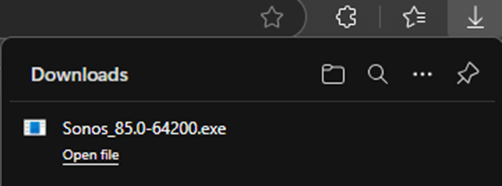
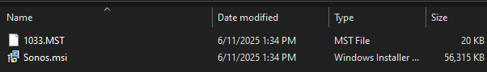

In this article, we will detail how to get the MSI required for the Sonos S1/S2 Controller Latest (MSI-x64) product in our catalog.

Sonos S1/S2 Controller provides a compressed install file which is in an EXE format and does not have a silent install option. It is essentially a self-extracting archive that contains an MSI file within it. Currently, we do not directly support these types of installers since the initial extraction phase typically involves interactive steps or temporary directories that are dynamically created and destroyed, making it difficult to automate reliably. The following steps outlined in this article are essential to enable support for Sonos installs.

These next steps cover the process of downloading the online installer, extracting the MSI and placing the MSI in the [Patch My PC Publisher Local Content Repository](https://patchmypc.com/local-content-repository-for-licensed-applications-that-require-manual-download).

## Download the Installer

The Sonos S1/S2 Controller requires a manual download.

Browse to Download the Sonos Controller you require. The download should start immediately.

### S1 Controller Link

[https://www.sonos.com/redir/controller\_software\_pc](https://www.sonos.com/redir/controller_software_pc)

### S2 Controller Link

[https://www.sonos.com/redir/controller\_software\_pc2](https://www.sonos.com/redir/controller_software_pc2 )



## Extract the Installer to obtrain the MSI

Once you have the online installer downloaded, you will have to extract it. This can be done manually or silently from a command prompt.

Navigate to the downloaded exe file. You can either extract the MSI manually or silently using the command line.

1. **Manually** - Extract the MSI by double-clicking the downloaded exe. The installer will launch. Leave this open in the background for now.


With the installer open, navigate to:-

  
**S1 Controller Temporary Directory**  
C:\\Users\\<UserName>\\AppData\\Local\\Downloaded Installations{90ADEE83-346E-45D3-8960-54792369FB54}  
  
****S2 Controller Temporary Directory****  
C:\\Users\\<UserName>\\AppData\\Local\\Downloaded Installations\\{AF00AB56-E4FE-4122-8688-4C47ADB9BF85}

You will see the MSI file. (The MST is not needed)



2. **Silently** – For a silent extract, open a command prompt, navigate to the download, and run the following command:

```
Sonos_xx.x-xxxxx.exe /S /x /b"C:\Windows\Temp" /v"/qb"
```

Navigate to: "C:\\Windows\\Temp" to obtain the MSI file.


## Copy the MSI to the Local Content Repository

> Copy the MSI file and place it in your [Local Content Repository](https://patchmypc.com/local-content-repository-for-licensed-applications-that-require-manual-download) configured in the Patch My PC Publisher on the Advanced tab.
> 
> **Note:** This process will need to be carried out **for each new version of the Sonos S1/S2 Controller Installer.**
