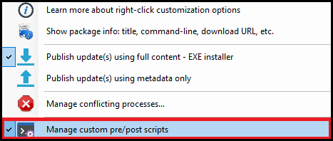
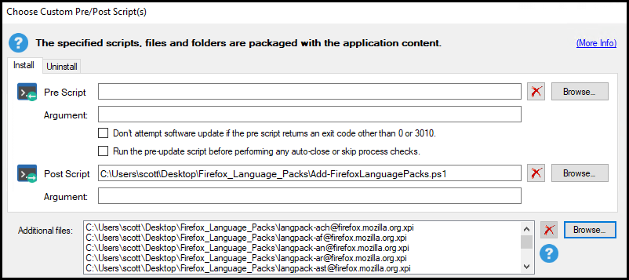
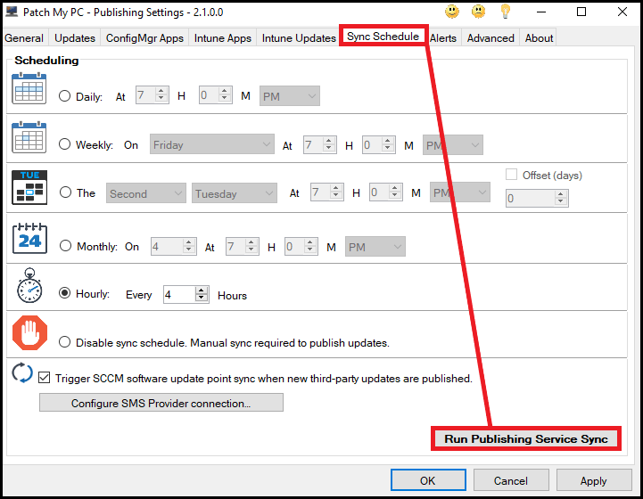

This article will demonstrate how you can leverage our [Publisher's](https://docs.patchmypc.com/) ability to [Add custom pre/post scripts](https://patchmypc.com/custom-options-available-for-third-party-updates-and-applications#custom-scripts) to allow you to add additional language packs to Firefox and configure it to use the appropriate language pack based on the system locale.

## Step 1: Download script and language packs

Download the post installation script from out GitHub repo here: **[Add-FirefoxLanguagePacks](https://github.com/PatchMyPCTeam/Community-Scripts/blob/main/Install/Post-Install/Add-FirefoxLanguagePacks/Add-FirefoxLanguagePacks.ps1)**.

Download all the language packs you require from **Mozilla's website**.

They can be found here: **https://releases.mozilla.org/pub/firefox/releases//win64/xpi/**

> **Note:** You can download and include any and all language packs using this process, you are not limited solely to 1 language pack, The post installation script will detect the system's locale and use the appropriate language pack.

> **Note:** Language packs are Firefox version specific and will need updated every time there is a new version of Firefox available.
> 
> The full version list can be found here: [Firefox version list](https://releases.mozilla.org/pub/firefox/releases/).
> 
> For example, to see all language packs for version 93.0, the URL is: **[https://releases.mozilla.org/pub/firefox/releases/93.0/win64/xpi/](https://releases.mozilla.org/pub/firefox/releases/93.0/win64/xpi/)** 

## Step 2: Add script and language packs to custom pre/post scripts

Once you have the script saved and the language packs downloaded, right click on any version of Firefox in out Publisher and select **Add custom pre/post scripts**.

Add the script to the **Post Script** field and add any language packs you downloaded previously in the **Additional files** section.

## Step 3: Synchronize to publish

Once you have completed Step 2 you will need to run a sync, or wait for your next sync schedule , to allow our Publisher to either update existing Firefox packages with the post script and additional files or publish fresh if Firefox was not previously published.

> **Note - Configuration Manager:** Previously published Firefox **Applications** will have their content updated on next sync to include the post script and zip file. Previously published Firefox **updates** will need [republished](https://patchmypc.com/when-and-how-to-republish-third-party-updates) to have the post script and zip file included.

> **Note - Intune:** Previously published Firefox **Applications** and **Updates** will need deleted and republished

## Additional information

This process follows documentation provided by Mozilla, more information on that process can be found [here](https://support.mozilla.org/bm/kb/deploying-firefox-language-packs)

If you encounter any issues with this either raise an issue on Github or email me at scott@patchmypc.com
