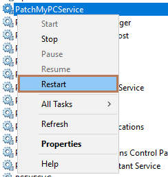

By default, we will always [Timestamp](https://en.wikipedia.org/wiki/Trusted_timestamping) third-party update content when publishing third-party updates to WSUS.

Timestamping can be helpful because even after the WSUS Signing Certificate's expiration date has occurred, clients will still **trust any previously published updates** that were signed with that certificate if it was timestamped.

For example, the following WSUS Signing Certificate has an expiration date of **May 20, 2023**. If timestamping is enabled, clients will trust an be able to install updates even after the expiration date.

We usually recommend leaving timestamping enabled, but if you need to disable the timestamp feature, you can create the following DWORD value:

**HKEY\_LOCAL\_MACHINE\\Software\\Patch My PC Publishing Service:DisableTimestamping = 1**

After creating the registry value, you will need to **restart the PatchMyPCService**

One reason why you may want to disable time stamping is to test if updates may be failing to publish due to [timestamping firewall rules](/list-of-domains-used-for-downloads-in-patch-my-pc-update-catalog) or [proxy not configured at the system-level](/update-publishing-fails-when-proxy-is-in-use-and-timestamping-is-enabled).

### Error Codes When Access to the Timestamping Server is Blocked or System-Level Proxy not Configured

If a proxy is in use, we recommend reviewing our article **[Update Publishing Fails When Proxy is in Use, and Timestamping is Enabled](https://patchmypc.com/update-publishing-fails-when-proxy-is-in-use-and-timestamping-is-enabled)**.

By default, we use **timestamp.digicert.com** for timestamping.

Here is a list of errors that may occur due to issues accessing the timestamping server.

An error occurred while publishing an update to WSUS: Failed to sign package; error was: 2147954402

An error occurred while publishing an update to WSUS: Failed to sign package; error was: 2147954429

An error occurred while publishing an update to WSUS: Failed to sign package; error was: 2147954407

An error occurred while publishing an update to WSUS: Failed to sign package; error was: 2148086027
