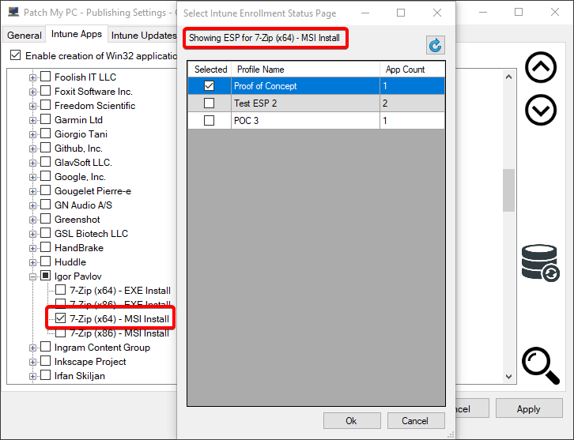

In this article, we will discuss how Patch My PC can manage the Intune Win32 applications which are associated with [Enrollment Status Pages](https://docs.microsoft.com/en-us/mem/intune/enrollment/windows-enrollment-status).

> **Note:** This feature will require your Azure App Registration to have [DeviceManagementServiceConfig.ReadWrite.All](https://patchmypc.com/intune-authentication-using-azure-app-registration) permissions set.

## Why Use Enrollment Status Pages

An Enrollment Status Page (ESP) allows you to configure a list of applications that [must be installed before the ESP completes](https://docs.microsoft.com/en-us/mem/intune/enrollment/windows-enrollment-status#block-access-to-a-device-until-a-specific-application-is-installed). This is particularly useful if you happen to be using the [Intune Updates feature](https://patchmypc.com/third-party-patch-management-for-microsoft-intune) of the Patch My PC Publisher. Generally, Intune Updates are assigned to **all devices** or a **large number of devices** as **required**. With this large scope of a required assignment, you would see the Intune Updates be evaluated during Autopilot or Device Enrollment. To prevent these updates from unnecessarily evaluating, you can **specify a list of applications in your ESP**.

Below is a sample of what an ESP might look like in the Intune portal. These are found within Intune under Home > Devices > Windows > Enrollment Status Page.

> **Note:** You shouldn't associate Intune Updates from the Patch My PC Publisher with an Enrollment Status Page. The updates have a 'Requirement' script that checks if an old version of the application is installed. This is almost never going to apply during Autopilot or Device Enrollment.

## Update ESP When New Application Version Published

Within the [Intune Options](https://patchmypc.com/intune-application-creation-options#Update-ESP), there is an option to 'Update Enrollment Status Page associations with new application when an updated application is created.' This option can be seen below.

This option will ensure that the list of selected Win32 applications for an Intune [Enrollment Status Page](https://docs.microsoft.com/en-us/mem/intune/enrollment/windows-enrollment-status#block-access-to-a-device-until-a-specific-application-is-installed) is **kept up to date as new versions of applications are published**. These Enrollment Status Pages are commonly used during Autopilot. With this checkbox checked the Publisher will ensure the latest version of the published application is associated with your ESP during a synchronization.

## Right-Click Option to Assign ESP

The 'Manage ESP Profiles' right-click option allows you to manage the [Enrollment Status Page profiles](https://docs.microsoft.com/en-us/mem/intune/enrollment/windows-enrollment-status#block-access-to-a-device-until-a-specific-application-is-installed) which any Win32 application can be associated with (Intune Apps).

The ESPs are pulled from Microsoft Intune for your configured tenant. Note that the profile must have '**Show app and profile configuration progress**' set to '**Yes**' in order to appear in the list for selection. An example list is shown below.

Any Win32 application **created by the publisher** will be **added to the ESPs which are selected** for the respective application.

> **Note:** ESP associations will be **added** to existing applications during the next publisher sync, but they **will not be removed** for existing applications. Whenever a **new** application is created the Publisher will ensure the **currently specified Enrollment Status Page associations are in place.**
