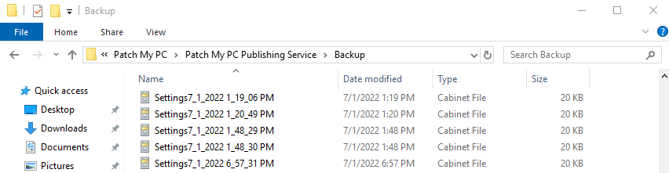
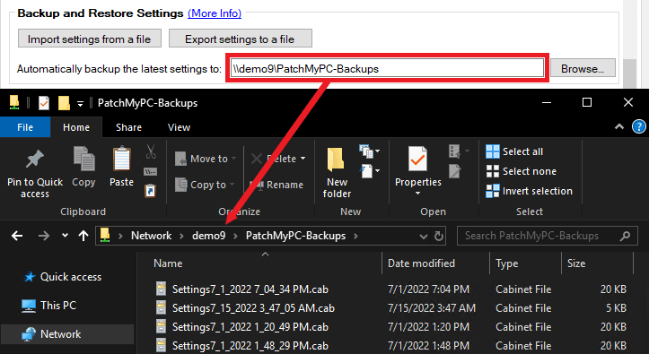
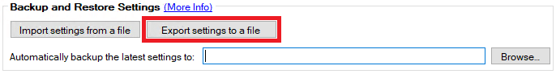
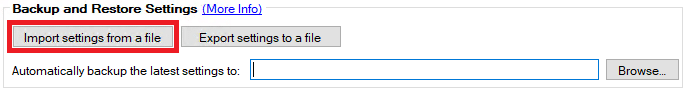
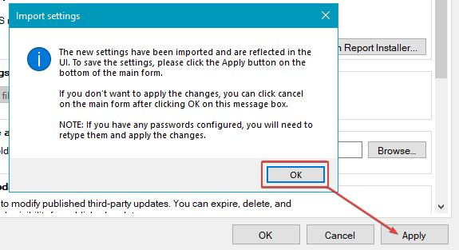

In this article, we are going to review the options available to **backup** and **restore** the settings in the Patch My PC [Publisher](/docs).

The publisher's settings are stored in the **%InstallDir%\\Settings.xml** file.

## Backup the Publisher Settings

By default, the Publisher will **automatically store the last 50 settings .cab files** in the **%InstallDir%Backup** directory.

The automatic local backup of the Publishers settings to a local **.cab** file can be helpful if there was a setting change made by accident, or you want to revert to a previous configuration on the same server.

In the **advanced** tab, you can also enable **automatic backup to a custom folder**. This option will allow you to save the latest **.cab** in a custom folder automatically. For example, you could choose a remote network share so settings could be restored if the server running the Publisher crashed.

You can also manually export the current settings to a **.cab** using the **Export settings to a file button** in the **Advanced** tab.

## Restore the Publisher Settings

From the **Advanced** tab, you can import any valid **.cab** file saved from a backup.

Click the **Import settings from a file** button in the Advanced tab.

Once imported, you should see an import settings message box with an **OK** button. Please be aware although the settings will be reflected in the Publisher's UI, the settings will not take effect until you click **Apply**.

> **Important:** Please be aware that if you are **restoring the setting backup to a new machine**, there are a few settings that you will need to update after the settings import manually if they were configured. The following settings will need to be manually updated:
> 
> - Entra ID app registration secret
> 
> - Proxy password
> 
> - SMS Provider connection account
> 
> - SMTP email password
> 
> - SQL connection account
> 
> - Webhooks specified for alerts
> 
> - Manage Conflicting Processes custom banner image
> 
> - If you are also referencing files on disk for features like the Local Content Repository, MST files, pre/post scripts, it is important that these folders and files are either accessible from, or manually brought over to, the new machine - preserving the original path.
