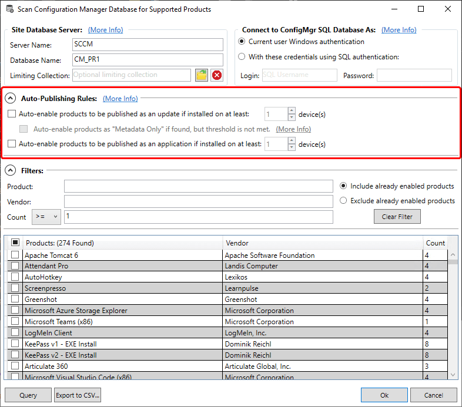
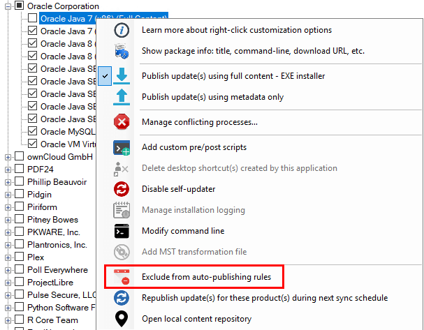

Today, we are excited to release a new feature that allows automated scanning and product enablement based on products being detected in your environment.

This new feature is directly from customer feedback on our [UserVoice](https://ideas.patchmypc.com/ideas/PATCHMYPC-I-20).

In the **Updates** or **ConfigMgr Apps** tab you can click the **database icon** to launch the scan feature. The scan feature allows you to perform a one-time query against your environment as well as automated scanning during scheduled synchronizations and automatic product enabling.

### How does Scanning Work?

Each time a synchronization is performed, the service will query the SCCM database and evaluate if any of our supported products match entries in the v**\_GS\_INSTALLED\_SOFTWARE, v\_Add\_Remove\_Programs, V\_GS\_ADD\_REMOVE\_PROGRAMS,** and **v\_GS\_ADD\_REMOVE\_PROGRAMS\_64 views** collected via hardware inventory in SCCM. If a product is detected and exceeds the count, it will automatically be enabled for publishing.

### Excluding Products?

In the event you want to exclude any existing products, you can right-click the product in the update or application rules tab in the publishing service.

### SQL Permissions Required?

For better performance, the query is performed directly against the SQL server and does not go through the SMSProvider.

When running the query in the publishing service user interface, it's performed under the logged on users context. When the query is performed during a synchronization, it's performed using the SYSTEM account of the WSUS server where the publishing service is installed.

If the WSUS server is remote from the SQL server, you will likely need to grant the computer account the [minimum permissions required to run the SQL query](/minimum-permissions-required-for-patch-my-pc-to-scan-the-sccm-database-for-managed-applications).
