# How Publishing Alerts Work Patch

An important factor of third-party patching is **staying informed** as new updates publish in real-time. Our alerts feature allows you to be notified via the following methods:

* **Email**
* **Microsoft Teams webhook notification**
* **Slack webhook notification**

This article will cover how the **SMTP Settings** and **Webhook Settings** work within our [**Publisher**](../../docs/).

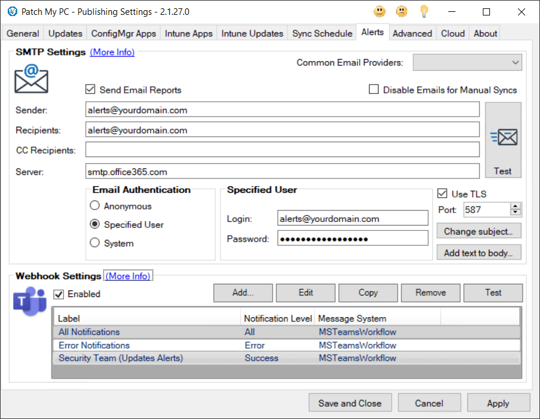

### How do Email Alerts Work in the SMTP Settings?

> **IMPORTANT: Patch My PC Publisher, at this time, cannot support Modern authentication and relies on SMTP authentication for sending email reports.**
>
> Please refer to [this](https://patchmypc.com/patch-my-pc-smtp-authentication-for-exchange-online) article for more information on how to re-enable SMTP authentication for 1 specific mailbox, which will allow Patch My PC Publisher to authenticate and send emails through your Exchange Online environment.

The [**Simple Mail Transfer Protocol (SMTP)**](https://en.wikipedia.org/wiki/Simple_Mail_Transfer_Protocol) has been around since 1982 and is a common method for sending emails. Our [**Publisher**](../../docs/) allows you to configure SMTP settings to send email alerts for **publishing operations**. The first step is to configure the required options for your SMTP server.

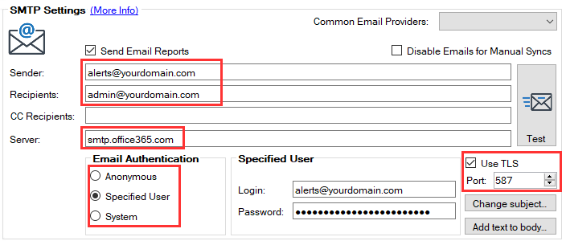

> [**Note**](https://docs.microsoft.com/en-us/microsoftteams/platform/webhooks-and-connectors/how-to/add-incoming-webhook#add-an-incoming-webhook-to-a-teams-channel)**:** The **Recipients** and **CC Recipients** value(s) must be a valid email address. You can specify multiple email-addresses and seperate the addresses with a semi-colon. e.g. alerts@yourdomain.com;support@yourdomain.com.

Once the settings are complete, you can click the **Test button** to see if the recipient received the test email. If you have any issues sending emails, it's likely an **SMTP configuration error**, and you can review our article [**Troubleshooting SMTP Email Report Sending When Using Patch My PC**](https://patchmypc.com/troubleshooting-smtp-email-sending).

Once the SMTP settings are saved, the Publisher will automatically send an email at the end of each synchronization when **any updates or applications** have been published.

The email will include the following details for all Published products:

* Update/Application **Title** (Links to release notes)
* **Time** of Publishing
* **Size** of binary
* Update **Classification**
* Update **Severity Level**
* **CVE's** (Links to CVE-ID on [https://cve.mitre.org/](https://cve.mitre.org/))

In the example below, you can see an email alert where both **updates and applications** were published to **WSUS & ConfigMgr**.

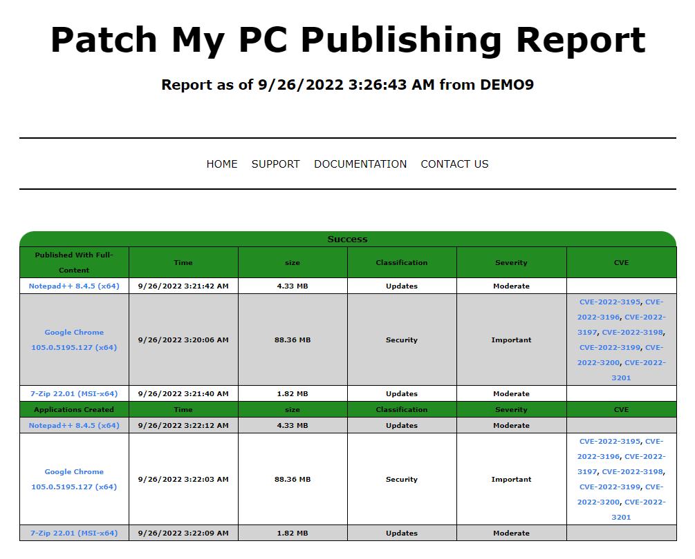

In the example below, you can see an email alert where both **Updates and Applications** were published to **Intune**

For products published to **Intune**, The email will include the following additional information

* Intune Tenant friendly name
* Intune assignments set during Publishing.

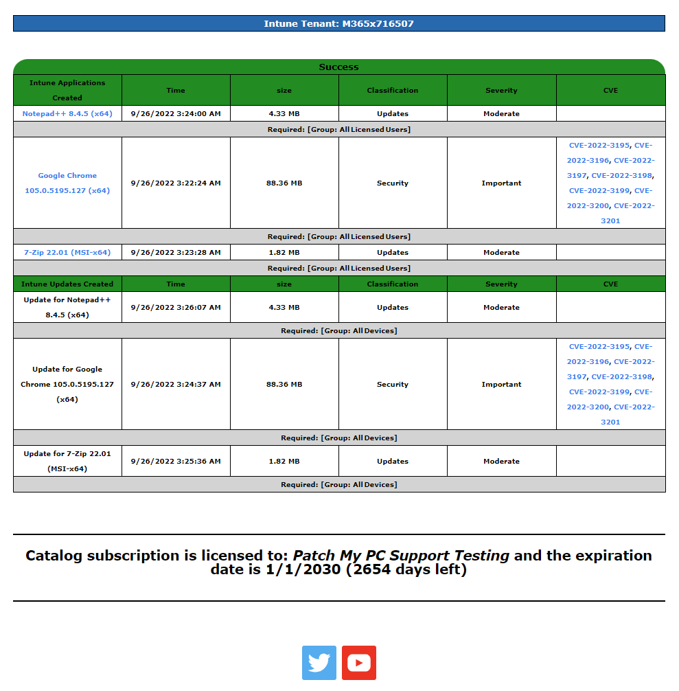

### How do Alerts Work in Microsoft Teams and Slack?

Another option for Alerts is to use a [Microsoft Teams Webhook](https://docs.microsoft.com/en-us/microsoftteams/platform/webhooks-and-connectors/how-to/add-incoming-webhook) or a [Slack Webhook](https://api.slack.com/messaging/webhooks). The Teams or Slack webhook will allow the Publisher to **send a message into a Teams or Slack channel** either as each update or application is published **in real-time** or a single message at the end of the synchronization.

> [**Note**](https://docs.microsoft.com/en-us/microsoftteams/platform/webhooks-and-connectors/how-to/add-incoming-webhook#add-an-incoming-webhook-to-a-teams-channel)**:** Microsoft announced the end of support for traditional Office 365 Connectors. You can read more about this announcment and how it affects Patch My PC alerts at [https://patchmypc.com/migrating-from-office-365-connectors-to-the-workflows-app](https://patchmypc.com/migrating-from-office-365-connectors-to-the-workflows-app)
>
> Customers are encouraged to migrate existing webhooks of the _**MSTeams**_ "Message System" type to the _**MSTeamsWorkflow**_ "Message System" type before **December 2024.** Migration of existing webhooks is covered below in the section [How to Update Existing Microsoft Teams Webhooks to Support Microsoft Teams Workflows.](how-publishing-alerts-work-patch.md#how-to-update-existing-microsoft-teams-webhooks-to-support-microsoft-teams-workflows)

> [**Note**](https://docs.microsoft.com/en-us/microsoftteams/platform/webhooks-and-connectors/how-to/add-incoming-webhook#add-an-incoming-webhook-to-a-teams-channel)**:** The \_MSTeamsWorkflow "\_Message System" type is supported in [Patch My PC Publisher version 2.1.27.0](https://patchmypc.com/patch-my-pc-publisher-production-version-2-1-27-0-released) or higher.

### How to Create a Microsoft Teams Webhook URL

Before you can send Microsoft Teams alerts, you need to create a Microsoft Teams Workflow to obtain a valid webhook URL.

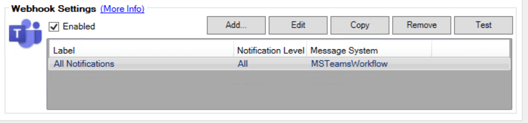

**IMPORTANT**

The account being used to create the Teams Workflow must be a member of the _**Team > Channel**_ where you want the Patch My PC notifications to appear. The notification will include the name of the person who created the Teams Workflow. You cannot omit the name from the notification. This is by design from Microsoft.

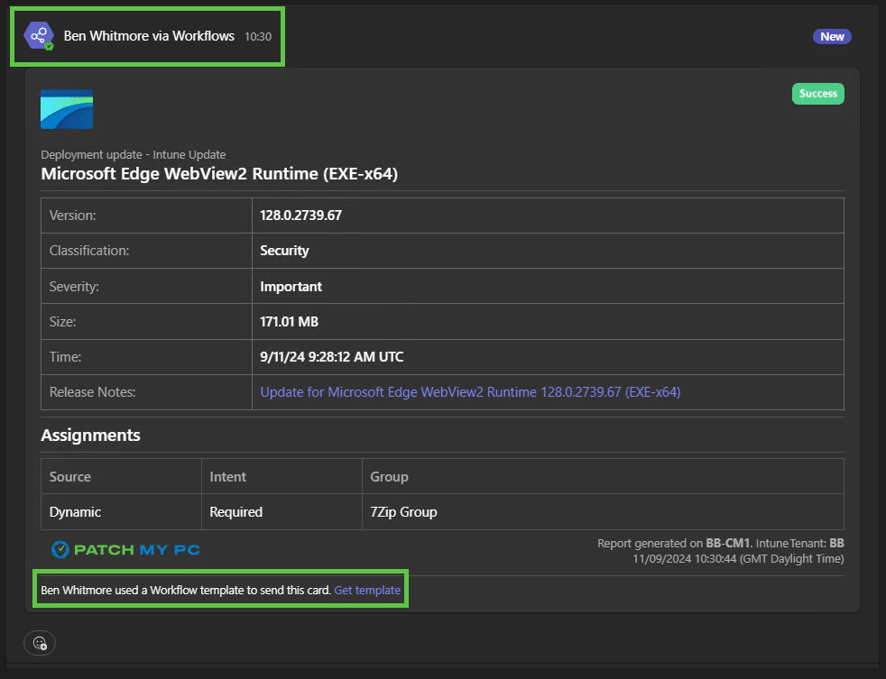

Please follow the steps below to **create an incoming webhook URL**:

1. Open Microsoft Teams and navigate to the Channel where you want to receive Webhook Notifications.
2. Click the More Options button **...** and select **Workflows**.  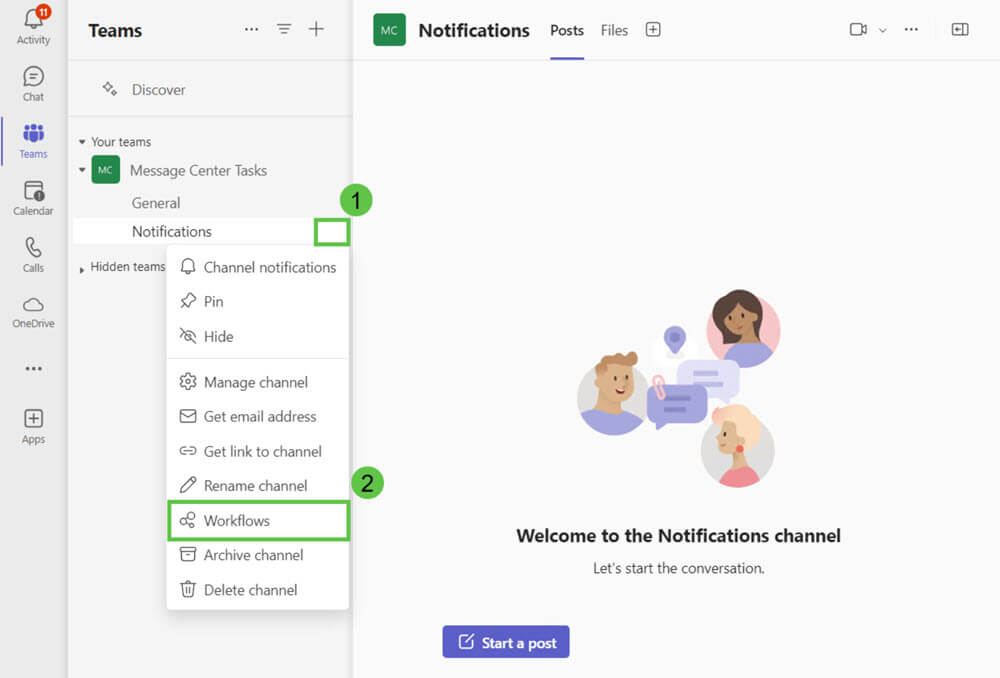
3. Select **Post to a channel when a webhook request is received**.\
   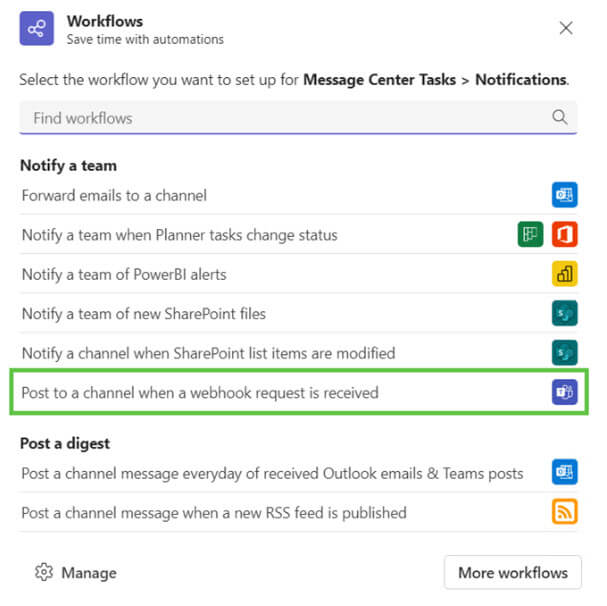
4. Allow a moment for the template to load, it can take a minute or two.\
   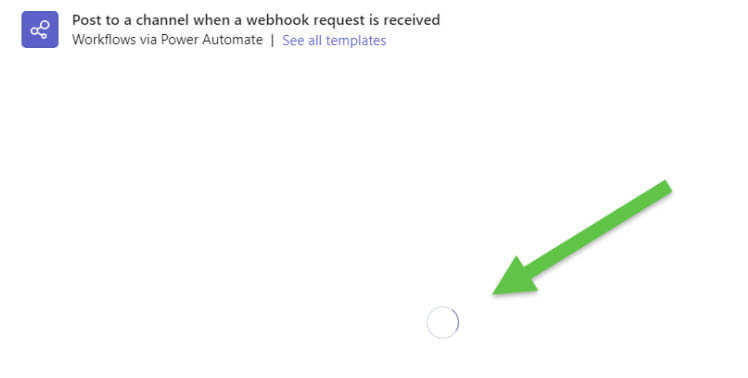
5. Click **Next**.\
   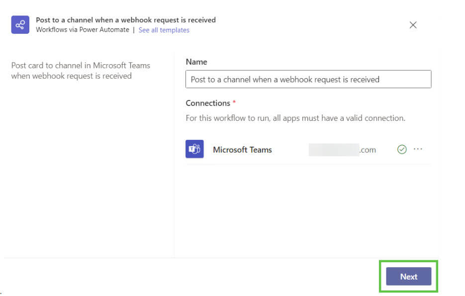
6. Allow a moment for the details tab to load to verify which Team and Channel the webhook URL will be created for and click **Add workflow**.\
   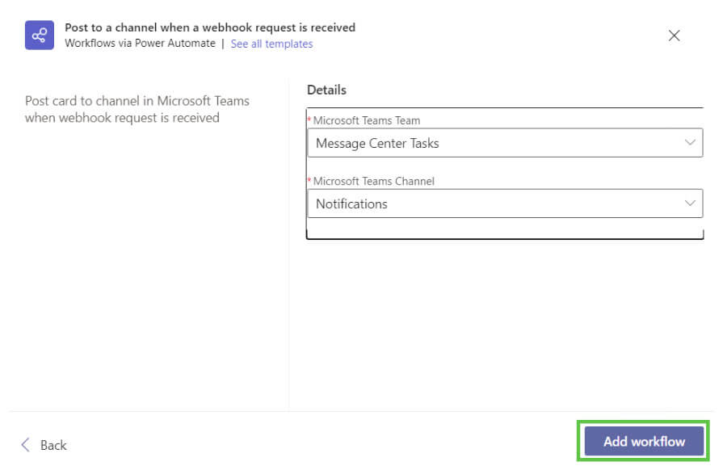
7. Click the **copy icon** to copy the webhook URL to your clipboard and click **Done**.\
   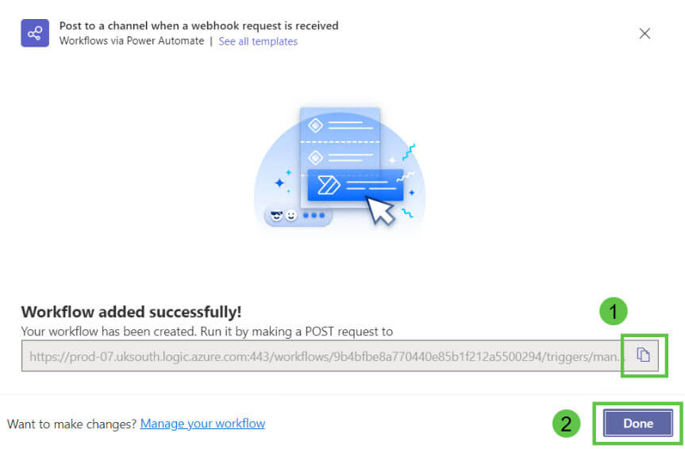
8. In the Patch My PC Publisher, navigate to the **Alerts** tab and in Webhook Settings click **Add**.\
   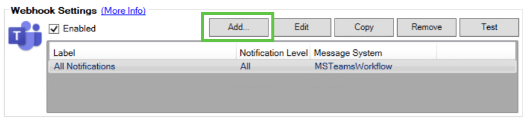
9. Add a **Label** and paste the Workflows URL obtained in Step 7 into the **Webhook URL** box. Configure additional settings for the alert too.\
   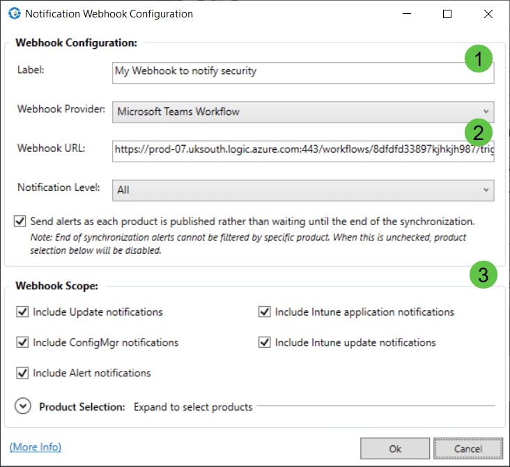
10. Click **Ok** to save the webhook and click **Test** to ensure the newly configured webhook is received to the Microsoft Teams channel.\
    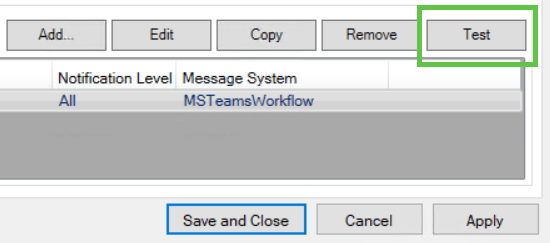

    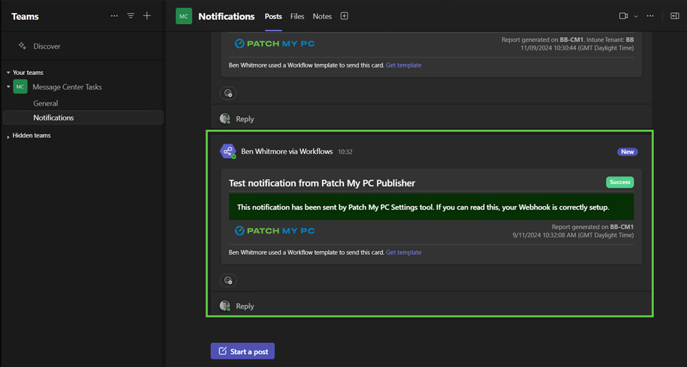

### Consideration for Private Channels

In Microsoft Teams, bots, including those created via Power Automate (Flow), can interact with channels to provide automated responses, notifications, and other functions. However, posting messages as a Flow bot to a private channel presents a challenge because of permissions restrictions that exist within the Teams platform.

A private channel in Teams is a more restricted environment compared to a standard channel. Only members who are specifically added to the private channel can access it and interact within it.

To ensure the workflow can post to a private channel, you need to edit the **Post As** value for the Flow.

1\. Navigate to [https://make.powerautonmate.com](https://make.powerautonmate.com)

2\. Find the Workflow(s) used for Teams notifications in the Private Channel and click **Edit**.

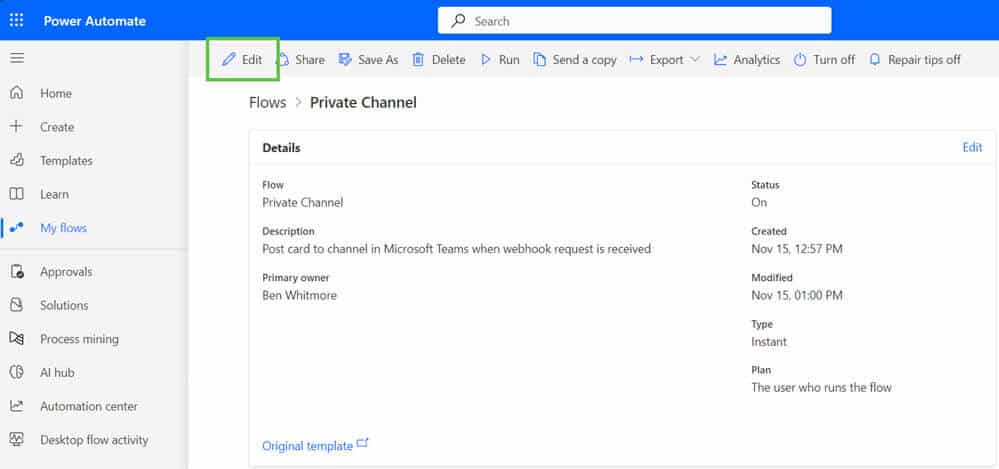

3\. Select the step in the flow chart named **Post card in a chat or channel**.

4\. Modify the **Post As** value and change it from **Bot** to **User**.

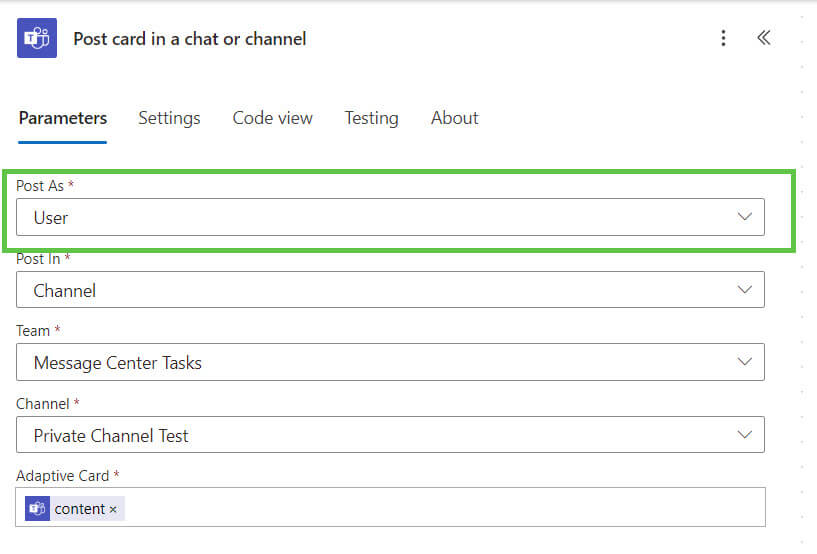

5\. Click **Save**.

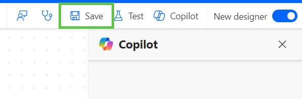

### How to update existing Microsoft Teams webhooks to support Microsoft Teams Workflows

Microsoft announced that Office 365 connectors are being deprecated. You can read the full post at [https://devblogs.microsoft.com/microsoft365dev/retirement-of-office-365-connectors-within-microsoft-teams/](https://devblogs.microsoft.com/microsoft365dev/retirement-of-office-365-connectors-within-microsoft-teams/)

To prepare for this change, Patch My PC now supports the Microsoft Teams Workflows app which is Microsoft's recommended alternative to using Office 365 connectors to generate webhook URLs to receive notifications in Microsoft Teams.

Workflows only support the "Adaptive Message Card" format. Legacy webhooks created in the Patch My PC Publisher use the "Message Card" format.

**Note:** [Patch My PC Publisher version 2.1.27.0](https://patchmypc.com/patch-my-pc-publisher-production-version-2-1-27-0-released) or higher is required to update legacy webhooks to support Microsoft Teams Workflows.

#### Which webhooks should I update?

Any webhook configured with the **MSTeams** "Message System" **(2)** in the Publisher should be updated to the **MSTeamsWorkflow** "Message System" **(1)** type.

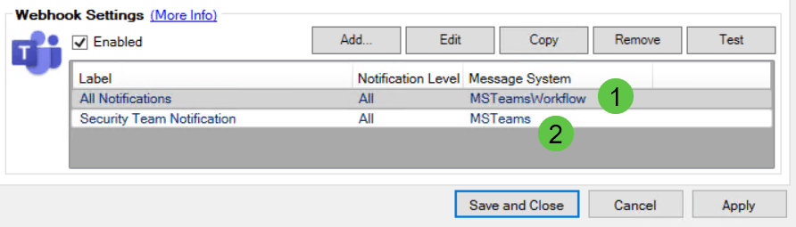

To update an existing webhook to the new format:-

1. Follow the steps outlined in [How to Create a Microsoft Teams Webhook URL](how-publishing-alerts-work-patch.md#topic3) to generate a new webhook URL for a Microsoft Teams Workflow.
2.  Highlight the webhook and click \*\*Edit.\
    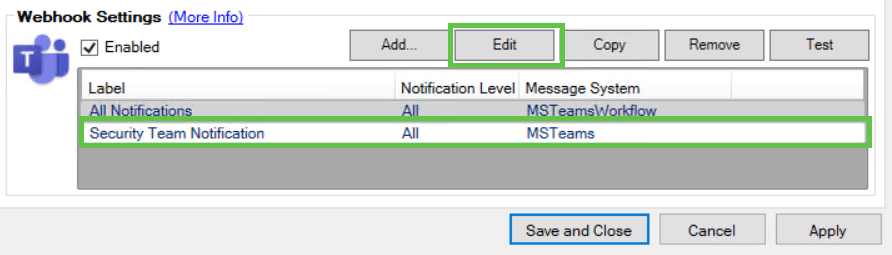

    \*\*
3. Change the **Webhook Provider** from _**Microsoft Teams (Legacy Webhook)**_ to _**Microsoft Teams Workflow**_.\
   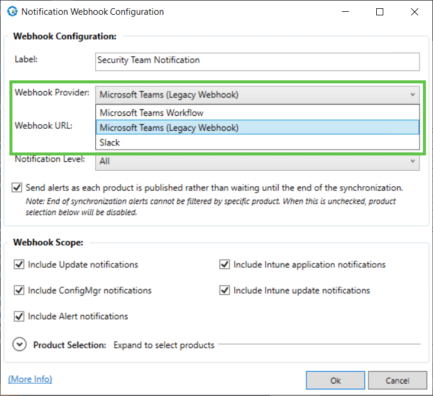
4. Replace the existing **Webhook URL** with the one obtained by completing Step 1 above.\
   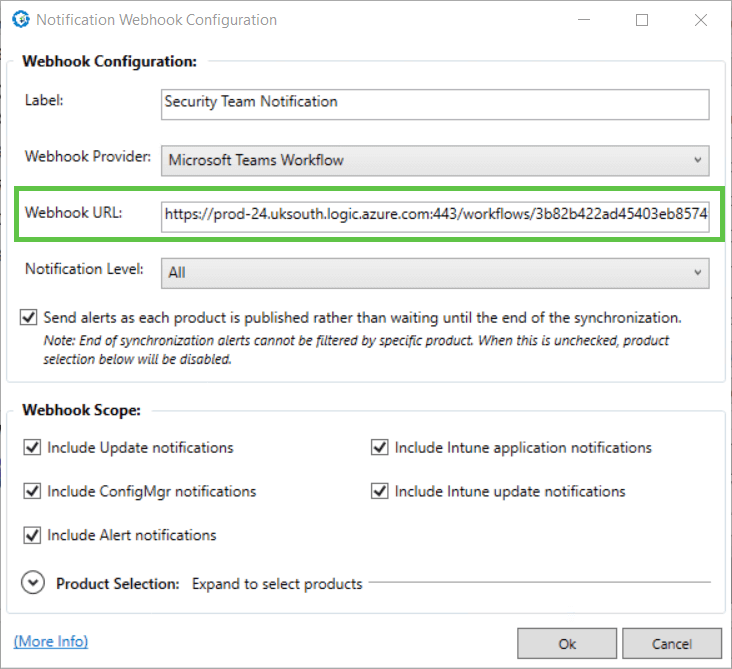
5. Click **Ok**

> **IMPORTANT:** The table formatting in the adaptive card for Teams may appear misaligned or incorrect unless the **Post As** parameter in the flow action is set to **Flow Bot**.
>
> 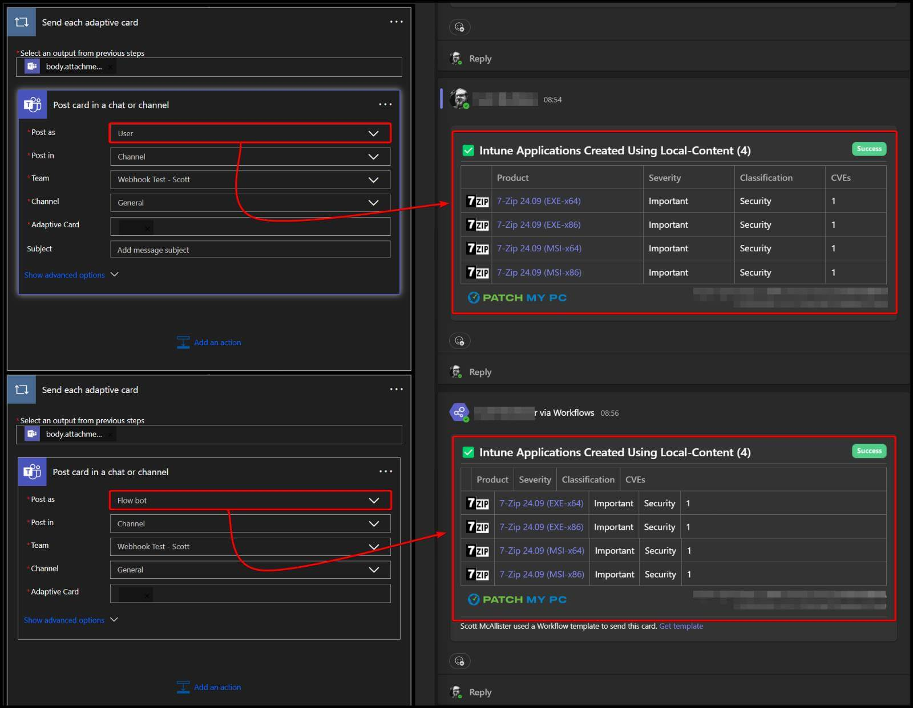

### How to Create a Slack Webhook URL

Before you can send Slack alerts, you need to [**create an incoming webhook**](https://api.slack.com/messaging/webhooks):

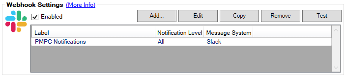

Please follow the steps below to **create an incoming webhook URL**:

1. On the following web page [https://api.slack.com/messaging/webhooks](https://api.slack.com/messaging/webhooks), select **Create your Slack app** (note: you will need to be logged into your Slack account and, depending on your settings, you may need to be a Workspace Owner of the account)\
   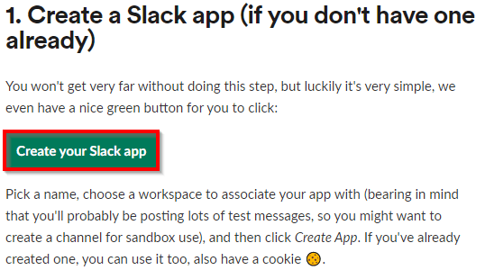
2. Select **Create an App > From Scratch.**  Enter an app name, choose your workspace, and then select \*\*Create App\
   \*\*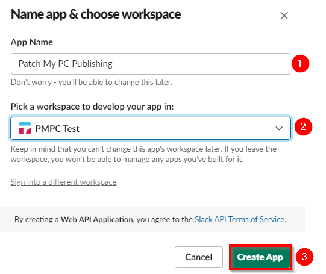
3. Set **Activate Incoming Webhooks** to \*\*On\
   \*\* 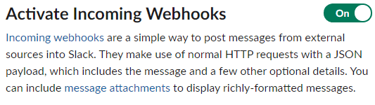
4. Select **Add New Webhook to Workspace**\
   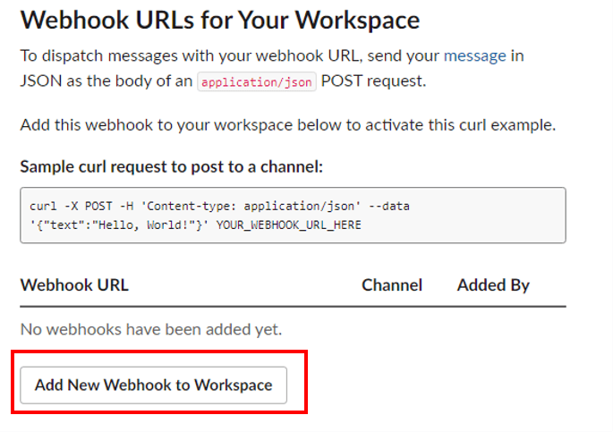
5. Choose the channel you want to post to and then select \*\*Allow\
   \*\* 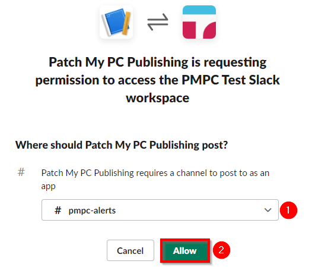
6. Copy the Webhook URL and **Paste** the URL into the Webhook URL in the Publisher and click the **Test button**\
   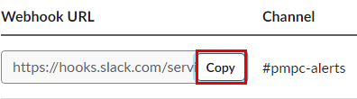
7. In the Patch My PC Publisher under the **Alerts** tab, select **Add** in the **Webhook Settings** section
8. In the Notification Webhook Configuration window, enter a Label for your webhook, set **Webhook Provider** to **Slack** and **Paste** the URL into the **Webhook URL** field. Click **OK** when done\
   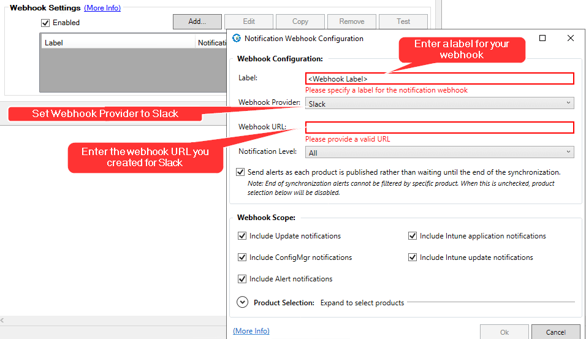
9. Click the**Test** button
10. You should see the **test message** sent in the Slack channel you selected

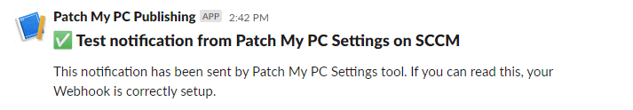

Custom Options for Teams and Slack Webhooks

You can configure the webhook notifications for Teams or Slack in the **Notification Webhook Configuration** window. To view the Notification Webhook Configuration select **Add** or **Edit** under **Webhook Settings**.

When the option “_**Send alerts as each product is published rather than waiting until the end of the synchronization.**_” is enabled, the Publisher will send a message **in real-time** right after each update or application is published. When this option is enabled, the message will include more detailed information about each update, including:

* Update/Application **Title**(Links to release notes)
* **Time**of Publishing
* **Size**of binary
* Update **Classification**
* Update **Severity Level**
* **CVE’s**(Links to CVE-ID on [https://cve.mitre.org/](https://cve.mitre.org/))

Below is an example of the individual notification in Teams.

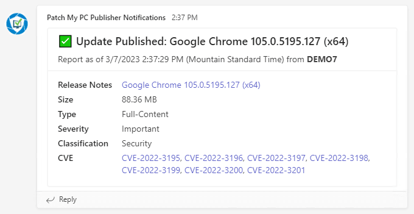

When the option “_**Send alerts as each product is published rather than waiting until the end of the synchronization.**_” is **disabled**, the Publisher will only send a summary of updates and applications published at the **end of the synchronization**. This option will **only include the name** of the update or application and link to the release notes. Below is an example of the Teams summary notification.

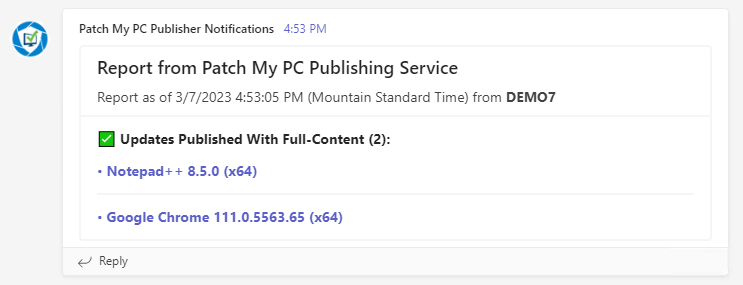

You can choose the **notification level in the Notification Webhook Configuration window**. The levels include receiving **All**, **Error**, or **Success**. This option can be helpful if you want a specific channel to only receive alerts if an update or application fails to publish.

In the **Webhook Scope** section you can scope the product type you want for the alerts. You can also scope out alerts by specific products with the **Product Selection** section.

> [**Note**](https://docs.microsoft.com/en-us/microsoftteams/platform/webhooks-and-connectors/how-to/add-incoming-webhook#add-an-incoming-webhook-to-a-teams-channel)**:** When the **Summary option** is enabled, notifications can be truncated if they are too long. This is due to Teams and Slack specifications. Since we can't send long notifications to Teams or Slack, you will need to enable **SMTP Settings** to receive a full email report. If email reports are not enabled, you will need to fall back to the log file for more information on any error messages.
