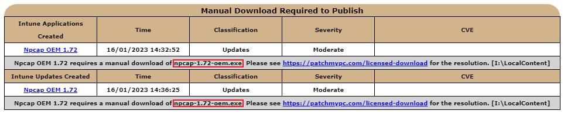

The **local content repository** is used for licensed products in catalogue where there is no public download available due to a **paywall login** and also when the vendor uses a compressed file for its installer.

This article handles how we handle products that require you to **manually download**.

**Note:** the local content repository is for publishing products in our catalog. To see products available in our catalogue, see **[Supported Products](/supported-products)**. To publish products not available in our catalog, see [Custom Apps](https://docs.patchmypc.com/installation-guides/patch-my-pc-cloud/custom-apps).

## Products that Require Manual Download to the Local Content Repository

The following products currently require a manual download of the installer files due to a **paywall portal**, file **download format,** or for **EULA** reasons:

\[table id=24 /\]

> **Important:** If Oracle JRE or JDK is enabled, you need to download the binaries from the **[Java SE Downloads](https://www.oracle.com/java/technologies/javase-downloads.html)** page instead of the Oracle portal. If you download from the Oracle licensing portal, the hash of the binary will be different from our catalog. 

## How the Local Content Repository Works when Using Patch My PC's Publisher

When you enable a product that requires a manual download, you will receive the following message when you click **Apply**.

This message will let you know you need to configure the folder in the **Advanced tab** that our publishing service will use to search for installers that are required for enabled products where the download can't be performed directly online.

The folder you define in the **Local Content Path** will be the location the publishing service searches through when attempting to publish third-party updates. You will need to download the EXE or MSI installer for products that require manual downloads.

In the example above, we defined a UNC path of "**sccm\\sourcesSoftware UpdatesThird-Party-Updates-Local-Repository**". In this folder, the Java installer files for **Java 8 Update 211** have been downloaded as shown below. **Note:** if you use a UNC path, the computer account of the server running the publishing service will need **read and modify permissions**.

We highly recommend enabling email notifications from the [Alerts](https://patchmypc.com/how-publishing-alerts-work#topic1) tab. If we are **unable to locate the installer file** during a publishing attempt, you will receive an email listing the specific updates that need to be manually downloaded as well as the expected file name.

These emails are especially helpful because they will let you know when action is required on your part to download installers when new updates are available for licensed products. 

## How the Local Content Repository Works when Using SCCM In-Console Publishing

If you are using SCCM 1806+ [in-console publishing](https://learn.microsoft.com/en-us/mem/configmgr/sum/deploy-use/third-party-software-updates) or [System Center Updates Publisher (SCUP)](https://learn.microsoft.com/en-us/mem/configmgr/sum/tools/updates-publisher), you cannot define a custom folder for the local content repository. Instead, you need to use the path specified in the catalog metadata.

The path used in the catalog metadata for any licensed updates is: **LocalHostPatchMyPCRepository**

To set this path, create a shared folder on the top-level WSUS/SUP server shared as "**PatchMyPCRepository**".

Once created, simply download any update installers that require manual downloads from the vendors pay portal. In the example below, we downloaded Java 8 Update 211 and Java SE Development Kit 8 Update 211 into the local content repository folder.

You can use the right-click option to [Show package info](https://patchmypc.com/custom-options-available-for-third-party-updates-and-applications#PackageInfo) to gather details such as file name, and version which can be helpful in getting the proper content to place in the local content repository.

> **Note:** If multiple products have the same file name, e.g. TeamViewer\_Full.msi is the file name for TeamViewer MSI x64 & x32, place each installer in a  separate subfolder within your Local Content Repository and the Publisher will find the correct file during the sync.

## How the Local Content Repository Works (Video Guide)

Please review the step-by-step video guide for information on how to publish products that require manual download.

<iframe src="https://www.youtube.com/embed/OvkGR_Gh4kY" width="560" height="315" frameborder="0" allowfullscreen="allowfullscreen" data-cookieconsent="ignore"></iframe>

## Compressed Installers

Some vendors publish their installers in the compressed file format. Download the compressed installer and extract the EXE or MSI into the Local Content Repository.

The folder you define in the **Local Content Path** will be the location the publishing service searches through when attempting to publish the app or update.

## Additional Options Available with Local Content Files

There are two additional options in the local content repository menu

**Delete the update file in the local repository after publishing**

When this option is checked, whenever a product is published using a content file located in the local content repository folder, the file will be **automatically deleted after publishing**.

**Check the local content repository for content files before attempting to download content files from the internet.**

When this option is checked, all content files that would typically be downloaded from the internet will first check if the file exists in the local content repository. If the file exists in the local content repository, it will use the **local file** rather than **downloading it from the internet**. This option may be helpful is the server is unable to download the content for certain products directly from the internet.
