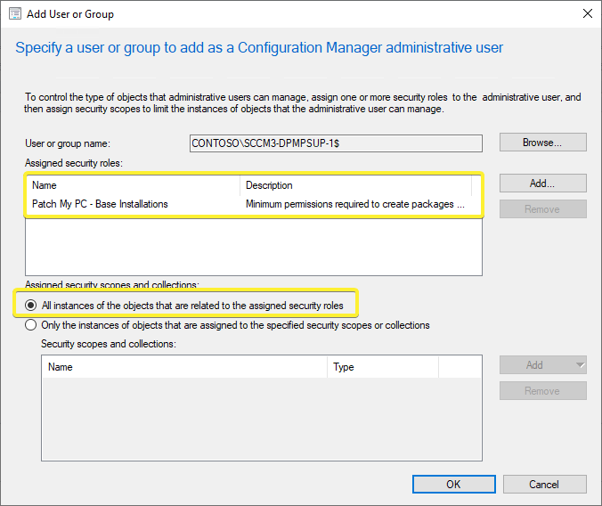
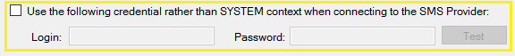

> **Note:** As a first step, ensure that the Configuration Manager console is installed on the remote Software Update Point as well. It is a [mandatory requirement](https://docs.patchmypc.com/installation-guides/configmgr/requirements).

When enabling the **[base installation feature](/automating-application-packaging-in-microsoft-sccm)** as shown below in our **[Publisher](https://patchmypc.com/publishing-service-setup-documentation)**, it's important to understand what permissions are required in SCCM.

## Automatically Create the Configuration manager Security Role for the Patch My PC Publisher

In build 1.8.6 or newer, the Publisher can **automatically create** the Security role with the minimum permissions for you.

After the security role is created, you will need to **assign the computer account** of the server running the publisher, **or the provided alternative account** to the security role.

**Note:** If you already have a role with the same 'Patch My PC Publisher' name then you will be prompted to overwrite the existing role. This will keep existing Security Role associations and simply update the permissions.

## Manually Create the Configuration manager Security Role for the Patch My PC Publisher

When we create installation packages and distribute then we will need the following permissions in SCCM.

- **Application:** Read, Modify, Delete, Set Security Scope, Create, Move Object, Modify Folder

- **Distribution Point:** Read, Copy to Distribution Point

- **Distribution Point Group:** Read, Copy to Distribution Point Group

- **Folder Class:** Read, Modify, Create

- **Security Scopes:** Read

- **Site:** Read

- **Software Updates:** Read, Modify

We will need to be able to create, modify, delete, and distribution packages within SCCM. By default, we attempt these actions **using the computer account of the server the publishing service is running**.

You can download our pre-created security role named "**[Patch My PC - Base Installations](https://patchmypc.com/app/uploads/2025/06/PatchMyPC-ConfigMgr-Role.zip)**". Once imported, you will then need to add the computer account as a new **Administrative User** and assign this new security role. Be sure to select **"All instances of the objects that are related to the assigned security roles"** to prevent potential issues with scoping.

If you prefer, you can configure an **impersonation account to use rather than the computer account** of the server in the base install options.

