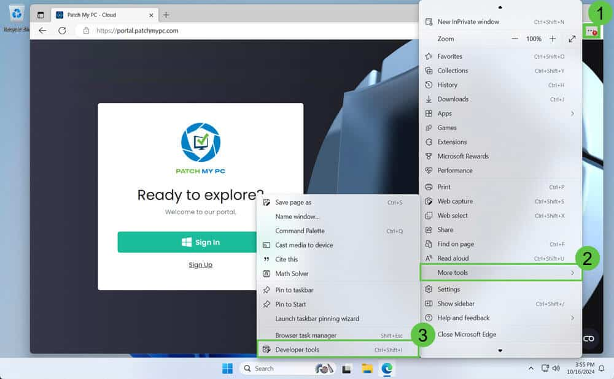
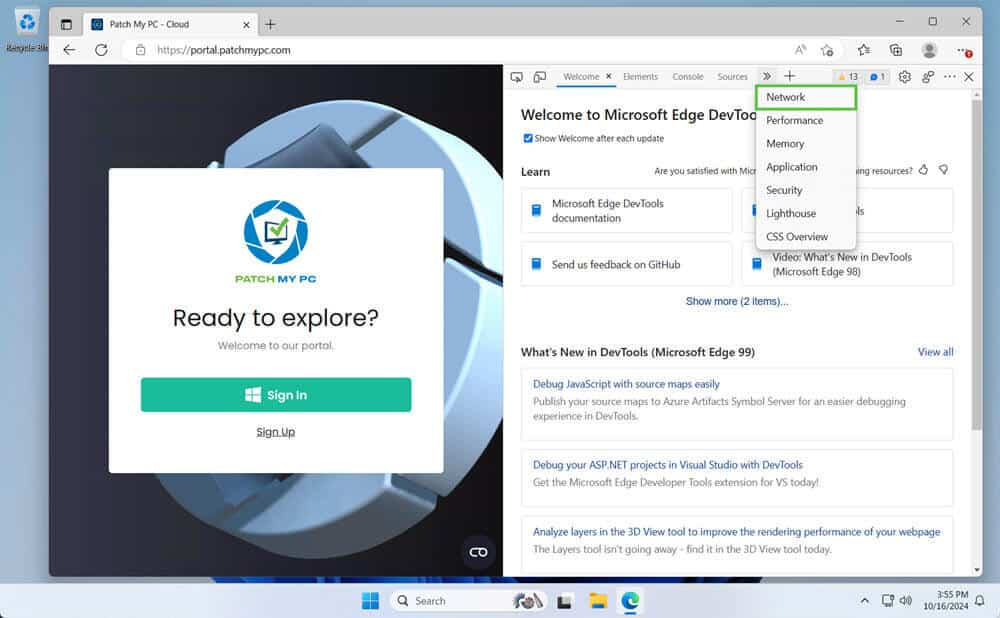
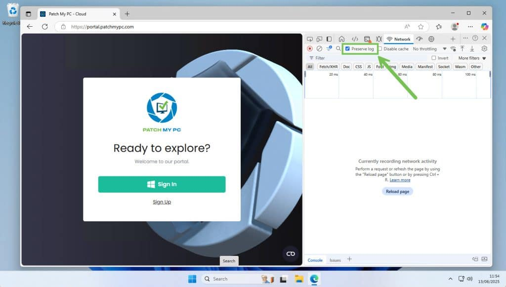
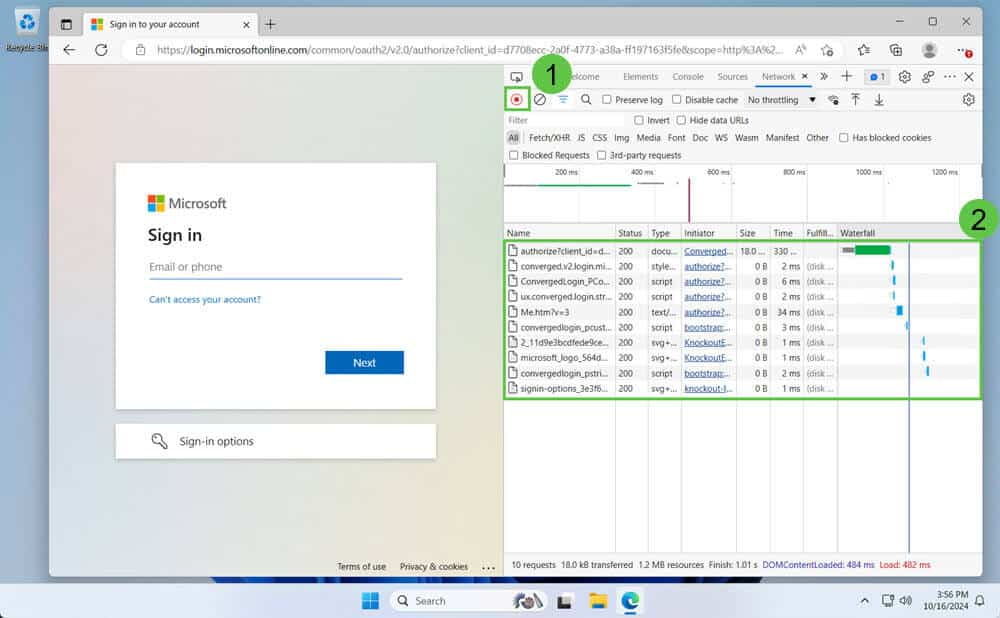
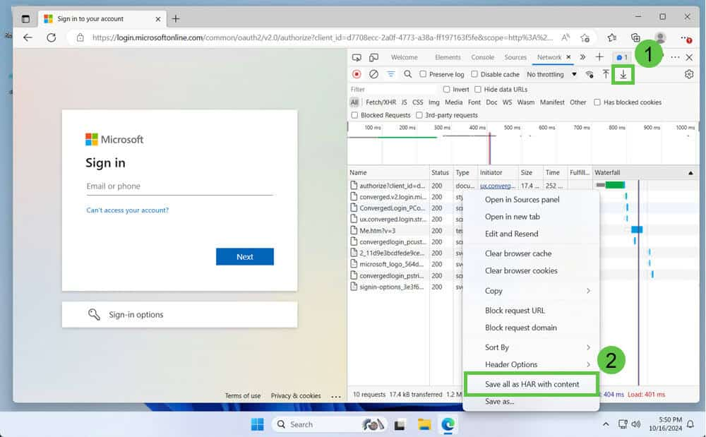

Recording browser network activity as a **HTTP Archive** or **.HAR** file is a quick and effective way to help troubleshoot issues with Patch My PC Cloud features. The .HAR file logs all network requests made between your browser and the Patch My PC portal, capturing critical information like load times, errors, and API responses. In this article, we’ll show you step-by-step how to generate a .HAR file so you can share it with support for assisted problem resolution.

## Record a .HAR file

We will use Microsoft Edge for the following example:-

1\. Open the Microsoft Edge browser.

2\. Press **F12** or **Ctrl + Shift + I** on your keyboard or open the browser menu and navigate to **More tools > Developer tools**

3\. In the Developer Tools window, select the **Network** tab at the top. This tab shows all the network activity between your browser and the website.

4\. Check the box to **Preserve log**.

5\. Reproduce the actions in the browser that are causing the issue to record the network activity for support.

**Note:** Click the circular record button ( ) at the top left of the **Network** tab (1) to start recording if you do not see any network activity (2).

Continue to perform the actions that are causing issues (e.g. click a button, fill out a field, or load a specific part of the page). This will capture those interactions in the network log.

6\. Once you've reproduced the issue, click the circular record button again ( ) to stop capturing network activity.

7\. Either click the download icon ⬇️ to save the .HAR file (1) or right-click anywhere in the network activity log and select **Save all as HAR with content** (2).

8\. Choose a location on your computer to save the .HAR file and give it a recognizable name (e.g. "support.har").

9\. If the file is large, it might be prudent to compress it before sending it to support.

**Video walk through**

https://www.youtube.com/watch?v=YXqEskLIlaw

## Share a .HAR file with support

Please share the resultant file with your customer engineer by either replying to your support case or uploading the file using the instructions documented at [Share Large Files with Patch My PC for Support Case](https://patchmypc.com/how-to-share-large-files)
