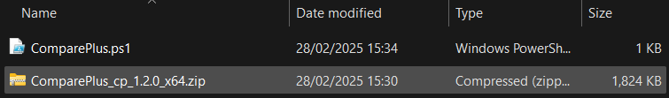
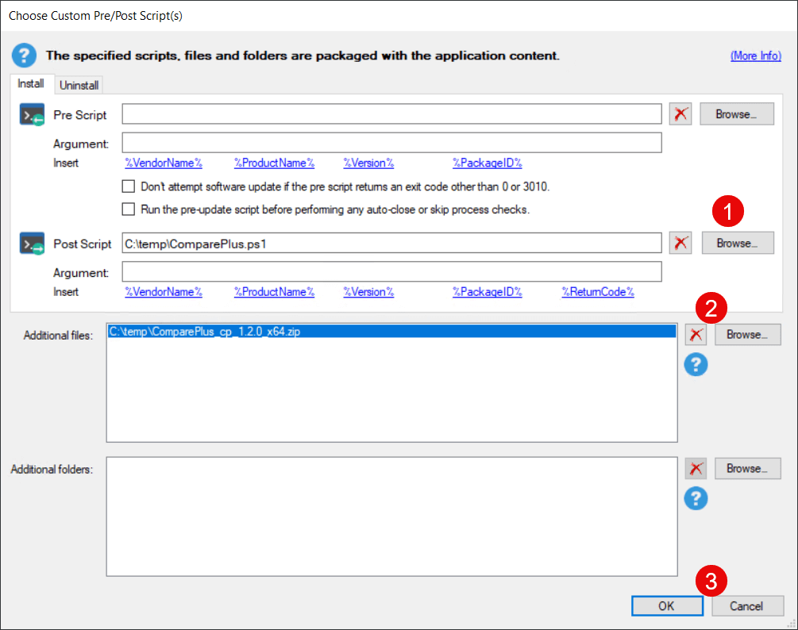

Many applications have advanced configurations that cannot be specified using **command-line parameters** and must be provided via configuration files or other means. This article will provide instructions on configuring applications or updates using the Patch My PC Publisher using a **custom post-installation script** and **additional file(s)**.

For this scenario, we will be adding a **custom plugin** to the installation or update of **Notepad++**. We will do so by providing a custom PowerShell Script and a zip file of the plugin.

## Walkthrough

First, we will **download the Plugin** from GitHub here: [https://github.com/pnedev/comparePlus/releases/latest](https://github.com/pnedev/comparePlus/releases/latest). We will **save the plugin as a zip file** with our PowerShell Script in a location accessible by the Patch My PC Publisher, outside of the actual application's content folder. Next, we will create the following PowerShell script and save it in the same folder as our downloaded plugin.

1\. Create a new folder called "ComparePlus" in the Notepad++ "plugins" folder

```
New-Item -itemtype Directory -Path "$env:ProgramFilesNotepad++pluginsComparePlus" -Force
```

2\. Extract the contents of the provided Compare Plus Plugin zip file to the Notepad++ "plugins" folder

```
Expand-Archive -Path $PSScriptRootComparePlus_cp_1.2.0_x64.zip -DestinationPath "$env:ProgramFilesNotepad++pluginsComparePlus" -Force
```



The **PowerShell file** and **Zip file** were saved to a location that the publisher can access.

Next, we can configure them in the Patch My PC Publisher. Open the Publisher and navigate to the product to be customized. **Right-click** the desired product and select "**Add custom pre/post update installation scripts**"


Add a Pre/Post Update Script by **right-clicking the product** to add the script to.

In the "**Choose Custom Pre/Post Update Script(s)**" window, click "**Browse...**" next to "**Post Script**", navigate to the share where the Powershell script created earlier is stored, and select it.

Next, click "**Browse...**" next to the "**Additional Files**" option and select the zip file containing the Notepad++ plugin that was downloaded earlier. Then select "**OK**"



Use the "**Browse..**" buttons to select the Pre/Post Update Scripts or Extra Files/Folders to include.

Once complete, ensure that Notepad++ is checked for sync, navigate to the "**Sync Schedule**" tab and click "**Run Publishing Service Sync**".  
Once the sync completes, your update should be configured to install the Notepad++ plugin after any update.
