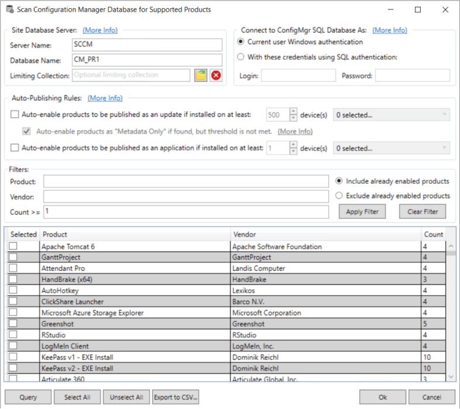
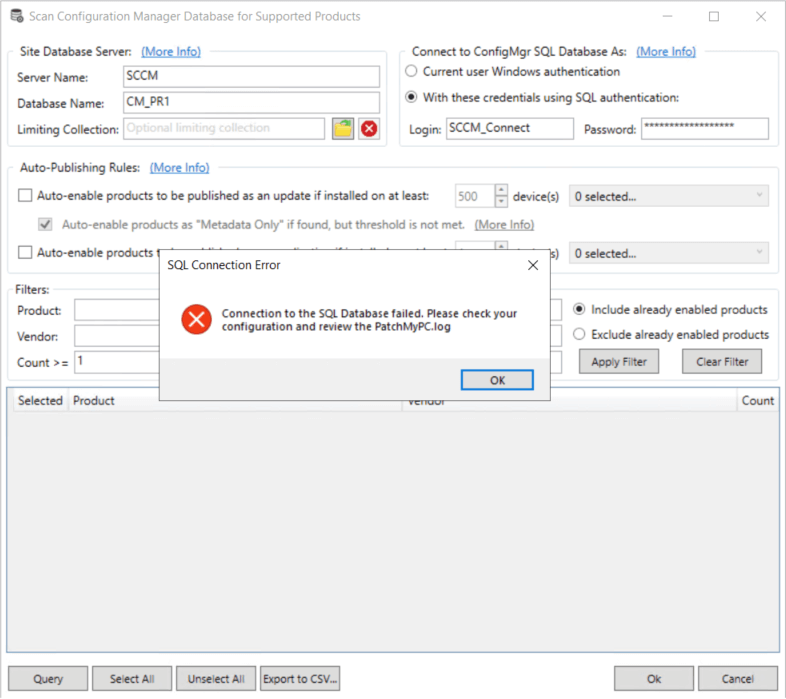
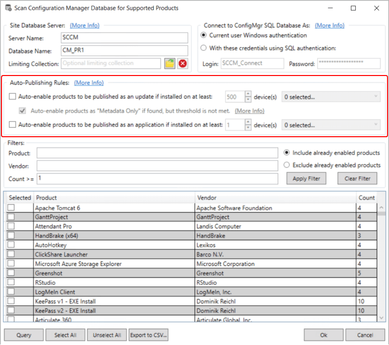
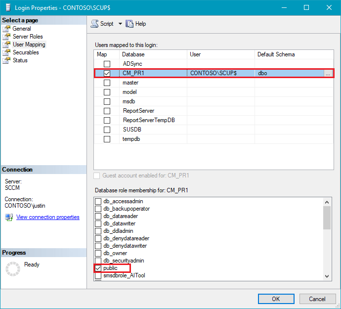

For the Publisher to use the **Scan SCCM for Management Applications** feature, you will need to ensure the user or SYSTEM has rights to the SCCM SQL database.

This article describes the **minimum permissions** required to scan the SCCM database for installed applications from the Patch My PC Publisher. If you have the appropriate SQL permissions to the SCCM database, you should see scan results that look similar to below:



**Topics** covered in this article:

- [Unable to Connect to the SCCM Database?](#topic1)

- [SQL Permissions Required to Run SCCM Application Scans?](#topic2)

- [Manually Add Permissions Using SQL Management Studio](#topic3)

## Unable to Connect to the SCCM Database?

In the event, you receive the error "_**Unable to connect to the SCCM database.**_" you will need to review the information below.

Here's the error you will receive if you don't have the appropriate permissions.



In the PatchMyPC.log, you will also see the following information.

Failed to connect to the WSUS database: Login failed for user 'CONTOSOuser'.

## SQL Permissions Required to Run SCCM Application Scans?

When we run the SCCM Application scan, it's a direct SQL Query and does not go through the SMSProvider. The SQL query allows for better performance but may require to you give account(s) permissions to the SCCM database using SQL Server Management Studio.

If the query fails, you will need to perform the following steps to add the user or computer account in SQL Server. The first option is some SQL code that you can edit, and run as a SQL query, and the second option is the manual steps to add the user, and permissions.

### First Option

```
-- Replace CM_PR1 with the database name for your Configuration Manager environment
USE CM_PR1
GO

-- Replace CONTOSO\ServerName$ with the appropriate value for your environment
DECLARE @UserName nvarchar(128) = 'CONTOSO\ServerName$'
DECLARE @QuotedUserToGrant nvarchar(128) = QUOTENAME(@UserName)

IF NOT EXISTS(SELECT principal_id FROM sys.server_principals WHERE name = @UserName) BEGIN
 DECLARE @LoginSQL as varchar(500)
 SET @LoginSQL = 'CREATE LOGIN '+ @QuotedUserToGrant + ' FROM WINDOWS'
 EXEC (@LoginSQL)
END

IF NOT EXISTS(SELECT principal_id FROM sys.database_principals WHERE name = @UserName) BEGIN
 DECLARE @UserSQL as varchar(500)
 SET @UserSQL = 'CREATE USER ' + @QuotedUserToGrant + ' FOR LOGIN ' + @QuotedUserToGrant
 EXEC (@UserSQL)
END

DECLARE @PermissionsSQL as varchar(500)
SET @PermissionsSQL = 'GRANT SELECT ON dbo.v_Add_Remove_Programs TO ' + @QuotedUserToGrant +
'GRANT SELECT ON dbo.v_GS_ADD_REMOVE_PROGRAMS TO ' + @QuotedUserToGrant +
'GRANT SELECT ON dbo.v_GS_ADD_REMOVE_PROGRAMS_64 TO ' + @QuotedUserToGrant +
'GRANT SELECT ON dbo.v_GS_INSTALLED_SOFTWARE TO ' + @QuotedUserToGrant +
'GRANT SELECT ON dbo.v_FullCollectionMembership TO ' + @QuotedUserToGrant +
'GRANT SELECT ON dbo.v_Collection TO ' + @QuotedUserToGrant
EXEC (@PermissionsSQL)
```

## Manually Add Permissions Using SQL Management Studio

From SQL Server Management Studio, click **New Login...**


Add the account you need to grant permissions to in SQL Server. In the event, you need to add a computer account such as a remote WSUS server enter it as $.


**Note:** when you run the Query in the UI directly, the scan is performed under the **current user context**. In the event you enable automated product scanning highlighted below, the query is executed under **SYSTEM context** using **WSUS server's computer account**.



You can leave the **public** access only under the **Server Roles** tab and click OK. Under the **User Mapping** tab, you need to check the SCCM database and enable the **public** database role membership.



Next, you need to grant the account you added **Select** permissions on the the following SQL views within the Configuration Manager database:

- **v\_Add\_Remove\_Programs**

- **V\_GS\_ADD\_REMOVE\_PROGRAMS**

- **v\_GS\_ADD\_REMOVE\_PROGRAMS\_64**

- **v\_GS\_INSTALLED\_SOFTWARE**

Right click on each view and click **Properties** and grant **Select** permissions. If collection filtering is used, permissions will also need to be enabled on the following views as well:

- **v\_FullCollectionMembership**

- **v\_Collection**


