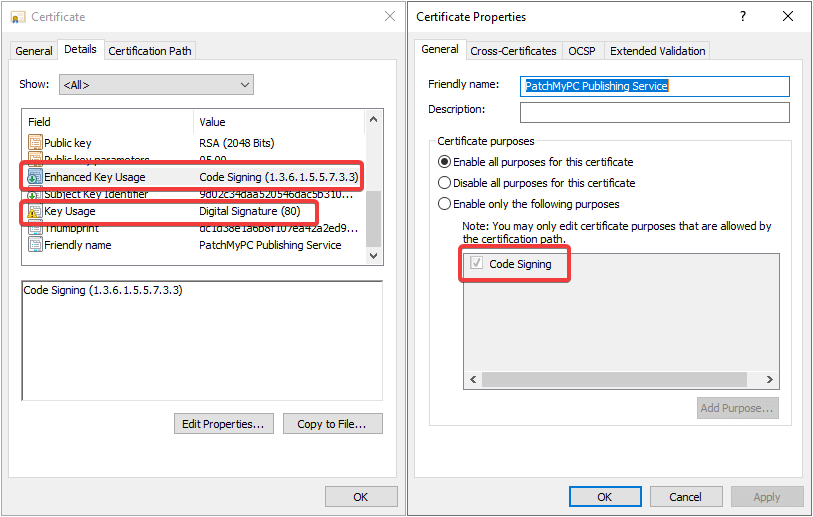

# Publisher Error Certificate Not Suitable

In certain situations, the Publisher may throw an error during the publishing of Apps or Updates when signing a PowerShell script fails. Patch My PC Publisher version 2.0.2.0 introduced this error, before the 2.0.2.0 release, a failure to sign PowerShell scripts would still result in a successfully published application, however the script included with the application (pre/post script or detection method script) would not be code signed.&#x20;

### Determine if You are Affected

This error will occur when the Publisher attempts to code sign a PowerShell script, but the Code Signing certificate used was created incorrectly. When this issue occurs you may see one of the following errors in the PatchMyPC.log:

* An error occurred while signing the PowerShell detection script, but there is no error message to display. CertManager\
  An error occurred while copying Pre/Post Script: Error creating detection method PowerShell script because code-signing is enabled, but there is no code-signing certificate available. Please review the following article for a resolution https://patchmypc.com/ui-doc-no-signing-certificate-for-intune \[\[System.Exception]]
* An error occurred while signing the file: Cannot sign code. The specified certificate is not suitable for code signing. \[\[System.Management.Automation.PSArgumentException]]. Please see kb: [https://patchmypc.com/ui-doc-certificate-not-suitable-for-code-signing](https://patchmypc.com/ui-doc-certificate-not-suitable-for-code-signing)\
  An error occurred while copying Pre/Post Script: while signing the file: Cannot sign code. The specified certificate is not suitable for code signing. \[\[PatchMyPC\_Certificate.AuthenticodeSignatureException]]

To confirm if you are affected by this issue, the following steps may be performed

1. On the system with the Patch My PC Publisher installed, run certlm.msc
2. Navigate to the WSUS -> Certificates store
3. Double-Click the Code Signing Certificate
4. Navigate to the "Details" tab
5. Under the "Details" tab, the following Properties should exist:
   * Enhanced Key Usage - Code Signing
   * Key Usage - Digital Signature
6. Click "Edit Properties..." ensure that Code Signing is listed and enabled under the list of "Certificate purposes"\
   

&#x20;If any of the properties listed above do not exist or contain the values listed, the certificate cannot be used to sign PowerShell scripts

### Solution: Recreate Code Signing Certificate

The full solution for this error is to recreate the Code Signing Certificate that is used for signing updates, and republish updates using the new code signing certificate.

See the following KB articles for information on creating a new Code Signing Certificate and republishing updates:

* [What is the WSUS Signing Certificate and How to Create It](https://patchmypc.com/pki-certificate-for-third-party-update-code-signing-in-sccm)
* [When and How to Republish Patch My PC Third-Party Updates](https://patchmypc.com/when-and-how-to-republish-third-party-updates)

### Workaround: Disable Code-Signing in the Publisher and disable any Patch My PC provided Pre/Post Scripts

If recreating the Code Signing Certificate is not possible, the following steps will work around the issue until a new Code Signing Certificate can be created.

1. Open the Patch My PC Publisher
2. Navigate to ConfigMgr Apps tab
3. Click Options...
4. Deselect the option to "Code-sign the PowerShell detection method script using the WSUS Signing Certificate" and click "OK"\
   
5. Click Apply to apply the changes

The Publisher also attempts to code sign any Patch My PC provided scripts by default (custom pre/post scripts are not resigned), any application utilizing a Patch My PC provided script will need to be disabled and optionally converted to a custom pre/post script in order for publishing to complete successfully. The following process can be used on each of the effected apps to perform this conversion.

1. Open the Patch My PC Publisher
2. Navigate to an application with a Patch My PC defined script (Oracle Java is a popular example)
3. Right click on the Product and select "Patch My PC defined pre/post scripts"\
   
4. Select the Option to "Disable the Patch My PC recommended pre/post-update script for this product."\
   
5. Click on View Script, this will open the provided script in a web browser
6. Save the script as a ".ps1" file in a location that the Publisher has read access, close the web browser\
   
7. Click OK in the "Patch My PC Defined Script(s)" window
8. Right click the Product in the Publisher again
9. Select "Add Custom Pre/Post Scripts"
10. Select "Browse..." next to the appropraite pre/post script option
11. Navigate and select the script that was just saved\
    
12. Click OK, Click Apply
13. The Update or Application should successfully publish on the next Publisher Sync
