# Troubleshooting Patch My PC Application Detection

In this article, we will detail how to troubleshoot the scripts that are generated by the Patch My PC Publisher. These scripts are created for the purposes of application detection (both Intune, and ConfigMgr applications) as well as Intune update requirement scripts.

**Topics** covered in this article:

* [Local Copy of PowerShell Scripts](pmpc-app-detection-troubleshooting.md#topic1)
* [Troubleshooting ConfigMgr Scripts](pmpc-app-detection-troubleshooting.md#topic2)
* [Topic3](pmpc-app-detection-troubleshooting.md#topic3)
* [Topic4](pmpc-app-detection-troubleshooting.md#topic4)
* [Topic5](pmpc-app-detection-troubleshooting.md#topic5)
* [Topic6](pmpc-app-detection-troubleshooting.md#topic6)

## Local Copy of PowerShell Scripts

When the Publisher processes software, it retains a copy of the PowerShell scripts that are generated. These copies can be found in the installation directory of the Publisher in subfolders as shown below. The names of the scripts will match the application name, version, and architecture making it easy to identify which one is needed for troubleshooting.

For example if you install the Publisher in the default location on the C: drive you would find scripts in the folders described below.

Root Folder **C:\Program Files\Patch My PCPatch My PC Publisher Service**

* Detection Method Scripts
  * Scripts generated for detecting Configuration Manager applications
* Detection Method Scripts for Intune
  * Scripts generated for detecting Intune Win32 applications
* Detection Method Scripts for Intune Updates
  * Scripts generated for both detection, and requirements for Intune Win32 updates

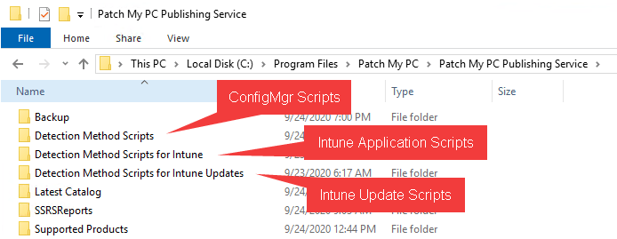

If troubleshooting a particular application installation, the respective script can be copied from these directories.

## Troubleshooting ConfigMgr Scripts

To troubleshoot the scripts for Configuration Manager applications, we will want to **grab a copy of the generated script** for the respective applications. For this example, we will run through the detection of '**Zoom Meetings 5.4.58740.1105**'

**Troubleshooting steps:**

* [Get a Copy of Detection Script](pmpc-app-detection-troubleshooting.md#ConfigMgrCopyScript)
* [Validate Code Signing Certificate Trust If Applicable](pmpc-app-detection-troubleshooting.md#ConfigMgrCodeSigning)
  * [Check Client Settings Execution Policy](pmpc-app-detection-troubleshooting.md#ConfigMgrExecutionPolicy)
* [Run Script On Client](pmpc-app-detection-troubleshooting.md#ConfigMgrRunScript)&#x20;
* [Run Script On Client In Verbose Mode](pmpc-app-detection-troubleshooting.md#ConfigMgrRunScriptVerbose)
* [Evaluate Patch My PC Log File](pmpc-app-detection-troubleshooting.md#PMPCLog)
* [Evaluate Configuration Manager Log Files](pmpc-app-detection-troubleshooting.md#ConfigMgrLogs)
* [Collect Uninstall Registry Hives for Support](pmpc-app-detection-troubleshooting.md#CollectUninstallHive)

## Get a Copy of Detection Script

Reference the [beginning of this article](pmpc-app-detection-troubleshooting.md#Topic1) to find the location of your Configuration Manager application detection scripts.&#x20;

I have located the generated script on my machine that runs the Patch My PC Publisher for Zoom Meetings. The example path is below.

**"C:\Program Files\Patch My PCPatch My PC Publishing ServiceDetection Method ScriptsZoom Meetings 5.4.58740.1105.ps1"**

This file can be copied to the client device we intend to do troubleshooting on.

## Validate Code Signing Certificate Trust If Applicable

In this case, the **script is signed** based on my [options in the Publisher](https://patchmypc.com/application-creation-options#topic3).

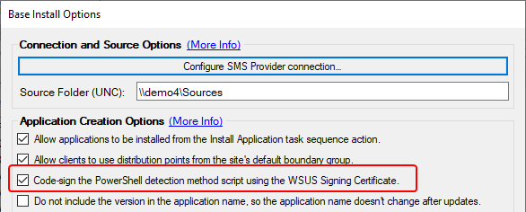

If the scripts are being signed, then you'll need to verify the trust relationship. If they are **not signed**, you'll still want to [verify the execution policy configured in your Client Settings](pmpc-app-detection-troubleshooting.md#ConfigMgrExecutionPolicy).

This code signing happens with the configured [WSUS Signing Certificate](https://patchmypc.com/wsus-signing-certificate-options-for-third-party-updates-in-configuration-manager). With the script being **signed**, we will want to validate that the **clients trust the code signing certificate** and **check the code signing configuration** within the Configuration Manager Client Settings.

An example of validating the client trusting the certificate is below used to sign the script is below. This is a copy of the signed script generated by the publisher. It should be copied directly from the directories described above to ensure the code signing is still valid. **Do not copy-paste the script from the Detection Method in Configuration Manager** as this may add or remove characters, invalidating the code signing.

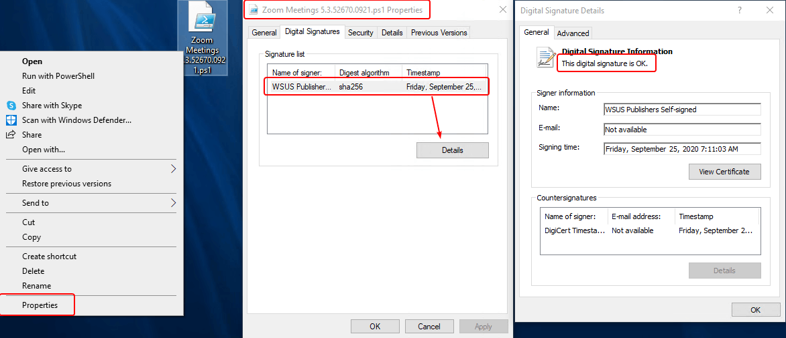

We can additionally validate this is the **same certificate in use by the Publisher**.

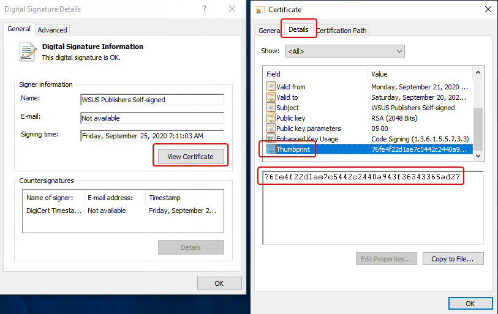 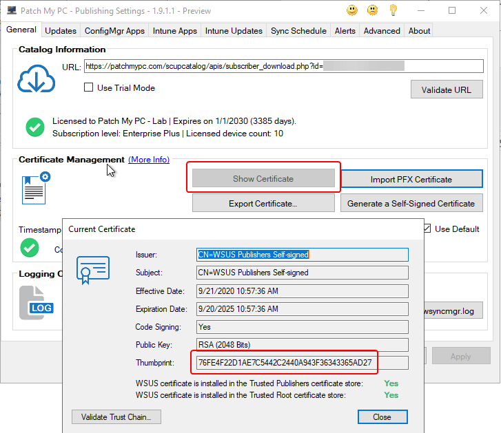

Certificate trust relies on the code signing certificate being in the '**Trusted Publishers**' certificate store, and also having a valid **certificate chain** for trust. There are two scenarios for certificate chain trust with a code-signing certificate.

* If the code signing certificate is **self-signed** the trust will rely on the **code-signing certificate being in the Trusted Root Certificate Authorities** certificate store.
  * 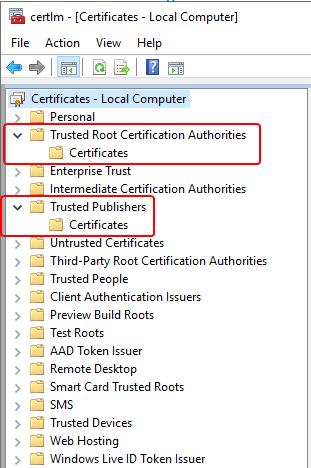
* If this is a **pki-base\*\*\*\*d** code-signing certificate, or from a **public certificate authority** then the certificate should already be trusted in your environment, as the **certificate chain would be trusted already**, and you would only need to ensure the code-signing certificate is in the '**Trusted Publishers**' certificate store unless you find it is not trusted for some reason.
  * 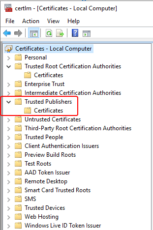

In either case, you should find the certificate in the respective stores similar to the below screenshot. With the certificate in the correct stores, the certificate should be trusted and valid.

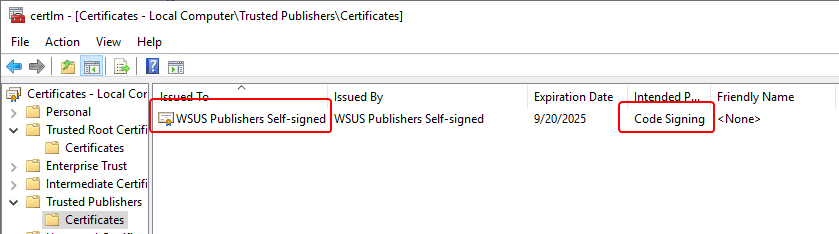

### Check Client Settings Execution Policy

Once we understand whether our detection scripts are being signed, and if we trust the signing certificate on our client, we can determine our **effective execution policy** for our client we are troubleshooting.

I have found the client in the **Configuration Manager Console**, right-clicked it, and selected '**Resultant Client Settings**'

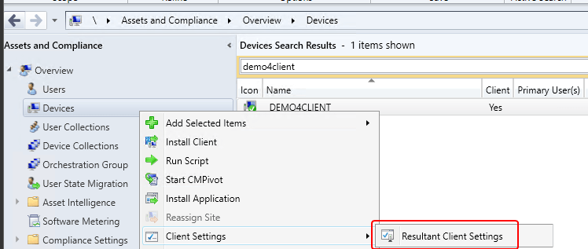

Navigate to: _Computer Agent > PowerShell execution policy_ and **take note of the value**. We will use this when we **execute our script on a client for testing**.

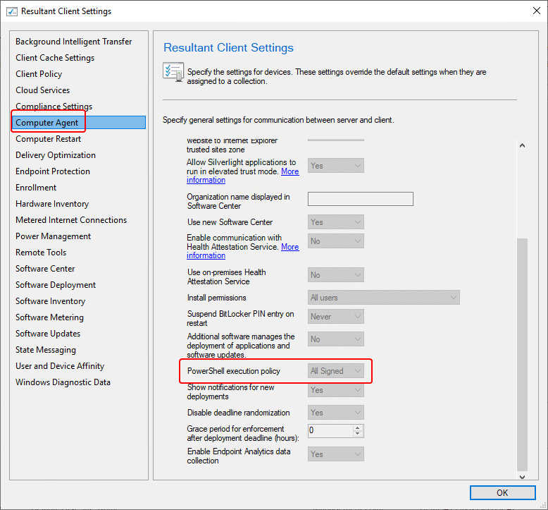

## Run Script On Client

When a Configuration Manager application detection method runs we do have some visibility into what happens. The **AppDiscovery.log**  and the **AppIntentEval.log** can be used to evaluate exit codes and the resolved intent of application discovery.

But, because we have a copy of the detection script it is good to do some testing by **running the script manually**. A detection script can run in **both** the **user context** and the **system context** depending on how the installation was started. For the Patch My PC script, testing in user context is sufficient.

In the below screenshot we have copied our script, **Zoom Meetings 5.4.58740.1105.ps1**, to the desktop of the client we are testing on. A PowerShell window is opened. It does not need to be elevated **unless you need to elevate to set the execution policy.**

Note that we use the **Set-ExecutionPolicy** cmdlet in order to match the policy we previously found in the **Resultant Client Settings**. In my case, I am setting it to **RemoteSigned** and also specify a 'Scope' of **Process** to ensure this is a temporary setting change.

With this in place, I have executed the script

& '.Zoom Meetings 5.4.58740.1105.ps1'

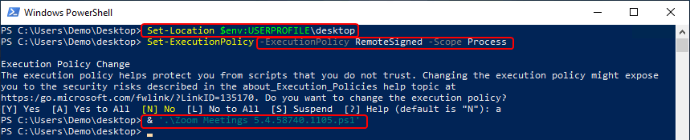

The expected output of this script is '**Detected**' and that is not what we are seeing on this client. This explains why this device would not detect this application from a Configuration Manager deployment.

## Run Script On Client In Verbose Mode

The Configuration Manager detection script has a **-verbose** parameter that will make it much more informational. This includes both **client output being verbose, as well as the log file having additional entries**.

& '.Zoom Meetings 5.4.58740.1105.ps1' -verbose

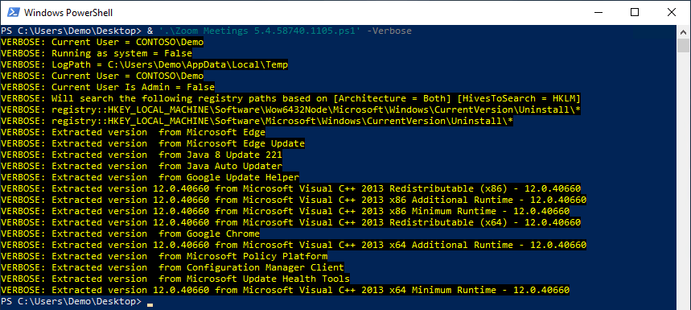

Note: The -verbose option was added in Version 2.0 of the script. You can open the script and check the release notes, or $ScriptVersion variable to see the version. Configuration Manager detection scripts can also be recreated using the [Recreate Detection Script right-click option](https://patchmypc.com/custom-options-available-for-third-party-updates-and-applications#RecreateDetection). The version is also noted in the log file generated by the script.

## Evaluate Patch My PC Log File

The log file for Configuration Manager application detection is called **PatchMyPC-SoftwareDetectionScript.log** and it can be located in one of **two locations** depending on the context the script was run under.

* **Script ran as user** (When testing script, or if the user clicks 'Install' in Software Center)
  * Temp directory of the user that ran the script
  * Variable **%temp%** (cmd/File Explorer) or **$env:temp** (PowerShell)
* **Script run as system** (Script runs as part of required application deployment, or you run as system deliberately for testing)
  * This is typically **C:\Windows\CCM\Logs** but the script does use the below registry value to get the exact value for the log path.
  * HKEY\_LOCAL\_MACHINE\Software\MicrosoftCCMLogging@Global > LogDirectory

Below is a sample log file from a verbose run of the detection script. We can see that both the **Software**, and **SoftwareWOW6432Node** were searched in this case, and no match was found for **Zoom** with **version 5.4.58740.1105**.

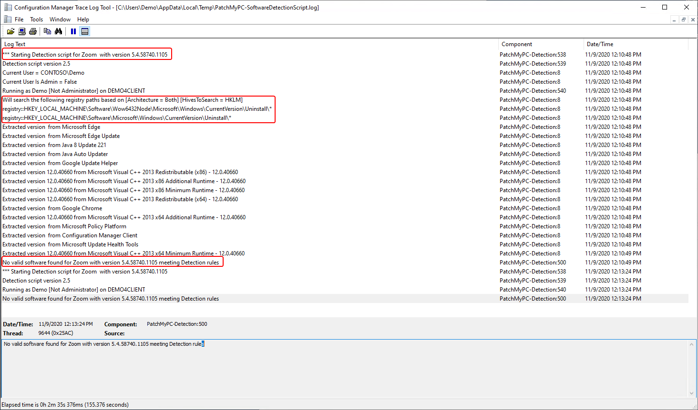

With no matches found, we can either manually navigate the registry hives, and try to identify why the software is not found, or we can run the script provided below to collect a CSV file which can be easier to navigate.

## Collect Uninstall Registry Hives for Support

If you are unable to determine the cause of the issue, or if requested by Patch My PC support, [this script](https://github.com/PatchMyPCTeam/CustomerTroubleshooting/blob/Release/PowerShell/Export-PMPCUninstallRegistryHives.ps1) can be used to generate a CSV file containing all the uninstall registry hives. Below you will find an example of using the script.

For the below example, [the script](https://github.com/PatchMyPCTeam/CustomerTroubleshooting/blob/Release/PowerShell/Export-PMPCUninstallRegistryHives.ps1) has been copied to a file Export-PMPCUninstallRegistryHives.ps1 in the C:\temp directory. The file is then [dot-sourced](https://docs.microsoft.com/en-us/powershell/module/microsoft.powershell.core/about/about_scripts?view=powershell-5.1#script-scope-and-dot-sourcing) to load the function so it can be run. You may need to set your execution policy.

The script will generate a **PMPC-Uninstall-Hive-Export.csv** in the same directory the script is by default. In the below screenshot I have simply imported the CSV to show some sample data. You would **PMPC-Uninstall-Hive-Export.csv** **PMPC-Uninstall-Hive-Export.csv**.

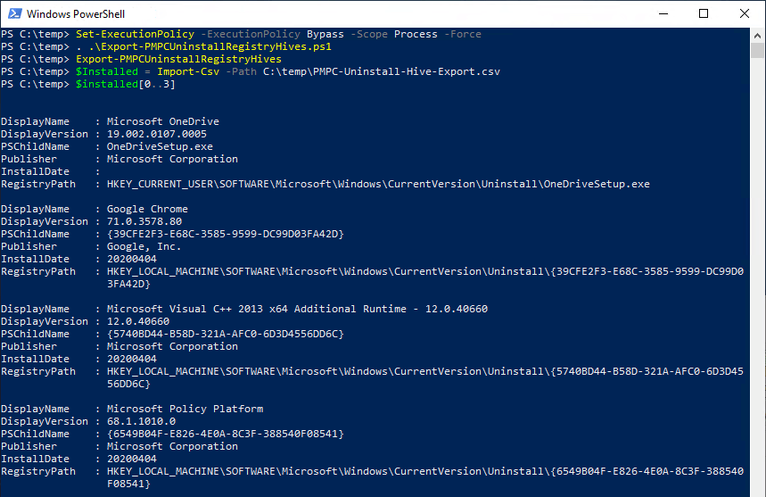

In the case of our missing Zoom install, I can either open the CSV in Excel or something similar, or I can search the CSV with PowerShell as shown below. And we do see that Zoom was found, BUT it is **under the HKEY\_CURRENT\_USER registry hive**. This is a common issue for software that supports user based installs.&#x20;

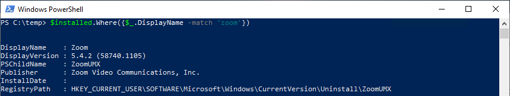

## Special Text Formatting and Common Text

Common log files and intro in **determine if you are affected**

If affected, you will see the following error in the ENTERLOGFILESURLs file.

List of **common server log files** with links:

[**PatchMyPC.log**](../../collecting-log-files-for-patch-my-pc-support/#publishing-service-app-logs-intune)\
[SMS\_ISVUPDATES\_SYNCAGENT.log\
](https://docs.microsoft.com/en-us/mem/configmgr/core/plan-design/hierarchy/log-files#BKMK_SU_NAPLog)[**SoftwareDistribution.log**](https://patchmypc.com/collecting-log-files-for-patch-my-pc-support#publishing-service-logs)

List of common **client log files** with links:

\*\*[WUAHandler.log](https://patchmypc.com/collecting-log-files-for-patch-my-pc-support#update-troubleshooting-client-logs)\
[WindowsUpdate.log](https://patchmypc.com/collecting-log-files-for-patch-my-pc-support#update-troubleshooting-client-logs)\
[PatchMyPC-ScriptRunner.log (For ConfigMgr Apps/Updates)](https://patchmypc.com/collecting-log-files-for-patch-my-pc-support#update-troubleshooting-client-logs)\
[PatchMyPC-ScriptRunner.log (For Intune Apps/Updates)](https://patchmypc.com/collecting-log-files-for-patch-my-pc-support#application-troubleshooting-client-logs-intune)\
[PatchMyPC-SoftwareDetectionScript.log](https://patchmypc.com/collecting-log-files-for-patch-my-pc-support#application-troubleshooting-client-logs-intune)\
[PatchMyPC-SoftwareUpdateDetectionScript.log](https://patchmypc.com/collecting-log-files-for-patch-my-pc-support#application-troubleshooting-client-logs-intune)\
\*\*

Common **KB references**

[**modify published updates wizard**\
](https://patchmypc.com/modify-published-third-party-updates-wizard)[**WSUS signing certificate**\
](https://patchmypc.com/wsus-signing-certificate-options-for-third-party-updates-in-configuration-manager)[**deploy the WSUS signing certificate to clients**](https://patchmypc.com/how-to-deploy-the-wsus-signing-certificate-for-third-party-software-updates)

Here's **Error Text**:

Example CMTace Error Message\
Example CMTrace Warning Message\
sample-powershell command line

**Note:** Here is an example call out section for something super duper cool
