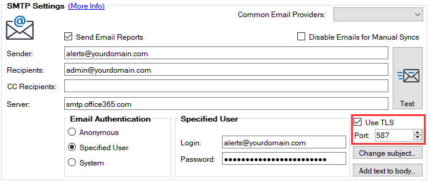
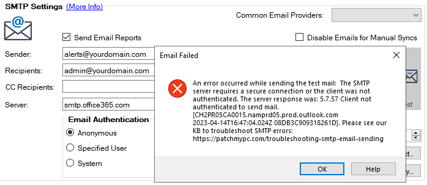
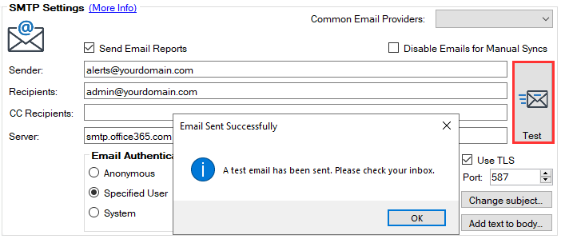
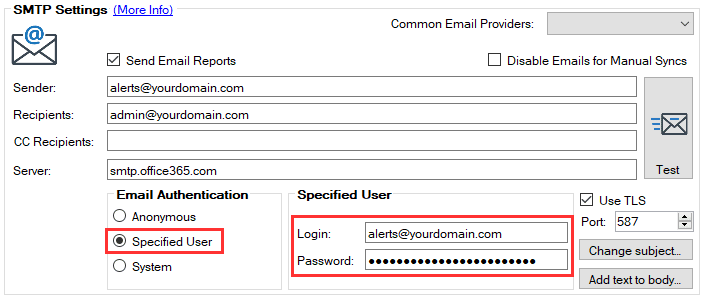

This article covers steps you can take to troubleshoot emails failing to send within our publishing service. Our **[automated email reports](/email-alerts-for-newly-published-third-party-products)** can be helpful to keep you informed when third-party products are publishing. These emails contain a lot of useful details like release notes, update classification, severity levels, and CVE IDs, as shown below:

If you can’t send emails, the problem is almost always related to the **SMTP server configuration**. Here are common issues we see that we recommend checking:

- Incorrect **SMTP Server details**

- SMTP **port** and **protocol**

- Verify all **usernames** and **passwords**

- **Firewall** settings

## Step 1: Check Your Ports

One of the most common issues we see is the ports defined aren't correct for the customer's SMTP server. By default, our service is configured to use **Port 587** and **Use TLS**. These are the default settings for many public email providers like Office 365, Outlook.com, and Gmail.

If you are using an **internal SMTP server**, it may be different such as the default **[Port 25](https://en.wikipedia.org/wiki/Simple_Mail_Transfer_Protocol#Ports),** or it may not be configured for **[TLS](https://en.wikipedia.org/wiki/Simple_Mail_Transfer_Protocol#Security_extensions)**.

## Step 2: Is Authentication Required?

Another common issue is that your SMTP server may require authentication, but you didn't set the **login** and **password** for a **Specified User**.

## Step 3: Does Sending Work in the UI But Not During An Automated Sync?

In some cases, you may be able to send a test email manually in our UI by clicking **Test**, but emails to send during a synchronization with errors in the PatchMyPC.log

Generally, this is because your SMTP server allows **domain accounts** to send emails, but doesn't allow anonymous users to send. Since our settings tool UI is running under your local user context, it will enable the email to send. However, our service runs **synchronizations** under the **local SYSTEM account** as a service that may not be allowed to send emails through your SMTP server.

In this scenario, try to configure an **authentication account** by selecting **Specified User** and setting the **Login** and **Password** for that user:

## Step 4: Try Using A Common Provider?

If sending is failing using an internal SMTP server, you can attempt to use a public email service. Click the drop-down menu and select your provider, if supported, we will pre-fill server, port, and TLS settings. You will need a valid email and password and ensure the outgoing ports aren't blocked.

## Step 5: Ask Your Email Team To Verify Settings and SMTP Logs

If you have a dedicated team for email, we recommend having them review all the configurations within our tool.

## We Hope This Helped Resolve Your Issue

Hopefully, this guide helped resolve your issue. Generally, we are going to be very limited in the support we can provide for SMTP emails as the sending is all performed on the SMTP server.
