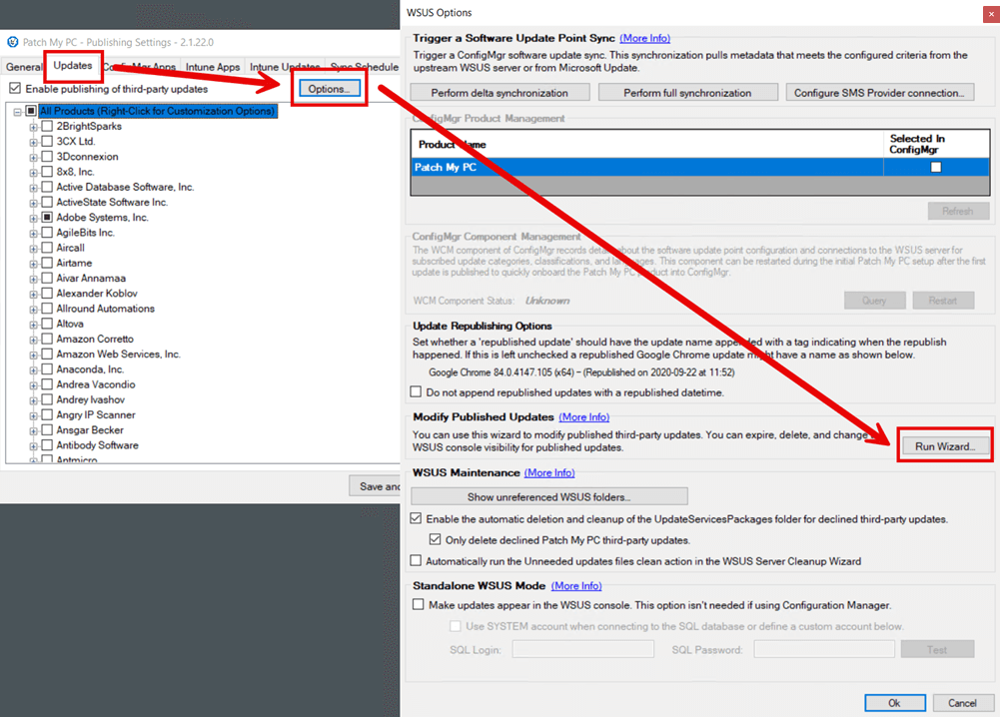

To remove a third-party update from WSUS, you can either **decline** or **delete** the update completely. We will review how to delete or decline third-party updates in this article.

## Option 1: Decline the Third-Party Updates from WSUS and SCCM

The first option to remove a third-party software update is to **decline** it. When you [decline an update](https://docs.microsoft.com/en-us/windows-server/administration/windows-server-update-services/manage/updates-operations#declining-updates), clients will no longer scan against the update, and it will [show expired in Configuration Manager](https://docs.microsoft.com/en-us/mem/configmgr/sum/understand/software-updates-icons#expired-icon).

To decline a third-party update, perform the **following steps**:

Open the **[Modify Published Updates Wizard](/modify-published-third-party-updates-wizard)** from the Updates (tab) > Options (button) in the **[Publisher](/docs)**.

**Check** the updates to decline from WSUS, and click **Decline**

Click **Close** on the dialog box that list the status of the declining operation.

After the updates are **declined in the Publisher**, you can manually **sync your software update point** in SCCM for the changes to occur immediately.

After the software update point sync is complete, you should see the **declined updates show as expired** in SCCM and will no longer be deployed. In the example below, you can see the declined 7-Zip updates show expired.

> **Note:** Expired updates will be automatically purged from the Configuration Manager after **7 days**.

## Option 2: Delete the Third-Party Updates from WSUS and SCCM

The second option is to **[delete the update](https://docs.microsoft.com/en-us/previous-versions/windows/desktop/aa349863\(v=vs.85\))** completely from WSUS. The delete option is **not recommended in most scenarios** as it can cause hash issues if the deleted updates are ever published again.

As a result, we **don't enable the Delete button** by default. To enable the delete button, you need to set the following registry value: HKEY\_LOCAL\_MACHINE\\Software\\Patch My PC Publishing Service:**EnableDeleteUpdates** = 1 (**REG\_DWORD**)

> **Note:** The **delete option** may be a help if you need to delete updates to clean up the UpdateServicePackages folder: **[How to Clean Up Third-Party Updates from the WSUS UpdateServicesPackages Folder](/clean-up-third-party-updates-from-the-wsus-updateservicespackages-folder)**

To **delete** an update after setting the **EnableDeleteUpdates** registry value, open the **[Modify Published Updates Wizard](/modify-published-third-party-updates-wizard)** from the Updates (tab) > Options (button) in the **[Publisher](/docs)**.

**Check** the updates to delete from WSUS, and click **Delete**

After the updates are **deleted in the Publisher**, you can manually **sync your software update point** in SCCM for the changes to occur immediately.

After the software update point sync is complete, you should see the **deleted updates show as expired** in SCCM and will no longer be deployed. In the example below, you can see the deleted 7-Zip updates show expired.

> **Note:** Expired updates will be automatically purged from the Configuration Manager after **7 days**.
